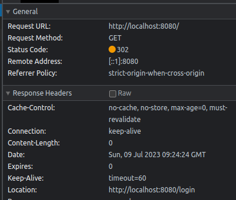

# 스프링 시큐리티 - 코어
- 정수원 님의 스프링 시큐리티 학습 정리

---

# Section 1. 스프링 시큐리티 기본 API 및 Filter 이해
## Chapter 1-1. 프로젝트 구성 및 의존성 추가

### 스프링부트 시큐리티 의존성 추가로 인해 일어나는 일
```groovy
dependencies {
    // 생략
    
	// SpringBoot - Security (추가)
	implementation 'org.springframework.boot:spring-boot-starter-security'
}
```
- Spring Boot 시큐리티 의존성을 추가한다.
```shell
Using generated security password: 201aeffe-e657-4543-b787-0a35ea5f1800

This generated password is for development use only. Your security configuration must be updated before running your application in production.
```
- 서버가 기동되면 스프링 시큐리티의 초기화 작업 및 보안 설정이 이루어진다.
- 별도의 보안 설정, 구현을 하지 않아도 스프링 부트는 기본 필터를 적용하고, 모든 엔드포인트에 보안 기능이 적용된다.
  - 모든 요청은 인증이 되어야 자원에 접근이 가능하다.
  - 인증 방식으로는 Form 로그인 방식, HttpBasic 로그인 방식이 지원된다.
  - 기본 로그인 페이지가 제공된다.
  - 기본 계정이 하나 제공된다. (username: user / password : 랜덤 문자열)



- 웹 브라우저를 통해 루트 페이지로 접근하면, `/login` 으로 리다이렉트 된다. (기본 로그인 페이지)
```shell
$ curl -i localhost:8080

HTTP/1.1 401 
Set-Cookie: JSESSIONID=0EF030C3ABB26D86ED4981C0E14F8E77; Path=/; HttpOnly
WWW-Authenticate: Basic realm="Realm"
X-Content-Type-Options: nosniff
X-XSS-Protection: 0
Cache-Control: no-cache, no-store, max-age=0, must-revalidate
Pragma: no-cache
Expires: 0
X-Frame-Options: DENY
WWW-Authenticate: Basic realm="Realm"
Content-Length: 0
Date: Sun, 09 Jul 2023 09:22:24 GMT
```
- Curl 명령어를 통해 API 요청을 하면, 401 UnAuthorized 응답이 온다.

---
