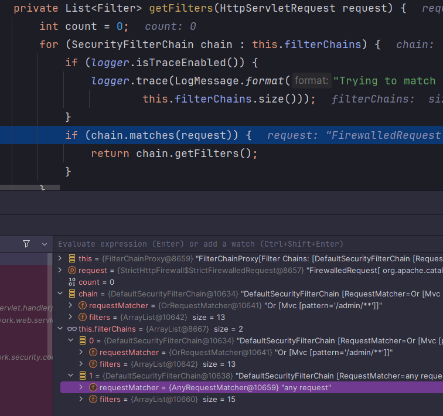

<nav>
    <a href="/#architecture" target="_blank">[Spring Security Core]</a>
</nav>

# 다중 SecurityFilterChain

---

## 1. SecurityFilterChain

```java
public interface SecurityFilterChain {

    boolean matches(HttpServletRequest request);

    List<Filter> getFilters();

}
```
- 우리가 시큐리티 설정 클래스에서 HttpSecurity 클래스를 통해 build를 호출하여 최종적으로 만들어지는 것이 SecurityFilterChain이다.
- 각 SecurityFilterChain마다 필터들이 각각 구성된다.
- 각 SecurityFilterChain마다 RequestMatcher 를 가지고 있다.
  - `http.securityMatcher(…)`

---

## 2. `FilterChainProxy.getFilters`


```java
private List<Filter> getFilters(HttpServletRequest request) {
    int count = 0;
    for (SecurityFilterChain chain : this.filterChains) {
        if (logger.isTraceEnabled()) {
            logger.trace(LogMessage.format("Trying to match request against %s (%d/%d)", chain, ++count,
                    this.filterChains.size()));
        }
        if (chain.matches(request)) {
            return chain.getFilters();
        }
    }
    return null;
}
```
- 런타임에 사용자 요청이 들어올 때마다 FilterChainProxy는 자신이 가진 SecurityFilterChain 각각에게 matches를 호출하여, 요청을 처리할 수 있는지 여부를 확인한다.
- matches가 true를 반환하면 해당 SecurityFilterChain이 가진 모든 필터들을 가져와서 반환하게 된다.
- 그렇다면 matches가 반환하는 값은 어떻게 결정되는걸까?

```java
	@Override
	public boolean matches(HttpServletRequest request) {
		return this.requestMatcher.matches(request);
	}
```
- 런타임의 SecuriryFilterChain 인스턴스의 클래스 타입은 DefaultSecurityFilterChain인데
이 클래스는 내부적으로 RequestMatcher를 의존하고 있다. 이 클래스에게 matches를 호출하여 요청을 처리할 수 있는 지를 물어본다.

```java
http.securityMatcher(...);
```
```kotlin
http {
            securityMatcher("/admin/**")
}
```
- RequestMatcher를 설정하는 방법은 위와 같다.
  - 패턴은 문자열 url 기반으로 설정하거나 RequestMatcher 클래스를 지정하여 전달할 수 있다.
  - 여러개 가변인자 형태로 전달할 수 있다.
  - or 기반이다. 즉 복수의 인자를 전달할 경우 해당 패턴 중 하나라도 일치하면 매칭된다.
- **별도로 위 설정 메서드를 호출하지 않으면 항상 true를 반환하는 AnyRequestMatcher가 설정된다.**
- SecurityFilterChain을 여러개 등록했다면 가장 먼저 matches가 true를 반환하는 SecurityFilterChain이 적용된다.
  - 이것 때문에 SecurityFilterChain의 순서가 중요하다.
  - `@Order(...)` 를 사용하여 명시적으로 순서를 지정하는 것이 좋다. 순서값이 낮을 수록 우선순위가 높다.
  - 넓은 범위의 엔드포인트일 수록 우선순위가 낮아야한다.

---

## 3. 실습

### 3.1 컨트롤러 설정
```kotlin
@RestController
class SecurityController {

    @GetMapping("/")
    fun index() = "index"

    @GetMapping("/admin/pay")
    fun admin() = "adminPay"

}
```
- 일반 사용자가 접근 가능한 루트 디렉터리
- 어드민 사용자가 접근 가능한 /admin/pay  를 지정

### 3.2 시큐리티 설정
```kotlin
@EnableWebSecurity
@Configuration
class SecurityConfig {

    @Bean
    @Order(0)
    fun filterChain1(http: HttpSecurity): SecurityFilterChain {
        http {
            securityMatcher("/admin/**")

            authorizeHttpRequests {
                authorize(anyRequest, authenticated)
            }
            httpBasic {  }
        }
        return http.build()
    }

    @Bean
    @Order(1)
    fun filterChain2(http: HttpSecurity): SecurityFilterChain {
        http {
            authorizeHttpRequests {
                authorize(anyRequest, permitAll)
            }
            formLogin {  }
        }
        return http.build()
    }

}
```
- 첫번째 SecurityFilterChain은 “/admin/**” 에 대해 매칭하는 필터이다.
- 두번째 SecurityFilterChain은 모든 요청에 대해 매칭되는 필터이다.

### 3.3 접속 실행


- 여기서는 루트로 접속을 시도해봤다.
- FilterChainProxy에서 내부적으로 `chain.matches` 를 호출하여, 필터들을 하나씩 순회하면서 매칭되는 지 확인한다.
- 첫번째 SecurityFilterChain에 대해 matches를 호출한다. 매칭되므로 해당 SecurityFitlerChain의 필터들이 반환된다.
- 참고로, @Order 값의 순서를 바꾸면 두번째 SecurityFilterChain이 먼저 등록되고 admin 페이지에 일반사용자도 접근 가능해진다.

---
