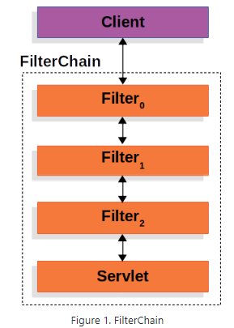
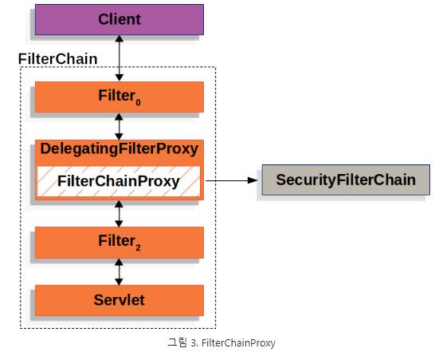
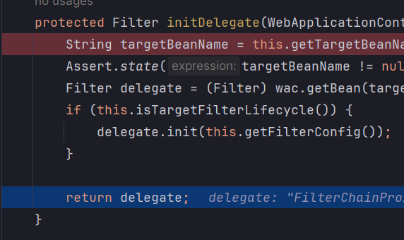
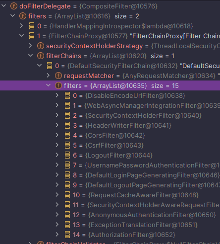
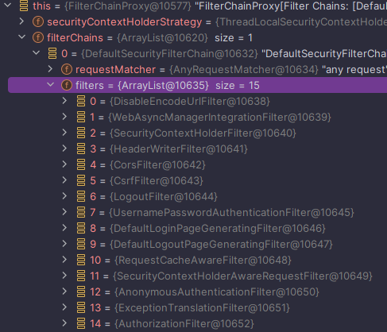
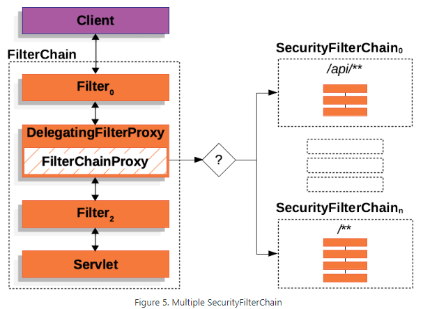
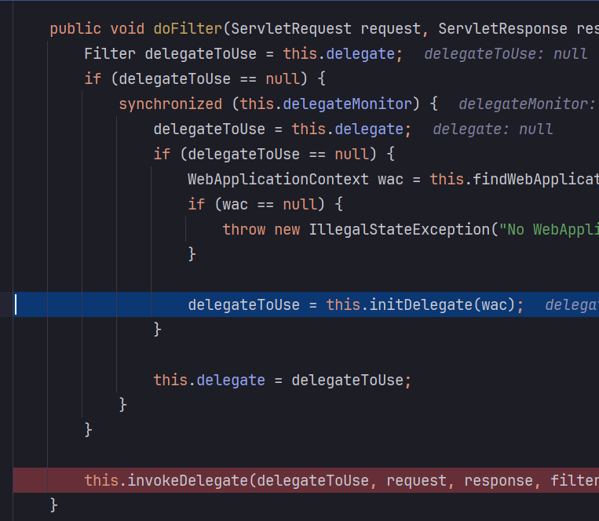
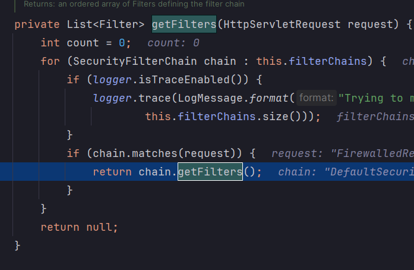
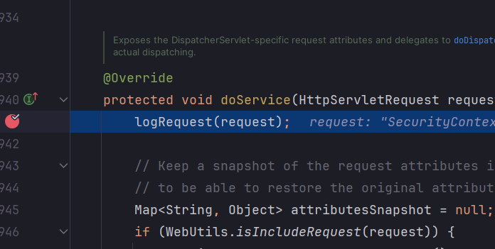

<nav>
    <a href="/#architecture" target="_blank">[Spring Security Core]</a>
</nav>

# 위임 필터 및 필터 빈 초기화 - DelegatingFilterProxy, FilterChainProxy

---

## 1. 서블릿 필터와 스프링 연결



- 서블릿 컨테이너는 자체 표준을 사용하여 Filter 인스턴스를 등록할 수 있지만, 스프링에서 정의한 빈들을 인식하지 못 한다.
스프링은 서블릿 컨테이너의 라이프사이클과 스프링의 애플리케이션 컨텍스트 간에 다리 역할을 하는 DelegatingFilterProxy라는 Filter 구현체를 제공한다.
- 따라서 우리는 서블릿 메커니즘을 통해 필터를 등록하는 대신 필터를 구현한 스프링 빈을 등록하고
이를 DelegatingFilterProxy를 통해 간접적으로 등록하는 방식을 사용하면 편리하게 필터를 등록할 수 있게 된다. 

```java
@Override
public void doFilter(ServletRequest request, ServletResponse response, FilterChain filterChain)
		throws ServletException, IOException {

	// 위임 필터를 지연 초기화
	Filter delegateToUse = this.delegate;
	if (delegateToUse == null) {
		synchronized (this.delegateMonitor) {
			delegateToUse = this.delegate;
			if (delegateToUse == null) {

				// 스프링 컨텍스트 가져오기(지연 로딩)
				WebApplicationContext wac = findWebApplicationContext();
				if (wac == null) {
					throw new IllegalStateException("No WebApplicationContext found: " +
							"no ContextLoaderListener or DispatcherServlet registered?");
				}
				// 컨텍스트에서 필터를 찾아서 delegateToUse 변수에 할당
				delegateToUse = initDelegate(wac);
			}
			// 인스턴스 변수인 delegate 변수에 위임 필터를 할당
			this.delegate = delegateToUse;

		}
	}

	// 앞으로의 로직은 delegateToUse(== this.delegate) 에게 위임
	invokeDelegate(delegateToUse, request, response, filterChain);
}

protected Filter initDelegate(WebApplicationContext wac) throws ServletException {
		// 특정 이름을 지정
		String targetBeanName = getTargetBeanName();
		Assert.state(targetBeanName != null, "No target bean name set");
		// 특정 이름을 가진 필터를 조회하여 위임
		Filter delegate = wac.getBean(targetBeanName, Filter.class);
		if (isTargetFilterLifecycle()) {
			delegate.init(getFilterConfig());
		}
		return delegate;
}
```
- DelegatingFilterProxy는 스프링 빈으로 등록된 스프링 시큐리티의 빈들 중 **특정 이름을 가진 필터를 찾아서 해당 필터에게 작업을 위임**한다.
    - `DelegatingFilterProxyRegistrationBean` 클래스를 이용하여, 특정 필터에게 위임할 수 있도록 설정할 수 있다.
- DelegatingFilterProxy의 또 다른 이점은 Filter 빈 인스턴스를 찾는 것을 지연시킬 수 있다는 점이다. 스프링 컨테이너가 시작하기 전에 Filter 인스턴스를 등록해야 하는데, 일반적으로 스프링은 Filter 인스턴스를 등록해야 할 때보다 더 늦게 Spring Bean을 로드하기 위해 `ContextLoaderListener`를 사용한다.


---

## 2. DelegatingFilterProxy와 FilterChainProxy

### 2.1 DelegatingFilterProxy와 FilterChainProxy의 관계







- Spring Security는 **“springSecurityFilterChain” 이름으로 생성된 빈**을 ApplicationContext에서 찾아서 요청을 위임하도록 초기화한다. 그 결과 **FilterChainProxy가 이 자리에 할당된다.** 이것은 서블릿의 Filter를 구현했다.
- FilterChainProxy는 Spring Security에서 제공하는 특별한 필터로서(이것 역시 서블릿의 Filter를 구현했다.), **내부적으로 여러 SecurityFilterChain을 리스트로 가지고 있다.**
  - SecurityFilterChain은 내부적으로 필터들을 List로 가지고 있다. 이들 필터들 역시 서블릿의 Filter를 구현했다. 그와 동시에 이들 모두는 스프링 컨테이너에 의해 관리되는 빈이다.
- DelegatingFilterProxy는 보안 처리를 하지 않고 FilterChainProxy에게 위임만 한다.

### 2.2 FilterChainProxy 상세



- “springSecurityFilterChain” 이름으로 생성되는 필터 빈
- DelegatingFilterProxy로부터 요청을 위임받고 실제 보안 처리
- 스프링 시큐리티 초기화 시 생성되는 SecurityFilterChain들을 리스트로 관리하고 제어
  - 커스텀 설정을 하지 않을 경우 스프링 시큐리티가 자동으로 구성한 SecurityFilterChain이 등록된다.
  - 우리가 SecurityFilterChain을 빈으로 등록하면 이곳에 리스트의 원소로 등록된다.
- 요청이 들어왔을 때, 어느 SecurityFilterChain을 사용할 지 결정하고 그 필터체인이 가진 필터들에게 요청을 포워딩한다.




- SecurityFilterChain은 FilterChainProxy가 내부적으로 리스트로 가지고 있다.
- 현재 요청에 대해 어떤 Spring Security 필터 인스턴스들을 호출해야 하는지 결정되어 사용된다.

---

# 4. 실습 (내부 코드 분석)
### 4.1 설정
```kotlin
@EnableWebSecurity
@Configuration
class SecurityConfig {

    @Bean
    fun filterChain(http: HttpSecurity): SecurityFilterChain {
        http {
            authorizeHttpRequests {
                authorize(anyRequest, permitAll)
            }
        }
        return http.build()
    }

}
```

```kotlin
@RestController
class SecurityController {

    @GetMapping("/")
    fun index() = "index"

}
```

- 루트 경로 엔드포인트 및 기본 시큐리티 커스텀 설정을 등록했다.

### 4.2 스프링부트 설정파일
```text
org.springframework.boot.autoconfigure.security.servlet.SecurityAutoConfiguration
org.springframework.boot.autoconfigure.security.servlet.UserDetailsServiceAutoConfiguration
org.springframework.boot.autoconfigure.security.servlet.SecurityFilterAutoConfiguration

...

org.springframework.boot.autoconfigure.web.servlet.DispatcherServletAutoConfiguration
org.springframework.boot.autoconfigure.web.servlet.ServletWebServerFactoryAutoConfiguration
org.springframework.boot.autoconfigure.web.servlet.error.ErrorMvcAutoConfiguration
org.springframework.boot.autoconfigure.web.servlet.HttpEncodingAutoConfiguration
org.springframework.boot.autoconfigure.web.servlet.MultipartAutoConfiguration
org.springframework.boot.autoconfigure.web.servlet.WebMvcAutoConfiguration
```
- `org.springframework.boot.autoconfigure.autoconfiguration.imports` 파일에는 AutoConfiguration 들이 등록되어 있다. 이 설정들을 읽어온다.
    - `SecurityAutoConfiguration`
    - `UserDetailsServiceConfiguration`
    - `SecurityFilterAutoConfiguration` : 이번 글에서는 이 부분을 초점을 두고 보겠다.
- 파일에서 spring servlet 부분은 좀 더 뒤에 불러와진다.

### 4.3 SecurityFilterAutoConfiguration
```java
@AutoConfiguration(after = SecurityAutoConfiguration.class)
@ConditionalOnWebApplication(type = Type.SERVLET)
@EnableConfigurationProperties(SecurityProperties.class)
@ConditionalOnClass({ AbstractSecurityWebApplicationInitializer.class, SessionCreationPolicy.class })
public class SecurityFilterAutoConfiguration {

    private static final String DEFAULT_FILTER_NAME = AbstractSecurityWebApplicationInitializer.DEFAULT_FILTER_NAME;

    @Bean
    @ConditionalOnBean(name = DEFAULT_FILTER_NAME)
    public DelegatingFilterProxyRegistrationBean securityFilterChainRegistration(
            SecurityProperties securityProperties) {
        DelegatingFilterProxyRegistrationBean registration = new DelegatingFilterProxyRegistrationBean(
                DEFAULT_FILTER_NAME);
        registration.setOrder(securityProperties.getFilter().getOrder());
        registration.setDispatcherTypes(getDispatcherTypes(securityProperties));
        return registration;
    }
}
```
- 스프링 시큐리티 필터 설정 클래스가 실행되면서, DelegatingFilterProxyRegistrationBean이 생성된다.
  이 클래스는 내부적으로 “springSecurityFilterChain” 이라는 이름값을 가지고 있다.
```java
    public DelegatingFilterProxy getFilter() {
        return new DelegatingFilterProxy(this.targetBeanName, this.getWebApplicationContext()) {
            protected void initFilterBean() throws ServletException {
            }
        };
    }
```
- 서블릿 Filter들이 초기화될 때 이 클래스의 getFilter가 호출되어 DelegatingFilterProxy가 생성되고 서블릿 필터체인에 등록된다.
- DelegatingFilterProxy 는 프록시 역할을 하고, 내부적으로 target이 되는 빈 이름(기본값:springSecurityFilterChain)을 가지게 된다.


### 4.4 WebSecurityConfiguration, WebSecurity
```java
	@Bean(name = AbstractSecurityWebApplicationInitializer.DEFAULT_FILTER_NAME)
	public Filter springSecurityFilterChain() throws Exception {
		boolean hasFilterChain = !this.securityFilterChains.isEmpty();
		if (!hasFilterChain) {
			this.webSecurity.addSecurityFilterChainBuilder(() -> {
				this.httpSecurity.authorizeHttpRequests((authorize) -> authorize.anyRequest().authenticated());
				this.httpSecurity.formLogin(Customizer.withDefaults());
				this.httpSecurity.httpBasic(Customizer.withDefaults());
				return this.httpSecurity.build();
			});
		}
		for (SecurityFilterChain securityFilterChain : this.securityFilterChains) {
			this.webSecurity.addSecurityFilterChainBuilder(() -> securityFilterChain);
		}
		for (WebSecurityCustomizer customizer : this.webSecurityCustomizers) {
			customizer.customize(this.webSecurity);
		}
		return this.webSecurity.build();
	}
```
- 이후 스프링 빈이 초기화되는 과정에서 WebSecurityConfiguration 클래스에서 springSecurityFilterChain() 메서드에서 webSecurity.build() 메서드가 호출된다.

```java
@Override
	protected Filter performBuild() throws Exception {
    
        // 생략
  
		FilterChainProxy filterChainProxy = new FilterChainProxy(securityFilterChains);
        
        // 생략
  
  
		Filter result = filterChainProxy;

		this.postBuildAction.run();
		return result;
	}
```
- WebSecurity 클래스의 performBuild 메서드에서 FilterChainProxy가 생성되고 반환된다.
- 이로서 springSecurityFilterChain 이라는 이름을 가진 필터 빈이 생성된다. 이것은 `FilterChainProxy` 인스턴스다.

### 4.5 (런타임) DelegatingFilterProxy.doFilter()


- 런타임에 처음 요청이 들어와서 doFilter가 호출될 때, 위임 필터 초기화가 수행된다.
- DelegatingFilterProxy의 initDelegate가 호출된다.
- initDelegate 메서드에서는 우리가 처음 DelegatingFilterProxy 생성시 전달됐던 “springSecurityFilterChain” 이름을 통해, 스프링 컨테이너에서 같은 이름을 가진 Filter 빈을 찾는다.
- 이 때, 앞에서 초기화됐던 SecurityFilterChain 이 찾아진다.
- 이후 invokeDelegate 메서드가 호출되고, 위임 필터, 즉 FilterChainProxy의 로직이 실행된다.

### 4.6 FilterChainProxy


- 요청이 FilterChainProxy쪽으로 위임된다.
- 이후 내부적으로 doFilterInternal, getFilters 메서드가 호출된다.



- FilterChainProxy는 내부적으로 여러개의 filterChain들을 갖고 있는데, 현재 요청에 매칭되는 SecurityFilterChain을 찾고
먼저 매칭된 filterChain의 filter 들을 가져온다.
- 여기서 가져온 filter 리스트를 기반으로 필터체인 데코레이터를 만들고 그쪽으로 요청을 위임시킨다.

### 4.7 DispatcherServlet


모든 필터를 성공적으로 통과하면 DispatcherServlet에 도달하게 된다.


---
