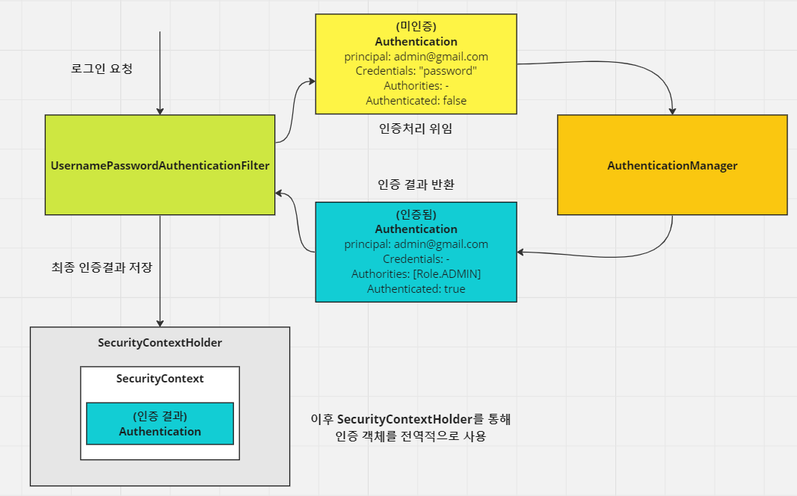

<nav>
    <a href="/#architecture" target="_blank">[Spring Security Core]</a>
</nav>

# 인증 개념 이해 - Authentication

---

## 1. Authentication
```java
public interface Authentication extends Principal, Serializable {

	Collection<? extends GrantedAuthority> getAuthorities();
	Object getCredentials();
	Object getDetails();
	Object getPrincipal();
	boolean isAuthenticated();
	void setAuthenticated(boolean isAuthenticated) throws IllegalArgumentException;

}
```
- 사용자의 인증 정보를 저장하는 토큰 개념
- `java.security.Principal` 인터페이스를 상속받았고, 직렬화 가능하다.
- 인증 시 id, password 를 담고 인증 검증을 위해 전달되어 사용된다.
- 인증 후 최종 인증 결과(user 객체, 권한 정보)를 담고 SecurityContext에 저장되어 전역적으로 참조가 가능하다.
  - `val authentication = SecurityContextHolder.getContext().getAuthentication()`
- 구조
  - principal(인증 주체) : 사용자 아이디 혹은 User 객체를 저장
  - credentials(자격 증명) : 사용자 비밀번호 혹은 Secret
    - 꼭 비밀번호 문자열일 필요는 없다. 인증에 필요한 핵심 정보에 해당한다면 문자열 형태의 비밀번호가 아니여도 됨
  - authorities :  인증된 사용자의 권한 목록
  - details : 인증 부가 정보
  - authenticated :  인증 여부

---

## 2. 인증 흐름


- 사용자는 로그인 요청을 한다.
  - 이 때 아이디, 패스워드를 파라미터를 통해 전달한다.
- UsernamePasswordAuthenticationFilter에서 요청을 가로채서, 아이디/패스워드를 Authentication 객체에 담아둔다.
  - Principal(인증 주체) : 아이디
  - Credentials : 패스워드
  - authorities : —
  - authenticated : false
- AuthenticationManager에게 인증 처리를 위임하여 인증을 처리한다.
- 인증이 성공되면 Authentication 객체에 인증 정보를 담아 반환된다.
  - Principal(인증 주체) : UserDetails
  - Credentials : —-
  - authorities : `[Role.ADMIN]`
  - authenticated : true
- Authentication은 SecurityContextHolder를 통해 현재 SecurityContext에 저장된다.
  - 이 과정에서는 ThreadLocal 이 사용된다. 따라서 해당 스레드의 요청-응답 처리 사이에 인증 객체를 전역적으로 꺼내서 사용할 수 있다.
- 인증이 실패되면 인증 예외가 발생된다. 이런 인증 실패 후속처리는 주로 AuthenticationFailureHandler에서 후속처리를 한다.
- 인증에 성공하면 인증 성공처리는 주로 AuthenticationSuccessHandler에서 후속처리를 한다.

---
