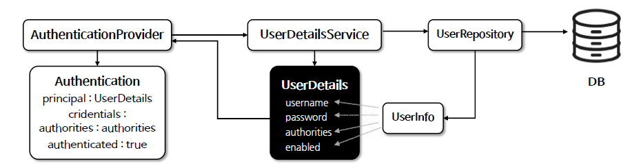

<nav>
    <a href="/#authentication-architecture" target="_blank">[Spring Security Core]</a>
</nav>

# 사용자 상세 - UserDetails



```java
public interface UserDetails extends Serializable {
    
    // 사용자에게 부여된 권한을 반환하며, null을 반환할 수 없다.
	Collection<? extends GrantedAuthority> getAuthorities();
	
    // 사용자 인증에 사용할 비밀번호를 반환한다.
    String getPassword();
	
    // 사용자가 활성화됐는 지 비활성화됐는 지를 나타내며 null을 반환할 수 없다.
    String getUsername();
	
    // 사용자 계정의 유효 기간이 유효한 지 여부를 나타내며, 기간이 만료됐다면 false를 반환하게 하면 된다.
    boolean isAccountNonExpired();

    // 사용자 계정이 잠겨있는 지 여부를 나타내며, 잠겨있다면 false를 반환하게 하면 된다.
    boolean isAccountNonLocked();
	
    // 사용자의 비밀번호가 유효기간을 지났는 지 여부를 확인하며 유효기간이 지난 비밀번호는 인증할 수 없다.
    // 기간이 유효기간을 넘었다면 false를 반환하게 하면 된다
    boolean isCredentialsNonExpired();
	
    // 사용자가 활성화됐는 지 비활성화 됐는 지를 나타내며 비활성화된 사용자는 인증할 수 없다.
    boolean isEnabled();
}
```
- SpringSecurity의 UserDetailsService 사양에서 사용하는 사용자의 인증에 필요한 정보를 저장하는 인터페이스
  - 도메인 엔티티, 데이터베이스 엔티티 등과 별개의 사양이다.
- 저장된 사용자 정보는 추후 인증 절차에서 사용되기 위해 Authentication 객체의 Principal로 설정할 수 있다.
  - 개발자 마음이며, 꼭 UserDetails를 UserDetails의 Principal 객체로 설정 안 해도 된다.
  - 더 나아가, 꼭 사용자 인증에 UserDetailsService, UserDetails 를 사용하지 않아도 된다.
- 기본 구현체로는 User 클래스가 제공되는데 개발자가 커스텀하게 UserDetails 인터페이스 구현체를 만들어도 된다.

---
