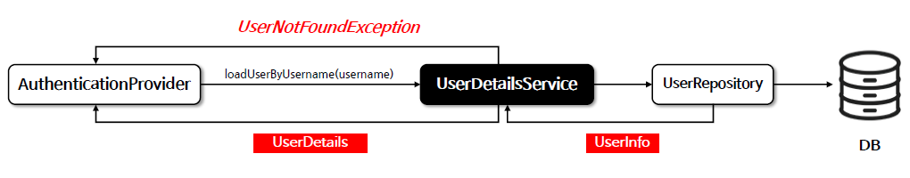
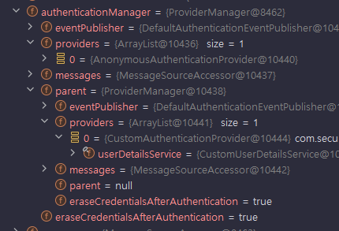
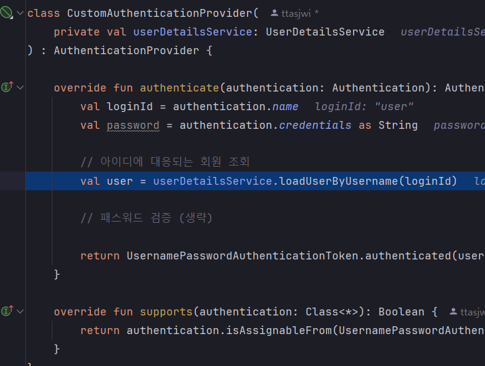

<nav>
    <a href="/#authentication-architecture" target="_blank">[Spring Security Core]</a>
</nav>

# 사용자 상세 서비스 - UserDetailsService

---

## 1. UserDetailsService : 사용자 인증 정보 관리
```java
package org.springframework.security.core.userdetails;

public interface UserDetailsService {
	UserDetails loadUserByUsername(String username) throws UsernameNotFoundException;
}
```
- UserDetailsService 의 주요 기능은 UserDetails(사용자와 관련된 상세 데이터, 스프링 시큐리티 사양)를 로드하는 것이며,
사용자의 신원, 권한, 자격 증병과 같은 정보를 포함할 수 있다.
- 이 인터페이스를 사용하는 클래스는 주로 AuthenticationProvider 이며, 여기서는 username으로 사용자 데이터를 검색해오고
이를 기반으로 인증 과정을 수행한다.
- username으로 사용자 조회에 실패할 경우 UsernameNotFoundException을 발생시킬 책임이 있다.

---

## 2. UserDetailsService 흐름도


- AuthenticationProvider에서 UserDetailsService를 통해 username에 대응하는 인증 정보 객체(UserDetails)를 가져온다.
  - 이떄 일치하는 사용자 조회에 실패하면 UsernameNotFoundException을 발생시킬 책임이 있다.
- 여기서 가져온 UserDetails 를 토대로 인증을 수행하면 된다.

---

## 3. 실습

### 3.1 커스텀 UserDetailsService 구현
```kotlin
class CustomUserDetailsService : UserDetailsService {

    @Throws(UsernameNotFoundException::class)
    override fun loadUserByUsername(username: String?): UserDetails {
        return if ("user" == username) {
            User.withUsername("user").password("{noop}1111").roles("USER").build()
        } else {
            throw UsernameNotFoundException("일치하는 username의 회원을 조회하지 못 함")
        }
    }
}
```
- 여기서는 간단하게, 이름이 "user"인 UserDetails 조회에 성공하고 나머지는 UsernameNotFoundException을 발생시키도록 한다.

### 3.2 커스텀 AuthenticationProvider 에서 UserDetailsService 사용하기
```kotlin
class CustomAuthenticationProvider(
    private val userDetailsService: UserDetailsService
) : AuthenticationProvider {

    override fun authenticate(authentication: Authentication): Authentication {
        val loginId = authentication.name
        val password = authentication.credentials as String

        // 아이디에 대응되는 회원 조회
        val user = userDetailsService.loadUserByUsername(loginId)

        // 패스워드 검증 (생략)

        return UsernamePasswordAuthenticationToken.authenticated(user.username, null, user.authorities)
    }

    override fun supports(authentication: Class<*>): Boolean {
        return authentication.isAssignableFrom(UsernamePasswordAuthenticationToken::class.java)
    }
}
```
- CustomAuthenticationProvider에서 UserDetailsService를 사용하여 사용자를 조회할 수 있도록 한다.

### 3.3 설정 등록
```kotlin
@EnableWebSecurity
@Configuration
class SecurityConfig {

    @Bean
    fun filterChain(http: HttpSecurity): SecurityFilterChain {
        http {
            authorizeHttpRequests {
                authorize(anyRequest, authenticated)
            }
            formLogin {  }
        }
        return http.build()
    }

    @Bean
    fun userDetailsService() : UserDetailsService {
        return CustomUserDetailsService()
    }

    @Bean
    fun customAuthenticationProvider(userDetailsService: UserDetailsService): CustomAuthenticationProvider {
        return CustomAuthenticationProvider(userDetailsService)
    }
}
```
- UserDetailsService를 수동으로 빈 등록했다.
  - AuthenticationProvider를 따로 빈으로 등록하지 않는다면 DaoAuthenticationProvider 에서 이를 사용하게 된다.(InitializeUserDetailsBeanManagerConfigurer)
- AuthenticationProvider를 수동으로 빈 등록하는데, 의존 UserDetailsService 빈을 주입받는다.
- AuthenticationProvider 빈이 하나 등록됐으므로 AuthenticationProvider 설정 과정에서 부모 ProviderManager 설정 과정에서
provider가 커스텀 AuthenticationProvider로 지정된다.

### 3.4 실행




- `http://localhost:8080/`
  - 우리가 등록한 커스텀 AuthenticationProvider가 잘 등록된다.
  - "user" 및 "1111" 로 로그인하면 성공한다.
  - 다른 이름으로 로그인 시도하면 UsernameNotFoundException이 발생하여, 인증에 실패함
  - password 인증로직은 생략했으므로 "user"의 비밀번호가 잘못되더라도 로그인된다.

---
