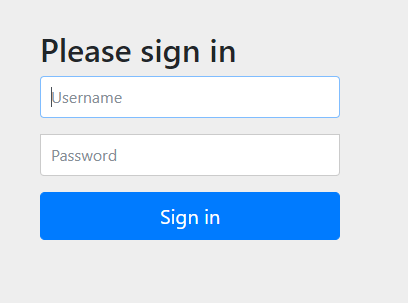

<nav>
    <a href="/#authentication-architecture" target="_blank">[Spring Security Core]</a>
</nav>

# 인증 개념 이해 - Authentication

---

## 1. Authentication
```java
public interface Authentication extends Principal, Serializable {

	Collection<? extends GrantedAuthority> getAuthorities();
	Object getCredentials();
	Object getDetails();
	Object getPrincipal();
	boolean isAuthenticated();
	void setAuthenticated(boolean isAuthenticated) throws IllegalArgumentException;

}
```
- 사용자의 인증 정보를 저장하는 토큰 개념
- `java.security.Principal` 인터페이스를 상속받았고, 직렬화 가능하다.
- 인증 시 id, password 를 담고 인증 검증을 위해 전달되어 사용된다.
- 인증 후 최종 인증 결과(user 객체, 권한 정보)를 담고 SecurityContext에 저장되어 전역적으로 참조가 가능하다.
  - `val authentication = SecurityContextHolder.getContext().getAuthentication()`
- 구조
  - principal(인증 주체) : 사용자 아이디 혹은 User 객체를 저장
  - credentials(자격 증명) : 사용자 비밀번호 혹은 Secret
    - 꼭 비밀번호 문자열일 필요는 없다. 인증에 필요한 핵심 정보에 해당한다면 문자열 형태의 비밀번호가 아니여도 됨
  - authorities :  인증된 사용자의 권한 목록
  - details : 인증 부가 정보
  - authenticated :  인증 여부

## 참고: Principal
```java
package java.security;

import javax.security.auth.Subject;

public interface Principal {
    
    boolean equals(Object another);
    String toString();
    int hashCode();
    String getName();
    default boolean implies(Subject subject) {
        if (subject == null)
            return false;
        return subject.getPrincipals().contains(this);
    }
}
```
- Principal은 java.util.security에서 제공되는 자바 사양의 인증 객체이다.
- Spring Security의 Principal은 이것의 하위 인터페이스이다.

---

## 2. 인증 흐름

- 사용자는 로그인 요청을 한다.
  - 이 때 아이디, 패스워드를 파라미터를 통해 전달한다.
- UsernamePasswordAuthenticationFilter에서 요청을 가로채서, 아이디/패스워드를 Authentication 객체에 담아둔다.
  - Principal(인증 주체) : 아이디
  - Credentials : 패스워드
  - authorities : —
  - authenticated : false
- AuthenticationManager에게 인증 처리를 위임하여 인증을 처리한다.
- 인증이 성공되면 Authentication 객체에 인증 정보를 담아 반환된다.
  - Principal(인증 주체) : UserDetails
  - Credentials : —-
  - authorities : `[Role.ADMIN]`
  - authenticated : true
- Authentication은 SecurityContextHolderStrategy를 통해 저장된다.
  - 이 과정에서는 ThreadLocal 이 사용된다. 이후에는 해당 스레드의 요청-응답 처리 사이에 인증 객체를 전역적으로 꺼내서 사용할 수 있다.
- 인증이 실패되면 인증 예외가 발생된다. 이런 인증 실패 후속처리는 주로 AuthenticationFailureHandler에서 후속처리를 한다.
- 인증에 성공하면 인증 성공처리는 주로 AuthenticationSuccessHandler에서 후속처리를 한다.

---

## 3. 실습
### 3.1 설정
```kotlin
@RestController
class HelloController {

    @GetMapping("/")
    fun index() = "index"

}
```
```kotlin
@EnableWebSecurity
@Configuration
class SecurityConfig {

    @Bean
    fun filterChain(http: HttpSecurity): SecurityFilterChain {
        http {
            authorizeHttpRequests { authorize(anyRequest, authenticated) }
            formLogin { }
        }
        return http.build()
    }

}
```

### 3.2 확인


- 최초로 루트 페이지로 접근할 때 우리는 어떠한 자격증명도 보유하고 있지 않기 때문에(익명사용자) AuthorizationFilter에서 인가 실패한다.
  - 이 과정에서도 SecurityContextHolder.getContext().getAuthentication 을 통해 인증정보를 꺼내온다.
- 익명사용자의 인가 실패는 ExceptionTranslationFilter에서 인증 예외 후속처리 로직으로 위임된다.
- 요청이 캐싱된 뒤 로그인 페이지로 리다이렉트 된다.
- DefaultLoginPageGeneratingFilter에서 요청을 가로채서 로그인 페이지를 응답으로 내려준다.



- 로그인 페이지를 응답으로 받아서 브라우저가 렌더링한다.
- 여기서 로그인을 시도해보자. "/login"으로 POST 요청이 가게 된다.


- Form 방식으로 POST /login 엔드포인트로 로그인을 시도하면 UsernamePasswordFilter에서 요청을 가로채고,
사용자 요청 정보를 기반으로 미인증 Authentication 객체를 생성한다.
- AuthenticationManager(구현체 : ProviderManager) 에게 인증 처리를 위임한다.
- 인증에 성공하면 AuthenticationManager는 인증 성공된 Authentication을 반환한다.
  - 이때 Credential에 해당되는 비밀번호 정보는 Authentication 객체에 존재하지 않는다.
  - 인증 상태는 authenticated 상태는 true 이다


- UsernamePasswordAuthenticationFilter (AbstractAuthenticationProcessingFilter) 는 SecurityContextHolderStrategy를 통해
SecurityContext를 생성한다.
- SecurityContext에 Authentication을 저장하고, SecurityContextHolderStrategy에 SecurityContext를 저장한다.
- 이제 이후 우리는 요청-응답 사이의 라이프사이클 내에서, SecurityContextHolderStrategy - SecurityContext를 통해 Authentication을
얻어올 수 있다.
- 스프링 시큐리티 기술 의존성을 고려하지 않는다면, 모든 곳에서 SpringSecurityContextHolderStrategy를 통해 인증 객체를 꺼내서 쓸 수 있다. 
이를 통해 서비스 레이어 등에서 현재 사용자 정보를 쉽게 추출할 수 있다. 개인적인 생각이지만 애플리케이션 레이어에서 스프링 시큐리티 기술에 강하게 의존하는 것은
유지보수성 관점에서 좋은 방법은 아니라고 판단된다. 기술 의존성을 어느 정도 배제시키기 위해 약간의 추상화 계층을 두고 현재 사용자 정보를 꺼내오는데 사용하는 정도가 좋을 것 같다.
- 참고로 여기서 securityContextRepository는 인증의 장기 저장과 관련된 컴포넌트이다.
  - 이 부분에 대해서는 뒤에서 배울 것이다.
  - 토큰 또는 세션을 사용하여 사용자의 인증 정보를 저장할 수 있는 수단을 마련하고 이후 매번 사용자가 요청할 때마다 로그인 과정을 거치지 않도록 할 수 있다.

---
