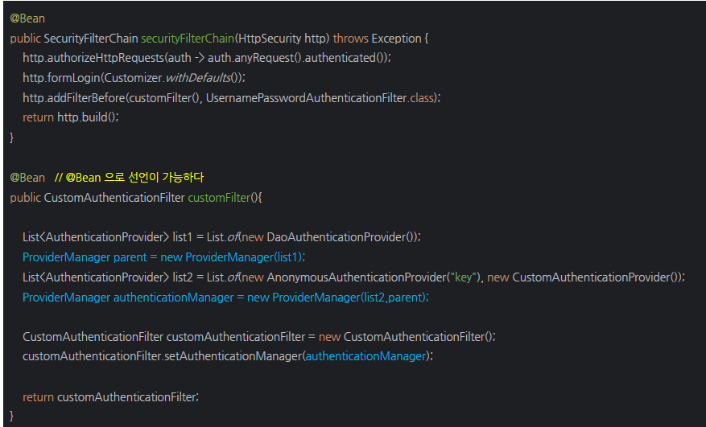

<nav>
    <a href="/#authentication-architecture" target="_blank">[Spring Security Core]</a>
</nav>

# 인증 관리자 - AuthenticationManager

---

## 1. AuthenticationManager
- 인증 필터로부터 AuthenticationManager 객체를 전달 받아 인증을 시도하며, 인증에 성공할 경우 사용자, 권한 등을 포함한 완전히 채워진
Authentication 객체를 반환한다.
- 직접 생성하는 방법도 있고, AuthenticationManagerBuilder를 통해 생성하는 방법도 있다.
- ProviderManager를 사용해서 관리하는 것이 제일 편하다.
  - AuthenticationManager의 기본 구현체
  - 여러 AuthenticationProvider 들을 관리하며 AuthenticationProvider 목록을 순차적으로 순회하면서 인증 요청을 처리한다.

---

## 2. AuthenticationManagerBuilder


- AuthenticationManager 객체(구현체 : ProviderManager) 를 생성하며, UserDetailsService 및 AuthenticationProvider 를 추가할 수 있다.
- HttpSecurity.getSharedObject(AuthenticationManagerBuilder.class) 를 통해 객체를 참조할 수 있다.
- 상속 구조
  - SecurityBuilder <- ProviderManagerBuilder <- AuthenticationManagerBuilder

---

## 3. AuthenticationManager 흐름도


- AuthenticationManager에게 인증이 위임처리가 위임된다.
  - 주어진 Authentication(미인증 객체)에 대해 인증하고 인증된 Authentication을 반환할 책임을 가진다.
- AuthenticationManager의 구현체인 ProviderManager는 내부적으로 parent와 AuthenticationProvider 목록을 가지고 있다.
- 목록을 순서대로 순회하면서 조건에 맞는(supports) Authentication을 찾고 찾았다면 인증을 위임한다.(인증이 됐다면 AuthenticationProvider에서 인증 완료된 Authentication 객체가 만들어진다.)
- 목록에서 supports되는 AuthenticationProvider를 발견하지 못 했다면 부모 AuthenticationManager에게 처리를 위임한다.(parent) 참고로 부모가 없거나 부모도 인증을 처리하지 못 했다면 `ProviderNotFoundException` 이 발생한다.
  - 부모도 ProviderManager일 수 있는데, 조건에 맞는 AuthenticationProvider를 찾을 때까지 그 조상까지 계속 위임된다.
- 인증에 성공하면
    - 기본적으로 `eraseCredentialsAfterAuthentication`  옵션이 활성화되어 있는데, 이에 따라 인증 객체의 Credentials 정보를 지운다.
    - 결과를 반환한다.
- 인증에 실패하면 예외가 바깥쪽 필터에 전파된다.

---

## 4. AuthenticationManager 초기화 과정 이해

### 4.1 자동설정 : 기본 AuthenticationManagerBuilder
```java
@AutoConfiguration(before = UserDetailsServiceAutoConfiguration.class)
@ConditionalOnClass(DefaultAuthenticationEventPublisher.class)
@EnableConfigurationProperties(SecurityProperties.class)
@Import({ SpringBootWebSecurityConfiguration.class, SecurityDataConfiguration.class })
public class SecurityAutoConfiguration {
```
```java
@Configuration(proxyBeanMethods = false)
@ConditionalOnWebApplication(type = Type.SERVLET)
class SpringBootWebSecurityConfiguration {
    
    // 생략
    
	@Configuration(proxyBeanMethods = false)
	@ConditionalOnMissingBean(name = BeanIds.SPRING_SECURITY_FILTER_CHAIN)
	@ConditionalOnClass(EnableWebSecurity.class)
	@EnableWebSecurity
	static class WebSecurityEnablerConfiguration {

	}

}
```
```java
@Retention(RetentionPolicy.RUNTIME)
@Target(ElementType.TYPE)
@Documented
@Import({ WebSecurityConfiguration.class, SpringWebMvcImportSelector.class, OAuth2ImportSelector.class,
		HttpSecurityConfiguration.class })
@EnableGlobalAuthentication
public @interface EnableWebSecurity {
	boolean debug() default false;
}
```
```java
@Retention(RetentionPolicy.RUNTIME)
@Target(ElementType.TYPE)
@Documented
@Import(AuthenticationConfiguration.class)
public @interface EnableGlobalAuthentication {

}
```
- 스프링 부트 자동 설정 과정
- `SecurityAutoConfiguration` -> `SpringBootWebSecurityConfiguration` -> `@EnableWebSecurity` -> `@EnbleGlobalAuthentication` -> `@AuthenticationConfiguration`
```java
	@Bean
	public AuthenticationManagerBuilder authenticationManagerBuilder(ObjectPostProcessor<Object> objectPostProcessor,
			ApplicationContext context) {
		LazyPasswordEncoder defaultPasswordEncoder = new LazyPasswordEncoder(context);
		AuthenticationEventPublisher authenticationEventPublisher = getAuthenticationEventPublisher(context);
		DefaultPasswordEncoderAuthenticationManagerBuilder result = new DefaultPasswordEncoderAuthenticationManagerBuilder(
				objectPostProcessor, defaultPasswordEncoder);
		if (authenticationEventPublisher != null) {
			result.authenticationEventPublisher(authenticationEventPublisher);
		}
		return result;
	}
```
- 여기서 스프링 시큐리티의 기본 `authenticationManagerBuilder`가 빈으로 등록되어 있다.

### 4.2 HttpSecurityConfiguration - HttpSecurity
```java
@Bean(HTTPSECURITY_BEAN_NAME)
@Scope("prototype")
HttpSecurity httpSecurity() throws Exception {
    LazyPasswordEncoder passwordEncoder = new LazyPasswordEncoder(this.context);
    AuthenticationManagerBuilder authenticationBuilder = new DefaultPasswordEncoderAuthenticationManagerBuilder(
            this.objectPostProcessor, passwordEncoder);
    authenticationBuilder.parentAuthenticationManager(authenticationManager());
    authenticationBuilder.authenticationEventPublisher(getAuthenticationEventPublisher());
    HttpSecurity http = new HttpSecurity(this.objectPostProcessor, authenticationBuilder, createSharedObjects());
    
    // 생략
    
    return http;
}
```
```java
	private AuthenticationManager authenticationManager() throws Exception {
		return this.authenticationConfiguration.getAuthenticationManager();
	}
```
```java
// authenticationConfiguration.getAuthenticationManaver()
public AuthenticationManager getAuthenticationManager() throws Exception {
    if (this.authenticationManagerInitialized) {
        return this.authenticationManager;
    }
    AuthenticationManagerBuilder authBuilder = this.applicationContext.getBean(AuthenticationManagerBuilder.class);
    if (this.buildingAuthenticationManager.getAndSet(true)) {
        return new AuthenticationManagerDelegator(authBuilder);
    }
    for (GlobalAuthenticationConfigurerAdapter config : this.globalAuthConfigurers) {
        authBuilder.apply(config);
    }
    this.authenticationManager = authBuilder.build();
    if (this.authenticationManager == null) {
        this.authenticationManager = getAuthenticationManagerBean();
    }
    this.authenticationManagerInitialized = true;
    return this.authenticationManager;
}
```
- HttpSecurity 빈 생성 시점에, sharedObject로 'DefaultPasswordEncoderAuthenticationManagerBuilder'가 설정된다.
- 이 authenticationManagerBuilder는 해당 HttpSecuriry 생성 시점에 생성되고, 이것은 위에서 스프링 시큐리티가 등록한 기본 authenticationManagerBuilder 빈에 대해
`build()` 를 호출하여 AuthenticationManager를 만든 뒤 부모로 설정한다.
- 이후 `http.getSharedObject(AuthenticationManagerBuilder.class)` 를 통해 얻어지는 것은 부모가 아니라 여기서 정의된 AuthenticationManagerBuilder가 된다.
- 우리가 별달리 AuthenticationManager 설정을 하지 않는다면 이 AuthenticationManagerBuilder 를 통해 ProviderManager가 생성될 것이다.

### 4.3 정리 : AuthenticationManagerBuilder를 얻는 방법
- 스프링 시큐리티가 등록해 준 AuthenticationManagerBuilder 빈을 사용하는 방법 : 권장 x
  - HttpSecurity 생성 시점에 build가 한번 되었으므로 build 할 수 없다.
- HttpSecurity에 기본적으로 설정된 AuthenticationManagerBuilder를 getSharedObject 메서드를 통해 얻는 것이 좋다.

---

## 5. AuthenticationManager 설정 방법
- AuthenticationManager는 빈으로 등록되어 있지 않고, 우리가 커스텀 설정을 하여 스프링 빈으로 등록한다고 해서 이것이 바로 설정으로 반영되는 것이 아니다.
따라서 우리가 설정클래스에서 직접 설정을 지정해서 등록해야한다.
- AuthenticationManager 설정은 크게 두 방법이 존재한다.

### 5.1 HttpSecurity.sharedObject 를 통해 AuthenticationManagerBuilder를 가져와서 사용하는 방법
```kotlin
@EnableWebSecurity
@Configuration
class SecurityConfig {

    @Bean
    fun filterChain(http: HttpSecurity): SecurityFilterChain {
        val builder = http.getSharedObject(AuthenticationManagerBuilder::class.java)
        val myAuthenticationManager = builder.build()

        val mySecurityContextRepository = DelegatingSecurityContextRepository(RequestAttributeSecurityContextRepository(), HttpSessionSecurityContextRepository())

        http {
            authorizeHttpRequests {
                authorize("/api/login", permitAll)
                authorize(anyRequest, authenticated)
            }
            authenticationManager = myAuthenticationManager
            addFilterBefore<UsernamePasswordAuthenticationFilter>(customAuthenticationFilter(myAuthenticationManager, mySecurityContextRepository))
            securityContext {
                securityContextRepository = mySecurityContextRepository
            }
        }
        return http.build()
    }

    fun customAuthenticationFilter(authenticationManager: AuthenticationManager, securityContextRepository: SecurityContextRepository): CustomAuthenticationFilter {
        return CustomAuthenticationFilter(
            requestMatcher = AntPathRequestMatcher("/api/login", HttpMethod.GET.name()),
            authenticationManager = authenticationManager,
            securityContextRepository = securityContextRepository
        )
    }

}
```
- 주의할 점은 이 이후 authenticationManager를 통해 AuthenticationManager 객체를 다시 가져오려면 `.getObject()`를 통해 가져와야한다.
  - `build()`를 한 번 호출하고나서 다시 호출할 수 없다.

### 5.2 직접 생성하는 방법


- 직접 ProviderManager를 만들어서 사용하는 방법이다.


---
