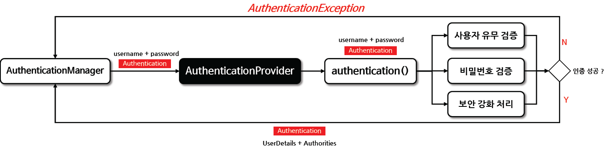
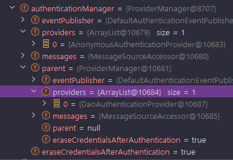
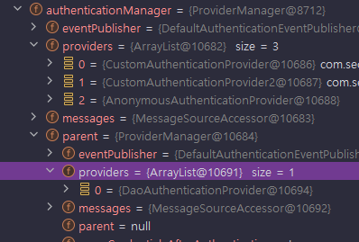
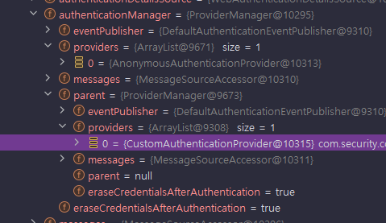
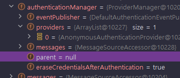

<nav>
    <a href="/#authentication-architecture" target="_blank">[Spring Security Core]</a>
</nav>

# 인증 제공자 - AuthenticationProvider

---

## 1. AuthenticationProvider
```java
public interface AuthenticationProvider {
	Authentication authenticate(Authentication authentication) throws AuthenticationException;
	boolean supports(Class<?> authentication);
}
```
- 사용자의 자격 증명을 확인하고 인증 과정을 관리하는 클래스로서 사용자가 시스템에 액세스하기 위해 제공한 정보(예: 아이디와 비밀번호)가 유효한지 검증하는 과정을 포함한다
-  다양한 유형의 인증 메커니즘을 지원할 수 있는데, 예를 들어 표준 사용자 이름과 비밀번호를 기반으로 한 인증, 토큰 기반 인증, 지문 인식 등을 처리할 수 있다.
- 성공적인 인증 후에는 Authentication 객체를 반환하며 이 객체에는 사용자의 신원 정보와 인증된 자격 증명을 포함한다
- 인증 과정 중에 문제가 발생한 경우 AuthenticationException 과 같은 예외를 발생시켜 문제를 알리는 역할을 한다.


---

## 2. AuthenticationProvider 흐름


- 기본적으로 AuthenticationManager는 인터페이스이고, ProviderManager가 기본 구현체이며 이 ProviderManager가 여러 AuthenticationProvider들을
목록으로 가지고 인증을 위임하는 형식이다.
- AuthenticationProvider는 전달받은 미인증 Authentication을 검증한 뒤 인증된 인증 객체를 반환할 책임을 가진다.


---

## 3. 실습 준비
```kotlin
package com.security.core.security.authentication.provider

import org.springframework.security.authentication.AuthenticationProvider
import org.springframework.security.authentication.UsernamePasswordAuthenticationToken
import org.springframework.security.core.Authentication
import org.springframework.security.core.authority.SimpleGrantedAuthority

class CustomAuthenticationProvider : AuthenticationProvider {

    override fun authenticate(authentication: Authentication): Authentication {
        val loginId = authentication.name
        val password = authentication.credentials as String

        // 아이디, 패스워드 검증 (생략)

        return UsernamePasswordAuthenticationToken.authenticated(loginId, null, listOf(SimpleGrantedAuthority("ROLE_USER")))
    }

    override fun supports(authentication: Class<*>): Boolean {
        return authentication.isAssignableFrom(UsernamePasswordAuthenticationToken::class.java)
    }
}
```
```kotlin
class CustomAuthenticationProvider2 : AuthenticationProvider {

    override fun authenticate(authentication: Authentication): Authentication {
        // 생략
        return UsernamePasswordAuthenticationToken.authenticated(loginId, null, listOf(SimpleGrantedAuthority("ROLE_USER")))
    }

    override fun supports(authentication: Class<*>): Boolean {
        return authentication.isAssignableFrom(UsernamePasswordAuthenticationToken::class.java)
    }
}

```
- 커스텀하게 구현한 AuthenticationProvider를 같은 코드로 두 개 만들었다.

---

## 4. AuthenticationProvider 사용 방법

### 4.1 설정 안 했을 때
```kotlin
@EnableWebSecurity
@Configuration
class SecurityConfig {

    // 설정 안 했을 때
    @Bean
    fun filterChain(http: HttpSecurity): SecurityFilterChain {
        http {
            authorizeHttpRequests {
                authorize(anyRequest, authenticated)
            }
            formLogin {  }
        }
        return http.build()
    }
}
```



- ProviderManager의 providers에는 HttpSecurity 기본 구성에 의해 AnonymousAuthenticationProvider 가 등록됨
- 부모 ProviderManager에는 DaoAuthenticationProvider가 등록되는데, 이는 AuthenticationConfiguration 클래스에서 생성되는 기본 사양이다.
  - ProviderManager 설정 과정에서 InitializeAuthenticationProviderBeanManagerConfigurer, InitializeUserDetailsBeanManagerConfigurer 가 개입하는데
  이 과정에서 별다른 설정을 안 했다면 InitializeUserDetailsBeanManagerConfigurer 설정 과정에서 DaoAuthenticationProvider가 설정된다.


### 4.2 일반 객체로 생성
```kotlin
package com.security.core.security.config

import com.security.core.security.authentication.provider.CustomAuthenticationProvider
import com.security.core.security.authentication.provider.CustomAuthenticationProvider2
import org.springframework.context.annotation.Bean
import org.springframework.context.annotation.Configuration
import org.springframework.security.config.annotation.authentication.builders.AuthenticationManagerBuilder
import org.springframework.security.config.annotation.web.builders.HttpSecurity
import org.springframework.security.config.annotation.web.configuration.EnableWebSecurity
import org.springframework.security.config.annotation.web.invoke
import org.springframework.security.web.SecurityFilterChain

@EnableWebSecurity
@Configuration
class SecurityConfig2 {

    // SharedObject에 등록된 AuthenticationManagerBuilder에 일반 객체 AuthenticationProvider를 지정할 경우
    @Bean
    fun filterChain(http: HttpSecurity): SecurityFilterChain {
        val managerBuilder = http.getSharedObject(AuthenticationManagerBuilder::class.java)

        // 같은 처리를 한다.
        managerBuilder.authenticationProvider(CustomAuthenticationProvider())
        http.authenticationProvider(CustomAuthenticationProvider2())

        http {
            authorizeHttpRequests {
                authorize(anyRequest, authenticated)
            }
            formLogin {  }
        }
        return http.build()
    }
}
/ AuthenticationProvider를 일반 객체로 생성해서 등록하는 방식
    @Bean
    fun filterChain(http: HttpSecurity, authenticationManagerBuilder: AuthenticationManagerBuilder): SecurityFilterChain {
        val builder = http.getSharedObject(AuthenticationManagerBuilder::class.java)
        builder.authenticationProvider(CustomAuthenticationProvider())
        builder.authenticationProvider(CustomAuthenticationProvider2())

        http {
            authorizeHttpRequests {
                authorize(anyRequest, authenticated)
            }
            formLogin {  }
        }
        return http.build()
    }
}
```



- AuthenticationProvider를 일반 객체로 생성해서, AuthenticationManagerBuilder에 설정하는 방법
- 이 경우, ProviderManager의 providers에는 우리가 설정한 두 개의 CustomAuthenticationProvider 1,2 가 설정되고 여기에 AnonymousAuthenticationProvider가 들어간다.
- 부모 ProviderManager 에는 위의 케이스와 마찬가지로 DaoAuthenticationProvider 가 등록된다.


### 4.3 빈으로 생성 - 1개
```kotlin
@EnableWebSecurity
@Configuration
class SecurityConfig3 {

    // CustomAuthenticationProvider를 스프링 빈으로 '1개' 등록할 경우
    @Bean
    fun filterChain(http: HttpSecurity): SecurityFilterChain {
        http {
            authorizeHttpRequests {
                authorize(anyRequest, authenticated)
            }
            formLogin {  }
        }
        return http.build()
    }

    @Bean
    fun customAuthenticationProvider(): CustomAuthenticationProvider {
        return CustomAuthenticationProvider()
    }
}
```




- AuthenticationProvider를 빈으로 정의하면 DaoAuthenticationProvider를 자동으로 대체하게 된다.
  - InitializeAuthenticationProviderBeanManagerConfigurer의 설정 작업 과정에서 AuthenticationProvider가 부모에게 설정된다.
  - 이후 InitializeUserDetailsBeanManagerConfigurer 클래스의 설정 과정에서, providers가 한 개라도 존재할 경우 설정이 진행되지 않아 부모쪽에 DaoAuthenticationProvider가 등록되지 않는다.


### 4.4 빈으로 생성 - 2개 이상
```kotlin
@EnableWebSecurity
@Configuration
class SecurityConfig4 {

    // CustomAuthenticationProvider를 스프링 빈으로 '2개' 등록할 경우
    @Bean
    fun filterChain(http: HttpSecurity): SecurityFilterChain {
        http {
            authorizeHttpRequests {
                authorize(anyRequest, authenticated)
            }
            formLogin {  }
        }
        return http.build()
    }

    @Bean
    fun customAuthenticationProvider(): CustomAuthenticationProvider {
        return CustomAuthenticationProvider()
    }

    @Bean
    fun customAuthenticationProvider2(): CustomAuthenticationProvider {
        return CustomAuthenticationProvider()
    }
}
```



- AuthenticationProvider 빈을 2개 이상 등록할 경우 부모 ProviderManager가 null 로 설정된다.
  - InitializeAuthenticationProviderBeanManagerConfigurer 에서 부모에게 설정할 AuthenticationProvider 를 결정하지 못 하고 null 을 반환
  - InitializeUserDetailsBeanManagerConfigurer 에서 UserDetailsService 빈 조회 과정에서 빈이 없어서 아무 설정도 하지 않는다.
    - `UserDetailsServiceAutoConfiguration` 설정 클래스는 스프링 빈으로 `AuthenticationManager.class, AuthenticationProvider.class, UserDetailsService.class, AuthenticationManagerResolver.class` 클래스가
    등록되어 있을 경우 UserDetailsService를 빈으로 등록하지 않기 때문이다.
  - 최종적으로 AuthenticationManagerBuilder쪽에 AuthenticationProvider가 아무것도 설정되지 않기 때문에 부모 ProviderManager가 null로 설정된다. 
- 따라서 2개 이상의 AuthenticationProvider를 빈으로 등록하려 한다면 sharedObject 설정을 통해 등록해야한다.

---

## 5. 개인적 생각
- AuthenticationProvider 를 빈으로 등록하고 위 동작을 디버거를 통해 살펴야하는 불편함이 존재한다.
- 인증 필터들은 AuthenticationManager를 의존하는데, 그 기본 구현체인 ProviderManager가 어떻게 설정되는 지를 개발자가 직접적으로 확인하기 어려워지는 문제가 발생한다.
- AuthenticationManager를 내가 커스텀하게 생성하고 설정으로 직접 지정하는게 제일 확실하다.

---
