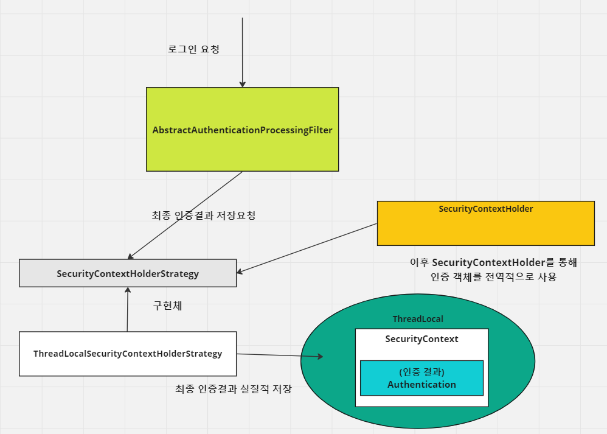
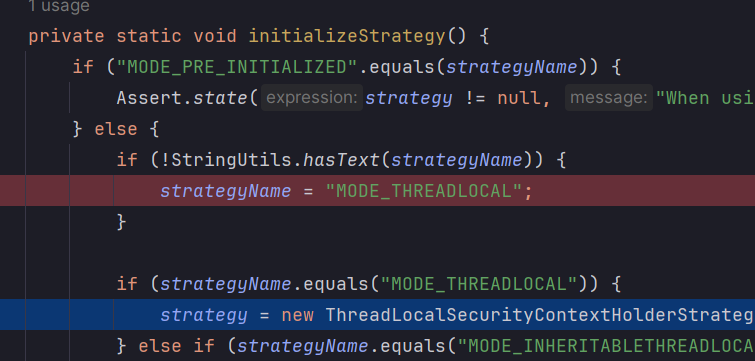
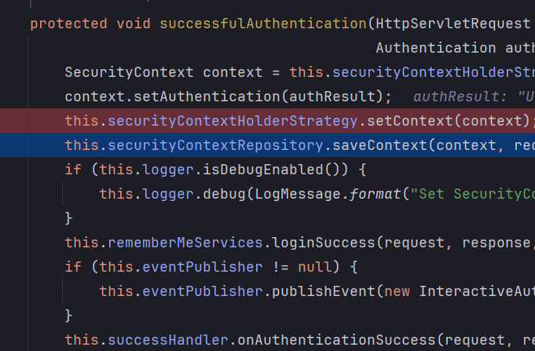
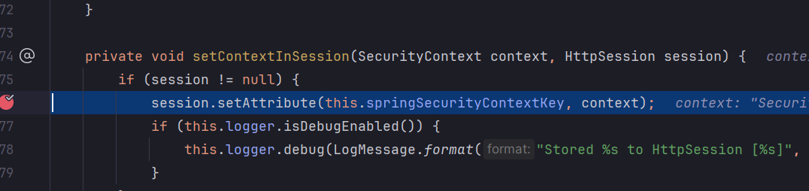
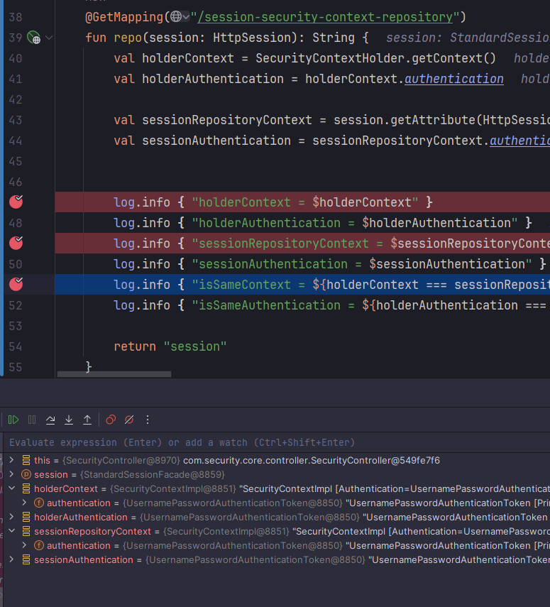
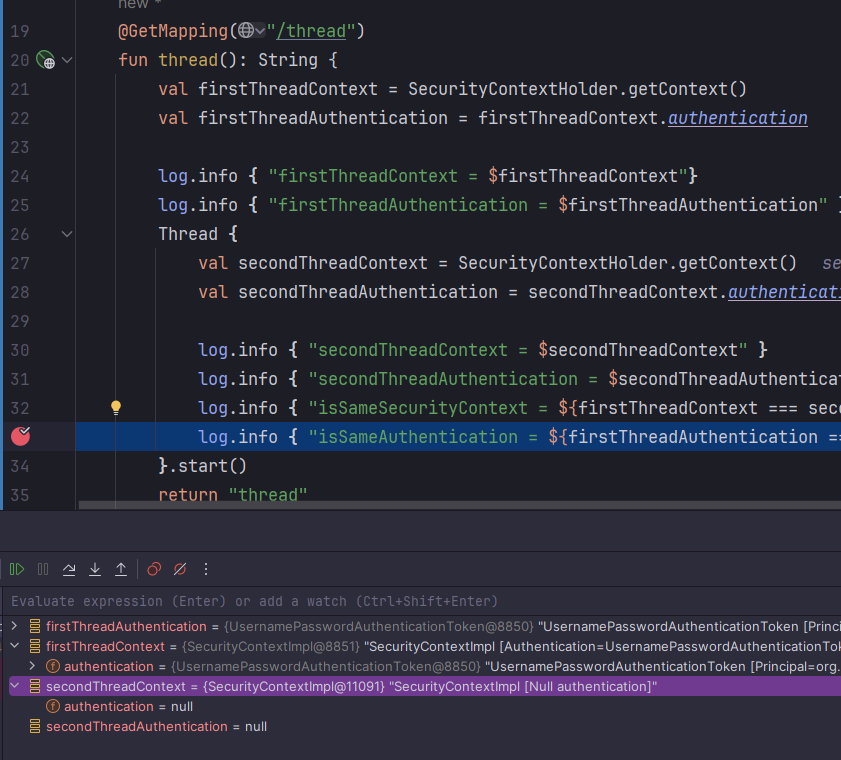
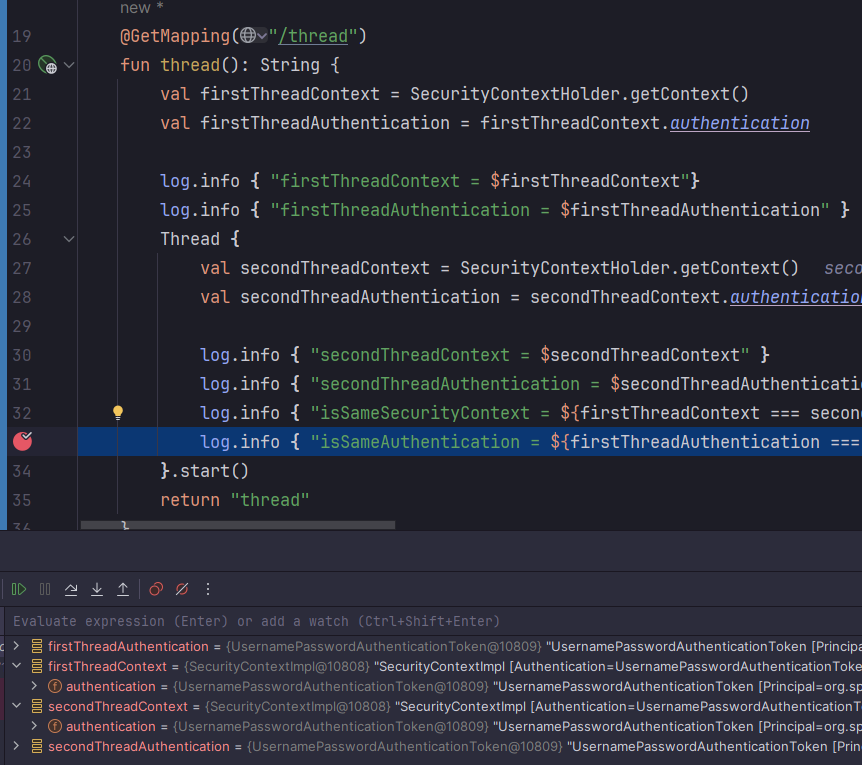

<nav>
    <a href="/#authentication-architecture" target="_blank">[Spring Security Core]</a>
</nav>

# 인증 컨텍스트 - SecurityContext, SecurityContextHolderStrategy, SecurityContextHolder

---

## 1. SecurityContext와 SecurityContextHolder

### 1.1 SecurityContext
- Authentication 객체가 저장되는 보관소로 필요 시 언제든지 Authentication 객체를 꺼내어 쓸 수 있도록 제공되는 클래스
- **밑에서 후술할 SecurityContextHolder 또는 HttpSession과 같은 전역 저장소에** **저장되어 아무 곳에서나 참조가 가능하도록 설계함**
- SecurityContext 안에 Authentication을 저장하고, Authentication 내부에는 User 객체가 저장된다.

### 1.2 SecurityContextHolder 및 SecurityContextHolderStrategy
```kotlin
val authentication = SecurityContextHolder.getContextHolderStrategy().context
```
```java
public class SecurityContextHolder {
		public static final String MODE_THREADLOCAL = "MODE_THREADLOCAL";
		public static final String MODE_INHERITABLETHREADLOCAL = "MODE_INHERITABLETHREADLOCAL";
		public static final String MODE_GLOBAL = "MODE_GLOBAL";
        private static SecurityContextHolderStrategy strategy;

		static {
			initialize();
		}

		private static void initialize() {
			initializeStrategy();
			initializeCount++;
		}

		private static void initializeStrategy() {
				if (MODE_PRE_INITIALIZED.equals(strategyName)) {
					Assert.state(strategy != null, "When using " + MODE_PRE_INITIALIZED
							+ ", setContextHolderStrategy must be called with the fully constructed strategy");
					return;
				}
				// 생성될 때 전달된 전략 이름으로 전략이 초기화
				if (!StringUtils.hasText(strategyName)) {
					// Set default
					strategyName = MODE_THREADLOCAL;
				}
				if (strategyName.equals(MODE_THREADLOCAL)) {
					strategy = new ThreadLocalSecurityContextHolderStrategy();
					return;
				}
				if (strategyName.equals(MODE_INHERITABLETHREADLOCAL)) {
					strategy = new InheritableThreadLocalSecurityContextHolderStrategy();
					return;
				}
				if (strategyName.equals(MODE_GLOBAL)) {
					strategy = new GlobalSecurityContextHolderStrategy();
					return;
				}
				// 생략
		}

		// 생략
}
```
- `SecurityContext`를 감싸서 저장하는 클래스
- SecurityContextHolrderStrategy: 객체 홀딩 전략
    - **`MODE_THREADLOCAL`** : 스레드당 SecurityContext 객체를 할당, 기본값
    - `MODE_INHERITABLETHREADLOCAL` : 부모 스레드와 자식 스레드에 관하여 동일한 SecurityContext 를 유지(다른 스레드를 호출할 때 공유)
    - `MODE_GLOBAL` : 응용 프로그램에서 단 하나의 SecurityContext를 저장한다.
        - 정적 필드를 모든 스레드에서 공유하게 됨
    - 처음 객체 생성시 설정의 `spring.security.strategy` 프로퍼티 값에 따라 전략이 초기화된다.
      값을 따로 설정하지 않았다면 `MODE_THREADLOCAL`이 전략으로 선택된다. 런타임에 이 전략은 동적으로 수정이 가능하다. (setStrategyName)
- 이 클래스를 통해 저장, 조회, 삭제가 요청되면 strategy에게 처리가 위임된다.
- `SecurityContextHolder.clearContext()` : SecurityContext 기존 정보 초기화

---

## 2. SecurityContextHolderStrategy 사용
- 참고: https://docs.spring.io/spring-security/reference/servlet/authentication/session-management.html#use-securitycontextholderstrategy

### 2.1 기존 방식
```java
SecurityContext context = SecurityContextHolder.createEmptyContext();
context.setAuthentication(authentication);
SecurityContextHolder.setContext(context);
```
- SecurityContextHolder 의 정적 메서드들은 여러 스레드에서 사용될 수 있다.
- 위 코드는 SecurityContextHolder를 통해 SecurityContext에 정적으로 접근할 때 여러 애플리케이션 컨텍스트가 SecurityContextHolderStrategy 를 지정하려고 할 때
여러 경쟁 조건을 발생시킬 수 있다.
  - 애플리케이션 내에서 여러 개의 애플리케이션 컨텍스트를 사용하는 경우

### 2.2 권장 방식
```java
SecurityContextHolderStrategy securityContextHolderStrategy = SecurityContextHolder.getContxtHolderStrategy();
SecurityContext context = securityContextHolderStrategy.createEmptyContext();
context.setAuthentication(authentication);
securityContextHolderStrategy.setContext(context);
```
- 애플리케이션이 SecurityContextHolder 내에 저장된 context로 정적으로 접근하는 대신, SecurityContextHolderStrategy 를 통해 얻어올 수 있게 한다.
- 각 애플리케이션 컨텍스트가 자신에게 가장 적합한 보안 전략을 사용할 수 있게된다.

---

## 3. SecurityContext 관리 흐름


AbstractAuthenticationProcessingFilter 기준
- 로그인에 실패하면 SecurityContextHolder의 컨텍스트를 초기화한다.
- 로그인에 성공하면
    - SecurityContextHolderStrategy를 통해 SecurityContext를 저장한다. 이 안에는 Authentication 객체가 저장되고 그 내부적으로는 UserDetails 등이 저장되어진다.
      기본적으로 ThreadLocal을 사용하는 전략이기 때문에 같은 스레드 요청 흐름내에서 전역적으로 꺼내서 사용할 수 있다.
    - SecurityContextHolder는 SecurityContextHolderStrategy를 알고 있다. 이후에는 SecurityContextHolder를 통해 인증 객체에 접근할 수 있다.
- 참고로 세션이 활성화되어 있을 경우, SecurityContextHolderRepository에도 저장된다. 장기 저장을 위한 컴포넌트인데 세션이 활성화됐다면
  세션에도 SecuriyContext가 보관된다. 이때 세션에 저장되는 SecurityContext의 key는 "SPRING_SECURITY_CONTEXT"(HttpSessionSecurityContextRepository.SPRING_SECURITY_CONTEXT_KEY)
  이다. SecurityContextRepository에 대해서는 뒤에서 자세히 다룬다.

---

## 4. 실습

### 4.1 컨트롤러 설정
```kotlin
@RestController
class HelloController {

    private val log = getLogger(javaClass)

    @GetMapping("/thread")
    fun thread(): String {
        val firstThreadContext = SecurityContextHolder.getContextHolderStrategy().context
        val firstThreadAuthentication = firstThreadContext.authentication

        log.info { "firstThreadContext = $firstThreadContext"}
        log.info { "firstThreadAuthentication = $firstThreadAuthentication" }
        Thread {
            val secondThreadContext = SecurityContextHolder.getContextHolderStrategy().context
            val secondThreadAuthentication = secondThreadContext.authentication

            log.info { "secondThreadContext = $secondThreadContext" }
            log.info { "secondThreadAuthentication = $secondThreadAuthentication" }
            log.info { "isSameSecurityContext = ${firstThreadContext === secondThreadContext }" }
            log.info { "isSameAuthentication = ${firstThreadAuthentication === secondThreadAuthentication }" }
        }.start()
        return "thread"
    }

    @GetMapping("/session-security-context-repository")
    fun repo(session: HttpSession): String {
        val holderContext = SecurityContextHolder.getContextHolderStrategy().context
        val holderAuthentication = holderContext.authentication

        val sessionRepositoryContext = session.getAttribute(HttpSessionSecurityContextRepository.SPRING_SECURITY_CONTEXT_KEY) as SecurityContext
        val sessionAuthentication = sessionRepositoryContext.authentication


        log.info { "holderContext = $holderContext" }
        log.info { "holderAuthentication = $holderAuthentication" }
        log.info { "sessionRepositoryContext = $sessionRepositoryContext" }
        log.info { "sessionAuthentication = $sessionAuthentication" }
        log.info { "isSameContext = ${holderContext === sessionRepositoryContext}" }
        log.info { "isSameAuthentication = ${holderAuthentication === sessionAuthentication}" }

        return "session"
    }

}
```
- `/thread` : SecurityContextHolderStrategy 에 따라 각 스레드별 SecurityContext, Authentication의 참조가 같은지 조회
- `/session-security-context-repository`: SecurityContextHolder에 저장된 컨텍스트와, HttpSession에 저장된 컨텍스트가 같은지 조회

### 4.2 설정
```kotlin
@EnableWebSecurity
@Configuration
class SecurityConfig {

    @Bean
    fun filterChain(http: HttpSecurity): SecurityFilterChain {
        http {
            authorizeHttpRequests { authorize(anyRequest, authenticated) }
            formLogin { }
        }
        return http.build()
    }

}
```
거의 모든 설정을 따르도록 함
- 모든 엔드포인트에 인증 요구
- 폼 로그인 활성화


### 4.3 디버깅



- 애플리케이션 로딩 과정에서 SecurityContextHolder의 기본 전략이 MODE_THREADLOCAL 로 설정된다.
    - 설정값이 따로 없으면 MODE_THREADLOCAL(-> ThreadLocalSecurityContextStrategy) 로 초기화된다.






- 폼 인증에 성공하면 AbstractAuthenticationProcessingFilter 에서 인증 성공 후속처리가 진행된다.
    - SecurityContext에 인증 객체를 담고, SecurityContextHolderStrategy를 통해 저장한다. SecurityContextHolder는 SecurityContextHolderStrategy를
      알고 있으므로, 이후부터는 해당 요청 사이클 내에서 SecurityContextHolder를 통해 SecurityContext 및 Authentication을 꺼내올 수 있다.
    - SecurityContextRepository에 SecurityContext를 저장한다.
        - 세션방식이므로 HttpSessionSecurityContextHolder를 통해 인증을 저장한다.
- 전역적으로 SecurityContextHolder를 통해 SecurityContext를 꺼내오고, 여기서 Authentication을 꺼내올 수 있게 됐다.



```shell
holderContext = SecurityContextImpl [Authentication=UsernamePasswordAuthenticationToken [Principal=org.springframework.security.core.userdetails.User [Username=user, Password=[PROTECTED], Enabled=true, AccountNonExpired=true, CredentialsNonExpired=true, AccountNonLocked=true, Granted Authorities=[]], Credentials=[PROTECTED], Authenticated=true, Details=WebAuthenticationDetails [RemoteIpAddress=0:0:0:0:0:0:0:1, SessionId=36F88572BBFA7C4D480A17A456ED96F7], Granted Authorities=[]]]
holderAuthentication = UsernamePasswordAuthenticationToken [Principal=org.springframework.security.core.userdetails.User [Username=user, Password=[PROTECTED], Enabled=true, AccountNonExpired=true, CredentialsNonExpired=true, AccountNonLocked=true, Granted Authorities=[]], Credentials=[PROTECTED], Authenticated=true, Details=WebAuthenticationDetails [RemoteIpAddress=0:0:0:0:0:0:0:1, SessionId=36F88572BBFA7C4D480A17A456ED96F7], Granted Authorities=[]]
sessionRepositoryContext = SecurityContextImpl [Authentication=UsernamePasswordAuthenticationToken [Principal=org.springframework.security.core.userdetails.User [Username=user, Password=[PROTECTED], Enabled=true, AccountNonExpired=true, CredentialsNonExpired=true, AccountNonLocked=true, Granted Authorities=[]], Credentials=[PROTECTED], Authenticated=true, Details=WebAuthenticationDetails [RemoteIpAddress=0:0:0:0:0:0:0:1, SessionId=36F88572BBFA7C4D480A17A456ED96F7], Granted Authorities=[]]]
sessionAuthentication = UsernamePasswordAuthenticationToken [Principal=org.springframework.security.core.userdetails.User [Username=user, Password=[PROTECTED], Enabled=true, AccountNonExpired=true, CredentialsNonExpired=true, AccountNonLocked=true, Granted Authorities=[]], Credentials=[PROTECTED], Authenticated=true, Details=WebAuthenticationDetails [RemoteIpAddress=0:0:0:0:0:0:0:1, SessionId=36F88572BBFA7C4D480A17A456ED96F7], Granted Authorities=[]]
isSameContext = true
isSameAuthentication = true
```

`/session-security-context-repository` 로 요청 후 로그인을 하였을 때,
- SecurityContextHolder 및 세션에 저장된 SecurityContext 를 조회하여 비교한다.
- 둘은 참조가 같은 것을 알 수 있다.



```shell
firstThreadContext = SecurityContextImpl [Authentication=UsernamePasswordAuthenticationToken [Principal=org.springframework.security.core.userdetails.User [Username=user, Password=[PROTECTED], Enabled=true, AccountNonExpired=true, CredentialsNonExpired=true, AccountNonLocked=true, Granted Authorities=[]], Credentials=[PROTECTED], Authenticated=true, Details=WebAuthenticationDetails [RemoteIpAddress=0:0:0:0:0:0:0:1, SessionId=36F88572BBFA7C4D480A17A456ED96F7], Granted Authorities=[]]]
firstThreadAuthentication = UsernamePasswordAuthenticationToken [Principal=org.springframework.security.core.userdetails.User [Username=user, Password=[PROTECTED], Enabled=true, AccountNonExpired=true, CredentialsNonExpired=true, AccountNonLocked=true, Granted Authorities=[]], Credentials=[PROTECTED], Authenticated=true, Details=WebAuthenticationDetails [RemoteIpAddress=0:0:0:0:0:0:0:1, SessionId=36F88572BBFA7C4D480A17A456ED96F7], Granted Authorities=[]]
secondThreadContext = SecurityContextImpl [Null authentication]
secondThreadAuthentication = null
isSameSecurityContext = false
isSameAuthentication = false
```

`/thread` 로 요청 후 로그인을 하였을 때
- 스레드1에서 스레드2를 만들고 각각 SecurityContextHolder를 통해 SecurityContext를 조회한다.
- 기본 SecurityContextHolderStrategy는 ThreadLocalContextHolderStrategy 라서, 파생된 스레드에서는 같은 SecurityContext를 사용하지 않고
  인증 객체 Authentication도 공유되지 않는다.

```kotlin
@Configuration
class SecurityConfig {

    @Bean
    fun filterChain(http: HttpSecurity): SecurityFilterChain {
        http {
            authorizeHttpRequests { authorize(anyRequest, authenticated) }
            formLogin { }
        }
        SecurityContextHolder.setStrategyName(SecurityContextHolder.MODE_INHERITABLETHREADLOCAL)
        return http.build()
    }

}
```
설정 클래스에서 SecurityContextHolderStrategyName 값을 SecurityContextHolder.MODE_INHERITABLETHREADLOCAL 로 변경해보자.



```shell
firstThreadContext = SecurityContextImpl [Authentication=UsernamePasswordAuthenticationToken [Principal=org.springframework.security.core.userdetails.User [Username=user, Password=[PROTECTED], Enabled=true, AccountNonExpired=true, CredentialsNonExpired=true, AccountNonLocked=true, Granted Authorities=[]], Credentials=[PROTECTED], Authenticated=true, Details=WebAuthenticationDetails [RemoteIpAddress=0:0:0:0:0:0:0:1, SessionId=7F6CFF16893CA4C8C68504E015CDA69A], Granted Authorities=[]]]
firstThreadAuthentication = UsernamePasswordAuthenticationToken [Principal=org.springframework.security.core.userdetails.User [Username=user, Password=[PROTECTED], Enabled=true, AccountNonExpired=true, CredentialsNonExpired=true, AccountNonLocked=true, Granted Authorities=[]], Credentials=[PROTECTED], Authenticated=true, Details=WebAuthenticationDetails [RemoteIpAddress=0:0:0:0:0:0:0:1, SessionId=7F6CFF16893CA4C8C68504E015CDA69A], Granted Authorities=[]]
secondThreadContext = SecurityContextImpl [Authentication=UsernamePasswordAuthenticationToken [Principal=org.springframework.security.core.userdetails.User [Username=user, Password=[PROTECTED], Enabled=true, AccountNonExpired=true, CredentialsNonExpired=true, AccountNonLocked=true, Granted Authorities=[]], Credentials=[PROTECTED], Authenticated=true, Details=WebAuthenticationDetails [RemoteIpAddress=0:0:0:0:0:0:0:1, SessionId=7F6CFF16893CA4C8C68504E015CDA69A], Granted Authorities=[]]]
secondThreadAuthentication = UsernamePasswordAuthenticationToken [Principal=org.springframework.security.core.userdetails.User [Username=user, Password=[PROTECTED], Enabled=true, AccountNonExpired=true, CredentialsNonExpired=true, AccountNonLocked=true, Granted Authorities=[]], Credentials=[PROTECTED], Authenticated=true, Details=WebAuthenticationDetails [RemoteIpAddress=0:0:0:0:0:0:0:1, SessionId=7F6CFF16893CA4C8C68504E015CDA69A], Granted Authorities=[]]
isSameSecurityContext = true
```
- 파생 스레드에서 SecurityContext 참조를 공유하게 됐고, Authentication 참조도 같은 것을 확인할 수 있다.

---
