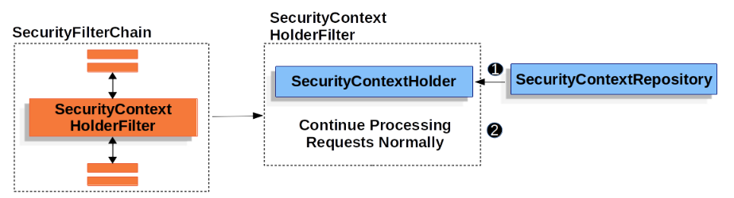
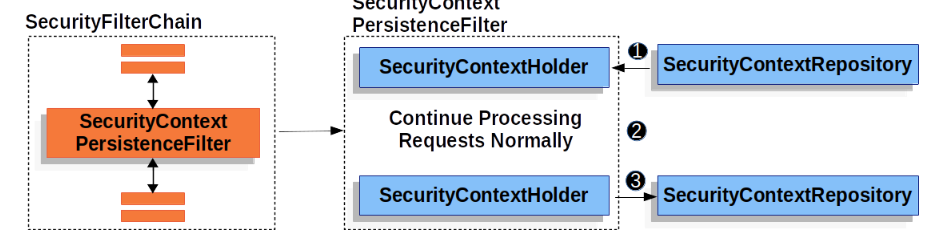
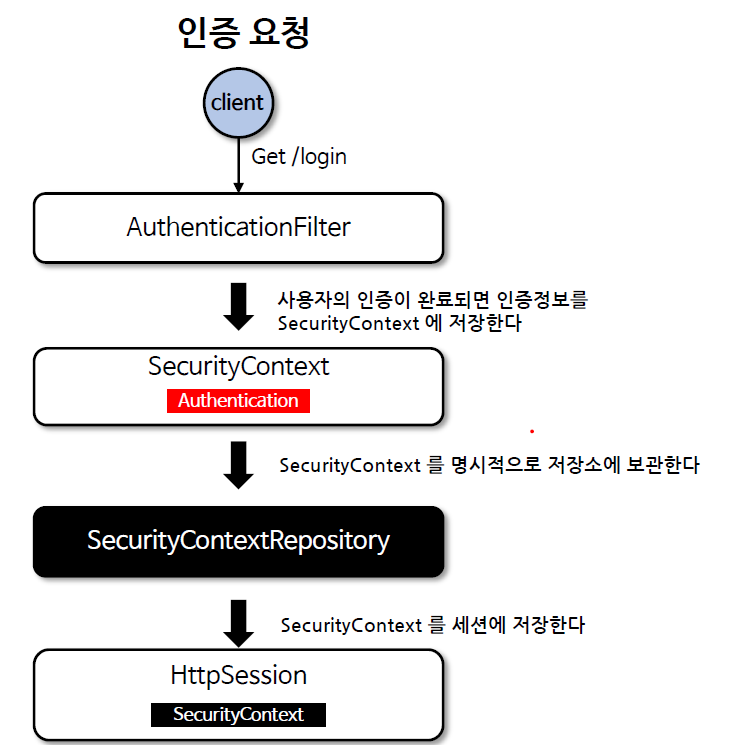
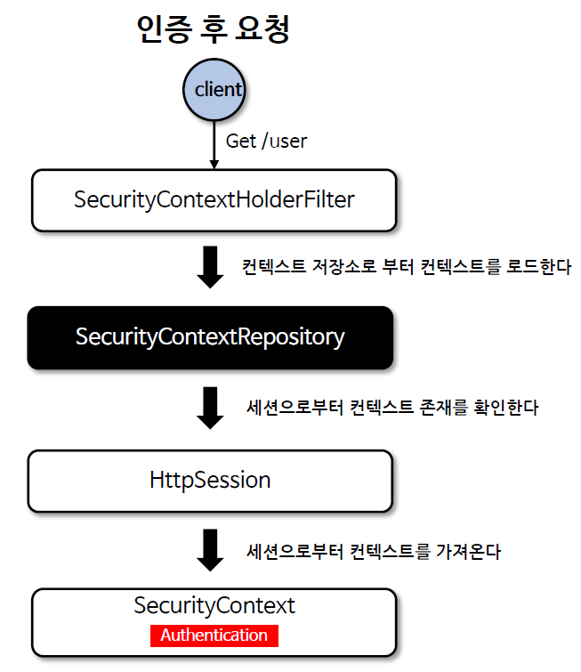
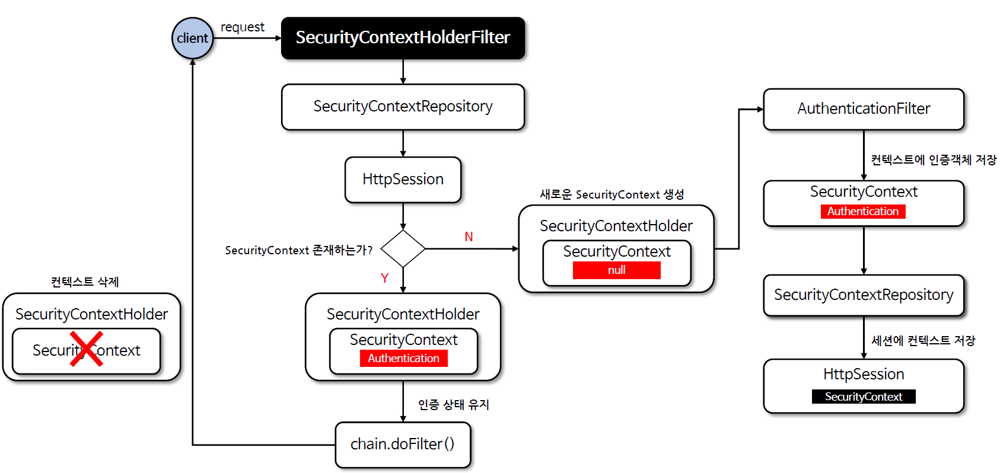

<nav>
    <a href="/#authentication-persistence" target="_blank">[Spring Security Core]</a>
</nav>


# SecurityContextRepository & SecurityContextHolderFilter

---

## 1. 자격증명을 서버에 저장?(Stateful, Stateless)
- 서버에 한 번 로그인을 하면 보통 서버는 클라이언트에게 인증을 위한 자격증명을 발급한다.
- 서버 입장에서는 크게 다음 두 가지 방법 중 한가지로 사용자에게 인증 정보를 전달하면 된다.
    - 세션방식 : 쿠키에 세션 id 를 담아서 사용자에게 전달
        - 이 경우 서버는 sessionId를 통해 세션을 조회해야하기 때문에 세션을 유지해야한다.(Stateful)
    - 토큰방식 : 쿠키에 jwt 토큰과 같은 토큰에 암호화된 “최소한의 사용자 정보”를 쿠키, 또는 담아 전달한다. 사용자는 매 인증마다 토큰을 전달하고 매번 인증을 거쳐야 한다.
        - 이 경우 서버는 인증 자체를 위해 상태를 유지할 필요는 없다.(Stateless)
- 서버 입장에서는 다양한 방식 중 하나로 사용자 정보를 저장, 조회, 삭제 가능해야한다.
    - 세션방식 : 인증에 필요한 사용자 정보를 서버에서 세션을 통해 유지해야한다.
    - 토큰방식 : 인증에 필요한 사용자 정보를 저장할 필요가 없다.
    - ...

---

## 2. SecurityContextRepository

### 2.1 개요
- 스프링 시큐리티에서 사용자가 인증을 한 이후 요청에 대해서 계속 사용자의 인증을 유지하기 위해 사용되는 클래스이다.
- 인증 상태의 영속 매커니즘은 사용자가 인증을 하게 되면 해당 사용자의 인증 정보와 권한이 SecurityContext에 저장되고 HttpSession 또는 토큰을 통해 영속이
이루어지는 방식이다.

### 2.2 인터페이스 사양
```java
public interface SecurityContextRepository {

	@Deprecated
	SecurityContext loadContext(HttpRequestResponseHolder requestResponseHolder);

	default DeferredSecurityContext loadDeferredContext(HttpServletRequest request) {
		Supplier<SecurityContext> supplier = () -> loadContext(new HttpRequestResponseHolder(request, null));
		return new SupplierDeferredSecurityContext(SingletonSupplier.of(supplier),
				SecurityContextHolder.getContextHolderStrategy());
	}

	void saveContext(SecurityContext context, HttpServletRequest request, HttpServletResponse response);
	boolean containsContext(HttpServletRequest request);

}
```
- 메서드
    - saveContext : SecurityContext를 저장
    - loadContext : 해당 요청에 대응하는 SecurityContext를 가져오는 클래스(**Deprecated**). 인증되지 않은 사용자에 대해서는 빈 컨텍스트를 반환해야함. null 반환 안 됨
    - loadDefferedContext : 해당 요청에 대응하는 지연SecurityContext(필요할 때 SecurityContext를 로딩하여 가져와서 성능향상을 하기 위함)를 조회
    - containsContext : 해당 요청에 대응하는 SecurityContext가 있는 지 여부 반환
- 주요 구현
    - HttpSessionSecurityContextRepository
    - NullSecurityContextRepository
    - RequestAttributeSecurityContextRepository
    - DelegatingSecurityContextRepository
- 기본 구현 :  DelegatingSecurityContextRepository
    - 이 클래스는 HttpSessionSecurityContextRepository, RequestAttributeSecurityContextRepository 순으로 요청을 위임한다.

### 2.3 HttpSessionSecurityContextRepository
- 세션에 SecurityContext를 save/load 하는 리포지토리
- **세션방식에서 주로 이 방식을 사용한다.**

### 2.4 NullSecurityContextRepository
- save를 해도 아무 것도 하지 않고, load를 하더라도 빈 SecurityContext를 반환하는 리포지토리
    - save: 아무것도 하지 않는다.
    - load : 빈 SecurityContext(emptyContext)를 생성해서 반환한다.
        - securityContextHolderStrategy.createEmptyContext()
- **토큰 방식의 경우 Stateless하므로, 따로 서버에서 SecurityContext를 지속적으로 세션과 같은 곳에 저장하지 않기 때문에 주로 이 방식을 사용한다.**

### 2.5 RequestAttributeSecurityContextRepository
- SecurityContext를 Request의 속성으로 저장하여 저장됨을 보장한다. 이렇게 함으로써, SecurityContext가 지워질 수 있는 디스패치 유형을 통해 발생하는 개별 요청에서도 반드시 SecurityContext를 사용할 수 있도록 한다.
- 예를 들어 클라이언트가 요청을 보내고 인증되고, 그런 다음 오류가 발생한다고 가정해 보자. 서블릿 컨테이너의 구현에 따라 오류가 WAS까지 전파되고 오류 디스패치가 발생한다. 오류 디스패치 과정에서 이전 요청과 관련된 보안 컨텍스트, 즉 SecurityContext가 지워질 수 있다. 이렇게 되버리면 오류 페이지가 보안 또는 현재 사용자 표시를 위해 SecurityContext를 사용할 수 없다. 그래서 SecurityContext를 반드시 요청 정보에 저장되도록 하기 위해 RequestAttributeSecurityContextRepository를 사용한다.
- 주로 DelegatingSecurityContextRepository 에서 반드시 하나 포함해서 같이 사용.

### 2.6 DelegatingSecurityContextRepository
- 여러 개의 SecurityContextRepository 구현체를 내부적으로 리스트로 가지고 있으며, 각각에게 위임한다. (컴포짓 패턴)

---
 
## 3. SecurityContextHolderFilter


- SecurityContextRepository를 통해 저장된 SecurityContext를 불러오는 역할
- 이미 저장된 사용자 정보를 가져올 수 있으면 빨리 가져오는게 좋으니, 이 필터는 SecurityFilterChain의 필터들 중에서 우선순위가 매우 높다. (기본적으로 1-3번째 쯤에 위치하게 된다.)
- 리포지토리에서 SecurityContext를 가져올 때 지연컨텍스트(DeferredSecurityContext) 를 가져온다. 그래서 내부 구현에서도 리포지토리에서 지연로딩해온다. (실제 로직에서 쓰일 때까지 생성을 연기)
- 요청이 끝나고 시큐리티 컨텍스트를 리포지토리에 저장하지 않는다. 이 부분은 다른 인증 필터에서 책임져야한다.
  - 이전 버전인 SecurityContextPersistenceFilter는 이 로직을 finally 구문에서 반드시 처리했었다

---

## 4. SecurityContextPersistenceFilter (deprecated)


```java
    chain.doFilter(holder.getRequest(), holder.getResponse());
    }
    finally {
        SecurityContext contextAfterChainExecution = this.securityContextHolderStrategy.getContext();
        // Crucial removal of SecurityContextHolder contents before anything else.
        this.securityContextHolderStrategy.clearContext();
        
        // 리포지토리에 save를 수행하는 작업도 함께 함
        this.repo.saveContext(contextAfterChainExecution, holder.getRequest(), holder.getResponse());
        request.removeAttribute(FILTER_APPLIED);
        this.logger.debug("Cleared SecurityContextHolder to complete request");
    }
```
- 예전 버전에서는 SecurityContextPersistenceFilter가 사용됐다.
- 하지만 즉시로딩을 사용하는 점, finally문에서 SecurityContextRepository 에 컨텍스트를 저장하는 점 때문에 Deprecated 됐다.
- 인증 정보를 장기적으로 저장할 것인 지의 책임을 각 인증 필터에서 자율적으로 수행하도록 하여 좀 더 나은 유연성을 제공하도록 한 것이다.

---

## 5. 인증 지속저장, 조회 흐름

### 5.1 인증 정보 장기 저장


- 예를 들면, 로그인 시 폼 로그인을 사용하여 UsernamePasswordAuthenticationFilter가 동작한다면, 로그인 인증을 수행하고
이 필터에서 SecurityContextRepository에 사용자 인증 정보(SecurityContext -> Authentication)를 장기적으로 보관한다.
- 세션을 사용한다면 이 과정에서 HttpSessionSecurityContextRepository를 사용하여 인증을 세션에 장기적으로 보관할 수 있다.

### 5.2 이후 요청에서 인증 정보 조회
`

- 사용자가 요청할 때마다 필터체인 초반부에 위치한 SecurityContextHolderFilter에서는 사용자 인증 정보를 SecurityContextRepository에서
조회를 시도한다.
- 조회에 성공하면 이 컨텍스트를 SecurityContextHolderStrategy를 통해 홀더에 보관하고 요청-응답 사이클에서 사용할 수 있게 한다.

---

## 6. SecurityContextHolderFilter 흐름


```java

	private void doFilter(HttpServletRequest request, HttpServletResponse response, FilterChain chain)
			throws ServletException, IOException {
        // 이 필터를 한번 통과했던 요청이면 그냥 통과시킨다.
		if (request.getAttribute(FILTER_APPLIED) != null) {
			chain.doFilter(request, response);
			return;
		}

        // 요청에 필터를 통과시켰다고 마킹한다.
		request.setAttribute(FILTER_APPLIED, Boolean.TRUE);

        // 시큐리티 컨텍스트를 지연로딩한다.(컨텍스트가 없으면 빈 시큐리티 컨텍스트가 이후 지연로딩될 것이다.)
		Supplier<SecurityContext> deferredContext = this.securityContextRepository.loadDeferredContext(request);
		try {
            // SecurityContextHolder에 지연 컨텍스트를 저장한다.
			this.securityContextHolderStrategy.setDeferredContext(deferredContext);
            
            // 요청을 통과시킨다.
			chain.doFilter(request, response);
		}
		finally {
            // 시큐리티 컨텍스트를 비운다.
			this.securityContextHolderStrategy.clearContext();

            // 요청에서 FILTER_APPLIED 속성을 지운다. 
			request.removeAttribute(FILTER_APPLIED);
		}
	}
```
- 이미 한번 통과됐던 요청이면 doFilter를 통해 통과된다.
- 현재 요청에 필터를 통과시켰다고 마킹한다.
- SecurityContextRepository에서 SecurityContext를 지연로딩한다.
    - 로딩의 경우, 시큐리티 컨텍스트를 찾지 못 했다면 빈 시큐리티컨텍스트가 지연로딩되도록 인터페이스 차원에서 구현 조건이 명세되어 있다. 아직 인증되지 않은 사용자들은 이 시점에 빈 시큐리티컨텍스트를 지연로딩하는 컨텍스트가 가져와진다.
    - 인증된 사용자는 인증 객체 담긴 지연 컨텍스트가 가져와진다.
- SecurityContextHolder에 지연 컨텍스트를 저장한다.
- doFilter를 통해 다음 필터로 통과시킨다.
    - 이후 필터에서 인증이 완료되면 인증된 Authentication이 발급되고 이를 SecurityContext에 담게 된다. SecurityContextHolderRepository에 SecurityContext가 저장되고, 다음에 요청이 올 때 이곳에서 찾아 사용하게 된다. SecurityContextHolder에도 이것이 저장된다.
    - AnonymousAuthenticationFilter까지 와서도 인증이 되지 않았다면 AnonymousAuthenticationToken이 발급되고 SecurityContextHolder의 SecurityContext에 저장된다.
    - 이후부터는 Authentication이 필요할 때마다 SecurityContextHolder를 통해 SecurityContext를 꺼내오고 여기서 Authentication을 꺼내게 된다.
- (최종 응답시 공통) doFilter가 반환되면
    - 시큐리티 컨텍스트를 비운다.(매우 중요)
    - 요청에서 FILTER_APPLIED 속성을 지운다.

---

## 7. 사용자별 인증 흐름
### 7.1 익명 사용자
- SecurityContextRepository 를 사용하여 새로운 SecurityContext 객체를 생성하여 SecurityContextHolder 에 저장 후 다음 필터로 전달
- AnonymousAuthenticationFilter 에서 AnonymousAuthenticationToken 객체를 SecurityContext 에 저장

### 7.2 로그인 사용자(필터에서 로그인을 처리 할 때)
- SecurityContextRepository 를 사용하여 새로운 SecurityContext 객체를 생성하여 SecurityContextHolder 에 저장 후 다음 필터로 전달
- UsernamePasswordAuthenticationFilter 에서 인증 성공 후 SecurityContext 에 UsernamePasswordAuthentication 객체를 SecurityContext 에 저장
- SecurityContextRepository 를 사용하여 HttpSession 에 SecurityContext 를 저장

### 7.3 로그인 후 요청
- SecurityContextRepository 를 사용하여 SecurityContext 꺼내어 SecurityContextHolder 에서 저장 후 다음 필터로 전달
- SecurityContext 안에 Authentication 객체가 존재하면 계속 인증을 유지한다

### 7.4 클라이언트 응답 시 공통
- SecurityContextHolder.clearContext() 로 컨텍스트를 삭제 한다 (스레드 풀의 스레드일 경우 반드시 필요)

---

## 8. securityContext API 및 커스텀 인증 필터 사용례

### 8.1 커스텀 필터
```kotlin
class CustomAuthenticationFilter(
    requestMatcher: RequestMatcher,
    authenticationManager: AuthenticationManager,
    securityContextRepository: SecurityContextRepository,
): AbstractAuthenticationProcessingFilter(
    requestMatcher, authenticationManager
) {

    init {
        super.setSecurityContextRepository(securityContextRepository)
    }

    override fun attemptAuthentication(request: HttpServletRequest, response: HttpServletResponse): Authentication {
        val username = request.getParameter("username")
        val password = request.getParameter("password")

        val token = UsernamePasswordAuthenticationToken.unauthenticated(username, password)
        return this.authenticationManager.authenticate(token)
    }
}
```
- AbstractAuthenticationProcessingFilter 를 상속하여 재사용
  - attemptAuthentication만 따로 구현하면 됨
  - 요청을 파싱하여 미인증 객체를 만든 뒤 AuthenticationManager에게 인증을 위임한다.
- 커스텀 AuthenticationFilter가 AbstractAuthenticationProcessingFilter를 상속한다면 SecurityContextRepository를 지정하는 코드를 작성해야한다.
  - AbstractAuthenticationProcessingFilter 는 RequestAttributeSecurityContextRepository를 기본값으로 사용하는데 이를 커스텀하게 설정해야한다.
- 커스텀 AuthenticationFilter가 AbstractAuthenticationProcessingFilter를 상속하지 않은 독자적 구현이라면, SecurityContextHolder 및 SecurityContextRepository에 사용자를 저장하는 기능을
  개발자가 명시적으로 작성해야한다.

### 8.2 설정 클래스
```kotlin
@EnableWebSecurity
@Configuration
class SecurityConfig {

    @Bean
    fun filterChain(http: HttpSecurity): SecurityFilterChain {
        val authenticationManagerBuilder = http.getSharedObject(AuthenticationManagerBuilder::class.java)
        val sharedAuthenticationManager = authenticationManagerBuilder.build()

        http {
            authorizeHttpRequests {
                authorize("/api/login", permitAll)
                authorize(anyRequest, authenticated)
            }
            formLogin {  }

            authenticationManager = sharedAuthenticationManager

            securityContext {
                securityContextRepository = securityContextRepository()

                // true -> holderfilter
                // false -> persistenceFilter (deprecated)
                requireExplicitSave = true
            }
            addFilterBefore<UsernamePasswordAuthenticationFilter>(customAuthenticationFilter(sharedAuthenticationManager))
        }
        return http.build()
    }

    fun customAuthenticationFilter(authenticationManager: AuthenticationManager): CustomAuthenticationFilter {
        return CustomAuthenticationFilter(
            requestMatcher = AntPathRequestMatcher("/api/login", HttpMethod.GET.name()),
            authenticationManager = authenticationManager,
            securityContextRepository = securityContextRepository()
        )
    }

    @Bean
    fun userDetailsService(): UserDetailsService {
        val user = User.withUsername("user").password("{noop}1111").roles("USER").build()
        return InMemoryUserDetailsManager(user)
    }

    @Bean
    fun securityContextRepository(): SecurityContextRepository {
        return DelegatingSecurityContextRepository(HttpSessionSecurityContextRepository(), RequestAttributeSecurityContextRepository())
    }
}
```
- securityContext 설정 메서드에서 SecurityContextRepository 및 requireExplicitSave 값을 설정할 수 있다.
  - securityContextRepository : SecurityContextRepository를 명시적으로 설정
  - requriresExplictSave : true로 전달하거나 null 로 전달하면 SecurityContextHolderFilter가 활성화되고(기본값), false를 전달할 경우 SecurityContextPersistenceFilter가 활성화된다.
- 커스텀 AuthenticationFilter를 설정하여 등록했다.

---
