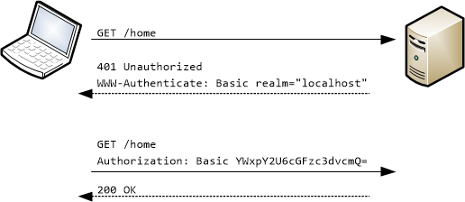
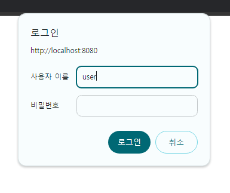
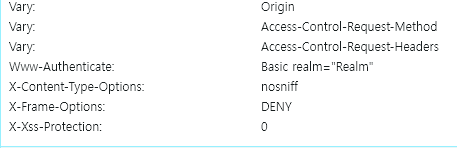
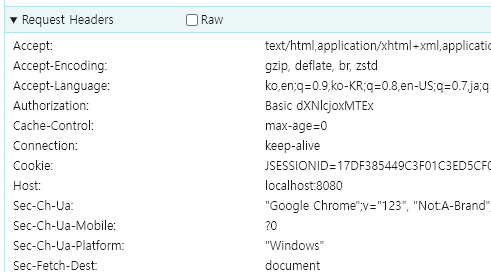

<nav>
    <a href="../../#authentication-process" target="_blank">[Spring Security Core]</a>
</nav>

# Basic 인증 - httpBasic()

---

## 1. HTTP Basic 인증


### 1.1 HttpBasic
- Http는 제공하는 액세즈 제어, 인증을 위한 프레임워크를 제공하는데 이들 중에서 가장 일반적인 방법은 “Basic” 인증 방식이다.
- RFC 7235 표준이며, 인증 프로토콜은 Http 인증 헤더에 기술되어 있다.
- 대부분의 브라우저는 HTTP Basic 인증을 지원한다.

### 1.2 흐름
1. 클라이언트는 인정 정보 없이 서버로 접속을 시도
2. 서버가 클라이언트에게 인증 요구를 보낼 때 401 Unauthorized 응답과 함께, WWW-Authenticate 헤더를 기술해서 realm(보안영역)과 Basic 인증 방법을 보냄
3. 클라이언트가 서버로 요청할 때마다 Base64로 Username과 password를 인코딩하고 Authorization 헤더에 담아서 요청
   - 한번 사용자가 입력한 값을 브라우저가 계속해서 헤더에 삽입해서 보내준다.
4. 성공적으로 완료되면 정상적인 상태코드를 반환

### 1.3 주의사항
- base64 인코딩은 매우 쉽게 디코딩 가능하므로, 인증 정보가 쉽게 노출됨
- 보안 상 취약하므로 반드시 Https와 같이, TLS 기술과 함께 사용해야 한다.

---

## 2. httpBasic() API
```kotlin
    @Bean
    fun securityFilterChain(http: HttpSecurity): SecurityFilterChain {
        http {
            authorizeHttpRequests {
                authorize(anyRequest, authenticated)
            }
            httpBasic {
                realmName = "security"
                authenticationEntryPoint = CustomAuthenticationEntryPoint("localhost")
            }
        }
        return http.build()
    }
```
- realmName : 보안이 적용되는 영역 이름을 설정한다
  - 기본값은 "Realm" 영역이다. 이는 BasicAuthenticationEntryPoint에 의해 이루어진다.
- authenticationEntryPoint : 인증 실패 시 호출되는 AuthenticationEntryPoint
  - 앞에서 realmName 설정을 하더라도 AuthenticationEntryPoint 가 커스텀하게 설정되어 있다면 무시되고 이것이 먼저 실행된다.

---

## 3. 실습
### 3.1 설정
```kotlin
@EnableWebSecurity
@Configuration
class SecurityConfig {

    @Bean
    fun securityFilterChain(http: HttpSecurity): SecurityFilterChain {
        http {
            authorizeHttpRequests {
                authorize(anyRequest, authenticated)
            }
            httpBasic {}
        }
        return http.build()
    }
}
```
- `http.httpBasic(...)`을 통해 Basic 관련 설정을 전달할 수 있다.
  - 이 설정과정을 거치면서 HttpBasicConfigurer가 HttpSecurity에게 전달되고, BasicAuthenticationFilter 가 구성된다.
- realmName을 지정할 수 있는데, AuthenticationEntryPoint 설정을 했다면 무시된다.

### 3.2 실행




- 루트 경로로 접속하면, 로그인되지 않았으므로 인가에 실패한다. ExceptionTranslationFilter에서 AuthenticationEntryPoint가 호출되는데
여기서 기본 구현체로 BasicAuthentication가 개입하여 HttpBasic 인증 관련 헤더가 필요하다는 헤더를 기입하여 전송한다.
  - `WWW-Authenticate: Basic realm="Realm"`
- 브라우저에서는 이 메시지를 받고 사용자에게 id, password를 입력하게 한다.



- 브라우저는 이후부터, 매 요청마다 Authorization 헤더를 통해 사용자의 id, password를 Base64 인코딩하여 함께 보내게 된다.
- BasicAuthenticationFilter에서 이 요청을 가로채고 매 요청마다 인증을 수행하게 된다.
- id, password가 올바르다면 정상적으로 서비스에 접속할 수 있다.

---
