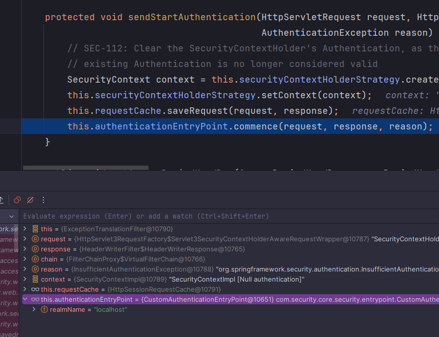
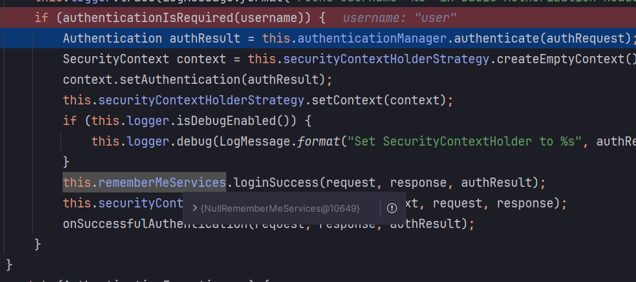

<nav>
    <a href="../../#authentication-process" target="_blank">[Spring Security Core]</a>
</nav>

# Basic 인증 필터 - BasicAuthenticationFilter

---

## 1. BasicAuthenticationFilter
- 이 필터는 Basic 인증 서비스를 제공하는 데 사용된다.
- BasicAuthenticationConverter를 사용해서, 요청 헤더에 기술된 인증 정보의 유효성을 체크하고, Base64 인코딩한 username, password를
추출한다.
- 세션을 사용하는 경우, 이 필터 앞에 있는 SecurityContextHolderFilter에서 인증이 거쳐지므로 여기서 인증과정을 거치지 않으나,
세션을 사용하지 않는 경우는 매 요청마다 인증과정을 거쳐야한다.
  - 보통 HttpBasic 인증 방식을 사용할 경우 세션을 사용하지 않고, 실제로도 세션을 사용하지 않는 것이 기본 구현이다.

---

## 2. 기본 흐름


- 인증 헤더 파싱 후 UsernameAuthenticationToken 생성(미인증)
  - 헤더 자체가 없을 경우 doFilter를 통해 다음 필터로 체이닝한다. 이후 AuthorizationFilter에서 인가 예외가 발생하고,
  ExceptionTranslationFilter에서 BasicAuthenticationEntryPoint 에 의해 "WWW-Authenticate" 헤더가 작성되어 응답된다.
  - 파싱 자체가 실패하면 인증 예외가 발생하고 아래의 인증 실패 흐름을 타게 된다.
- authenticationIsRequired : 인증 필요가 있는 지 검증
  - SecurityContextHolder에 이미 동명의 인증된 Authentication이 있으면 또 다시 인증할 필요가 없으므로 doFilter 호출하여 다음 필터로 체이닝
  - SecurityContextHolder에 동명의 인증된 Authentication이 없을 경우 인증 작업을 수행해야 함 
- AuthenticationManager에게 UsernamePasswordAuthenticationToken을 전달하여 인증을 수행
- 인증 성공
  - SecurityContextHolderStrategy : 요청-응답 사이클에서 사용되는 SecurityContext 저장
  - RememberMeServices.loginSuccess() : remember-me 설정했을 경우, 성공 후속처리를 위임
  - SecurityContextRepository : (설정했다면) 세션, 토큰 등에 SecurityContext 장기 저장
  - 다음 필터로 체이닝
- 인증 실패
  - SecurityContextHolderStrategy : 요청-응답 사이클에서 사용되는 SecurityContext 제거
  - RemeberMeServices.loginFail() : 로그인 실패를 RememberMeServices 에 알림
  - AuthenticationEntryPoint : 인증 실패 후속처리 -> BasicAuthenticationEntryPoint가 기본 구현체. 기본적으로 여기서 WWW-Authenticate를 보낸다.

---

## 3. 디버깅

### 3.1 최초 페이지 접속


```kotlin
class CustomAuthenticationEntryPoint(
    private val realmName: String
) : AuthenticationEntryPoint {

    override fun commence(
        request: HttpServletRequest,
        response: HttpServletResponse,
        authException: AuthenticationException
    ) {
        response.setHeader("WWW-Authenticate", "Basic realm=\"$realmName\"")
        response.sendError(HttpStatus.UNAUTHORIZED.value(), HttpStatus.UNAUTHORIZED.reasonPhrase)
    }
}
```
- 최초 접속 시에는 Authorization 헤더 자체가 요청에 포함되지 않았기 떄문에 BasicAuthenticationFilter에서 요청을 처리하지 않는다.
- AuthorizationFilter에서 인가 예외가 발생하고, ExceptionTranslationFilter에서 기본적으로 BasicAuthenticationEntryPoint 에 의해 "WWW-Authenticate" 헤더가 작성되어 응답된다.
  - CustomAuthenticationEntryPoint가 등록되어 있어서 이것이 실행된다.

### 3.2 로그인


- 브라우저는 `WWW-Authenticate: Basic realm="localhost"` 헤더를 읽고 사용자에게 id, password를 기입하게 한다.
- 이 값을 Base64 인코딩한 뒤 매 요청마다, Authorization 헤더에 담아 보낸다.

### 3.3 BasicAuthenticationFilter - BasicAuthenticationConverter 에서 헤더 파싱


- BasicAuthenticationFilter는 BasicAuthenticationConverter에게 Authorization 헤더 파싱을 위임한다.
  - id, password가 추출되고 이를 UsernameAuthenticationToken(미인증)에 담아 반환한다.

### 3.4 BasicAuthenticationFilter - 인증 필요 여부 확인


- 앞에서 파싱하여 가져온 Authentication의 사용자 이름과 같은 인증된 사용자가 SecurityContextHolder에 있는 지 확인한다.
- 우리는 인증을 하지 않았고 따로 세션, 쿠키 등에 인증 정보를 저장하지 않았으므로 인증이 있을 리 없다.
- BasicAuthenticationFilter는 사용자 요청에 대해 인증이 필요하다고 판단하고 인증을 시작한다.

### 3.5 BasicAuthenticationFilter - 인증 처리 시작


- AuthenticaionManager를 통해 인증 처리를 시작한다.
- 이후의 인증 흐름은 앞에서 배운 Form 로그인과 거의 유사하므로 자세히 다루지 않고 생략한다.
  - 인증 실패시 BasicAuthetnicationEntryPoint에게 위임해서 "WWW-Authenticate" 헤더를 작성하게 한다.

---
