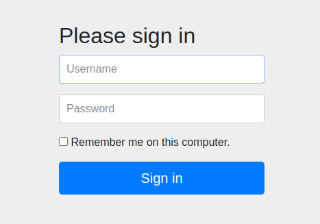

<nav>
    <a href="../../#authentication-process" target="_blank">[Spring Security Core]</a>
</nav>

# 기억하기 인증 - rememberMe()

---

## 1. RememberMe 인증



- 사용자가 웹 사이트나 애플리케이션에 로그인할 때 자동으로 인증 정보를 기억하는 기능
- 폼 로그인을 담당하는 UsernamePasswordAuthenticationFilter와 함께 사용되며, AbstractAuthenticationProcessingFilter 슈퍼 클래스에서 훅을 통해 구현됨
  - 로그인 인증 성공시, `RememberMeServices.loginSuccess()` 를 통해 RememberMe 토큰을 생성하고, 쿠키로 전달
  - 로그인 인증 실패시, `RememberMeServices.loginFail()` 를 통해 RememberMe 쿠키 지우기
  - LogoutFilter와 연계해서, 로그아웃 시 쿠키를 지움

---

## 2. RememberMeService
```java
public interface RememberMeServices {
    
	Authentication autoLogin(HttpServletRequest request, HttpServletResponse response);
    
	void loginFail(HttpServletRequest request, HttpServletResponse response);

	void loginSuccess(HttpServletRequest request, HttpServletResponse response,
			Authentication successfulAuthentication);

}
```
- 리멤버미 인증과 관련된 작업을 수행하는 역할
  - autoLogin: 요청, 응답 객체를 받아 리멤버미 인증을 수행하고 Authentication을 얻어온다.
  - loginSuccess : 로그인이 성공했을 때, 적절한 작업을 수행하게 한다.
  - loginFail: 로그인에 실패했을 때, 적절한 작업을 수행하게 한다.
- 구현체
  - NullAuthenticationServices : autoLogin에 대해서 null 을 반환하고, loginSuccess, loginFail 이 호출되도 아무 것도 안 함.
  - AbstractAuthenticationServices
    - 추상 골격 클래스.
    - TokenBasedRememberMeServices: 토큰을 브라우저에 저장해서 관리
    - PersistentTokenBasedRememberMeServices: 토큰을 발급하되, 인증에 필요한 사용자 정보를 별도의 저장소에 두고 관리(인메모리 또는 DB)
    - 여기서 두 구현 모두 사용자의 정보를 검색해오기 위해, UserDetailsService가 필요하다.

```text
base64(username+":"+algorithmName+":"algorithmHex(username+":"+expirationTime+":"+password+":"+key))
```
- 여기서 스프링 시큐리티는 기본 구현체로 `TokenBasedRememberMeServices`를 사용한다.
  - 암호화된 토큰을 생성하고, 쿠키에 담아 보낸 뒤 향후 RememberMeAuthenticationFilter에서 이 쿠키를 감지하여 자동 로그인이 이루어지는 방식으로 달성
- Base64 인코딩과 별도의 해시 알고리즘을 사용하여 암호화되어진다.
  - username: UserDetailsServices로 식별 가능한 사용자 이름
  - password : 검색된 UserDetails에 일치하는 비밀번호
  - expirationTime: remember-me 토큰이 만료되는 날짜와 시간, 밀리초로 표현
  - key: remember-me 토큰의 수정을 방지하기 위한 개인 키
  - algorithmName: remember-me 토큰 서명을 생성하고 검증하는 데 사용되는 알고리즘(기본적으로 SHA-256 알고리즘을 사용)


---

## 3. rememberMe() API 사용

### 3.1 설정
```kotlin
@EnableWebSecurity
@Configuration
class SecurityConfig(
  private val userDetailsService: UserDetailsService
) {

  @Bean
  fun filterChain(http: HttpSecurity): SecurityFilterChain {
    http {
      authorizeRequests {
        authorize(anyRequest, authenticated)
      }
      formLogin { }
      rememberMe {
        rememberMeParameter = "remember" // 파라미터명 : 기본 파라미터명은 remember-me
        rememberMeCookieName = "remember" // 기억하기(rememberMe) 인증을 위한 토큰을 저장하는 쿠키 이름. 기본은 "remember-me"이다.
        tokenValiditySeconds = 3600 // 토큰이 유효한 시간 : 초 단위 설정, 기본 값은 14일(2주)
        // alwaysRemember = true // 사용자가 기억하기를 활성화시키는 작업 없이도 항상 실행 (일반적으로 false)
        userDetailsService = userDetailsService() // 리멤버미 인증 작업에서 사용자 계정을 조회하는 작업 수행. 반드시 필요...
        key = "security" // 기억하기 인증을 위해 생성된 토큰을 식별하는 키 설정 -> 보통 환경설정파일에 숨겨서 관리
      }
    }
    return http.build()
  }

  private fun userDetailsService() = userDetailsService
}
```
- SecurityFilterChain 구성 시 RememberMe 설정을 할 수 있다.

### 결과
- 로그인 후 로그인 쿠키를 제거하더라도, 새로고침하면 다시 인증에 성공하고 로그인 쿠키가 재발급된다.

---
