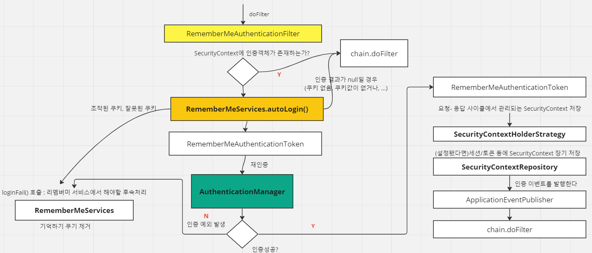

<nav>
    <a href="../../#authentication-process" target="_blank">[Spring Security Core]</a>
</nav>

# 기억하기 인증 필터 - RememberMeAuthenticationFilter

---

## RememberMeAuthenticationFilter

- SecurityContextHolderStrategy 를 통해 Authentication을 조회해오고, Authentication이 포함되지 않는 경우 실행되는 필터이다.
- Authentication이 존재하지 않는 경우 전달된 RememberMe 인증수단(토큰, ...)을 사용해 유효성을 검사하고, 토큰이 검증되면 자동 로그인 처리를 수행한다.
  - 앞서 로그인 과정에서 기억하기 인증이 활성화 되어 있었다면 이에 해당하는 RememberMe 인증 수단이 발급됐을 것이다. 이를 사용한다.
- 흐름
  - 필터에 요청이 들어오면, SecurityContextHolderStrategy 를 통해 SecurityContext를 가져오고, Authentication의 존재 여부를 확인한다.
  - Authentication이 있으면(앞에서 이미 인증이 완료됐다면) 다음 필터로 요청을 포워딩 시킨다.
  - RememberMeServices의 autoLogin을 호출하여 리멤버미 인증을 시도하고 Authentication을 얻어온다.
    - 이 결과가 null 일 경우, 아무 것도 안 하고 다음 필터로 위임한다.
  - Authentication을 얻어왔다면 AuthenticationManager를 통해 재인증을 시도한다.
  - 여기까지 인증 과정에서 성공했다면 성공 로직을 수행
    - SecurityContextHolderStrategy를 통해 SecurityContext에 Authentication에 인증 정보를 저장한다.
    - SecurityContextRepository에 SecurityContext를 저장한다.
    - ApplicationEventPublisher를 통해 인증 성공 이벤트를 발행한다.
  - 일련의 과정에서 인증에 실패했다면 실패 로직을 수행
    - RememberMeServices의 loginFail 메서드 호출
    - ...

---
