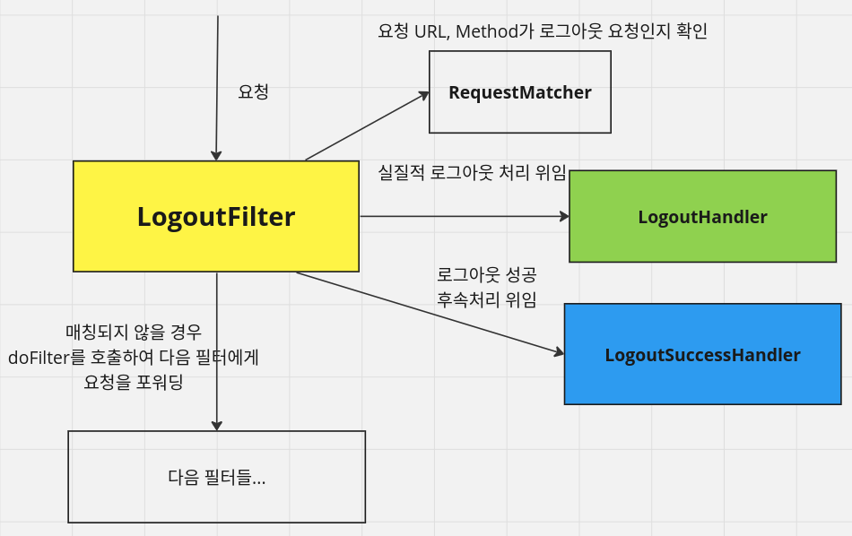
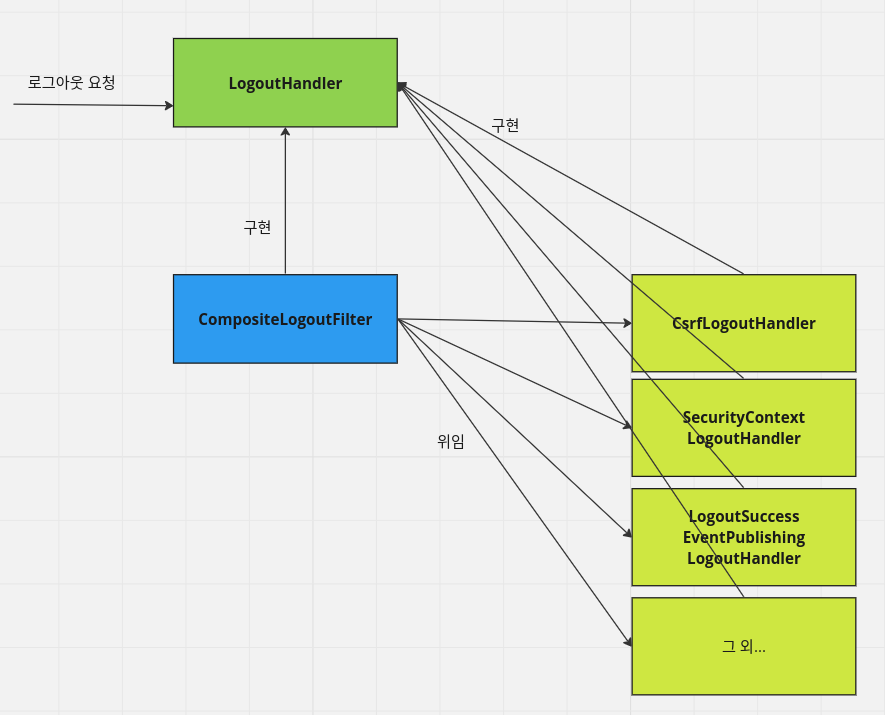

<nav>
    <a href="../../#authentication-process" target="_blank">[Spring Security Core]</a>
</nav>

# 로그아웃 - logout()

---

## 1. 로그아웃
- 스프링 시큐리티는 기본적으로 DefaultLogoutPageGeneratingFilter 를 통해 로그아웃 페이지를 제공하고, GET `/logout` URL로 접근 가능
- 로그아웃 실행은 기본적으로 POST `/logout` 으로만 가능하다.
- 아래 조건에 맞다면 GET, PUT, DELETE 모두 가능하다.
  - CSRF 기능을 비활성화하거나
  - RequestMatcher를 커스텀하게 지정했을 경우
- 로그아웃 필터를 않고 Spring MVC에서 커스텀하게 구현할 수 있으며 로그인 페이지가 커스텀하게 생성될 경우 로그아웃 기능도 커스텀하게 구현해야 한다.

## 2. 로그아웃 API
```kotlin
@EnableWebSecurity
@Configuration
class SecurityConfig {

    @Bean
    fun filterChain(http: HttpSecurity): SecurityFilterChain {
        http {
            authorizeHttpRequests {
                authorize("/logoutSuccess", permitAll)
                authorize(anyRequest, authenticated)
            }
            // csrf { disable() }
            logout {
                logoutUrl = "/logout" // 로그아웃 처리 URL(POST)
                logoutRequestMatcher = AntPathRequestMatcher("/logout", "POST")
                logoutSuccessUrl = "/login" // 로그아웃 성공 후 이동 페이지(successHandler 설정을 안 하면 이쪽으로 리다이렉트 되도록 함)
                addLogoutHandler(myLogoutHandler()) // 로그아웃 핸들러
                deleteCookies("JSESSIONID", "remember-me") // 로그아웃 후 쿠키 삭제
                invalidateHttpSession = true // HttpSession을 무효화해야하는 경우. true(기본값) , 그렇지 않을 경우 false
                clearAuthentication = true // 로그아웃 시 SecurityContextLogoutHandler가 인증(Authentication)을 삭제해야 하는지 여부를 명시 
                logoutSuccessHandler = logoutSuccessHandler() // 로그아웃 성공 후 핸들러
                permitAll = true // logoutUrl, RequestMatcher의 URL에 대해 모든 사용자의 접근 허용
            }
        }
        return http.build()
    }

    @Bean
    fun myLogoutHandler(): LogoutHandler {
        return LogoutHandler {request, response, authentication ->
            val session = request.session
            session?.invalidate()
            SecurityContextHolder.getContextHolderStrategy().context.authentication = null
            SecurityContextHolder.getContextHolderStrategy().clearContext()
        }
    }

    @Bean
    fun logoutSuccessHandler(): LogoutSuccessHandler {
        return LogoutSuccessHandler {request, response, authentication ->
            response.sendRedirect("/logoutSuccess")
        }
    }
}
```

## 3. 로그아웃 필터


- 로그아웃 로직을 수행하는 필터
- 요청 가로채기 : RequestMatcher를 통해 로그아웃 요청인지 확인한뒤, 요청이 로그아웃 요청이면 가로챈다.
  - 로그아웃 요청이 아닐 경우 doFilter 호출해서 다음 필터로 요청 포워딩
- 로그아웃 처리: LogoutHandler에게 실질적 로그아웃 처리를 위임(아래에서 설명)
- 로그아웃 성공처리: LogoutSuccessHandler에게 로그아웃 성공처리를 위임
  - 기본 구현체는 SimpleUrlLogoutSuccessHandler 인데, 로그아웃 성공 URL로 리다이렉트 시킨다.
  - 우리가 LogoutSuccessHandler를 등록하면 그것이 우선적으로 실행된다.

## 4. LogoutHandler


- 로그아웃 필터는 자신이 가진 LogoutHandler에게 실질적 로그아웃 처리를 위임한다고 했었다.
- LogoutHandler의 기본 구현체는 CompositeLogoutHandler인데, 이 핸들러는 내부적으로 다른 LogoutHandler 구현체들을 리스트로 가지고 있다.
- 리스트로 가지고 있는 LogoutHandler들을 차례로 호출하면서 로그아웃 과정에서 수행해야할 처리들을 위임한다.
- 대표적인 구현체
  - CsrfLogoutHandler : Csrf 관련 로그아웃 처리
  - SecurityContextLogoutHandler: SecurityContext 관련 로그아웃 처리
    - SecurityContextHolderStrategy
    - SecurityContextRepository
  - LogoutSuccessEventPublishingLogoutHandler: 로그아웃 성공 관련 이벤트 발행

---
