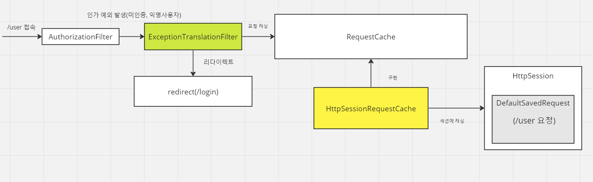
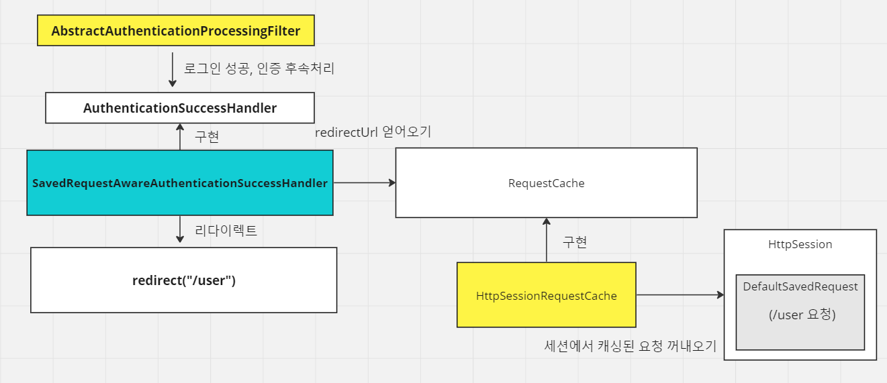
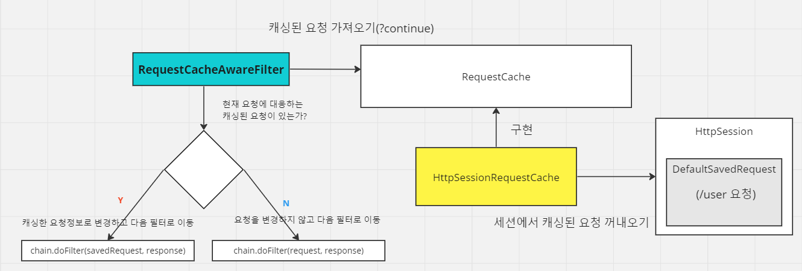

<nav>
    <a href="../..#authentication-process" target="_blank">[Spring Security Core]</a>
</nav>

# 요청 캐시 - RequestCache & SavedRequest


---

# 1. RequestCache
```java
public interface RequestCache {
	void saveRequest(HttpServletRequest request, HttpServletResponse response);
	SavedRequest getRequest(HttpServletRequest request, HttpServletResponse response);
	HttpServletRequest getMatchingRequest(HttpServletRequest request, HttpServletResponse response);
	void removeRequest(HttpServletRequest request, HttpServletResponse response);
}
```
- 사용자의 요청을 캐싱하는 역할
- 보통, 인증 절차 문제로 리다이렉트 된 이후에 이전에 했던 요청 정보를 담고 있는 'SavedRequest' 객체를 쿠키 혹은 세션에 저장하고
필요 시 다시 가져와 동일 요청을 실행할 수 있도록 하기 위해 사용

---

# 2. SavedRequest
```java
public interface SavedRequest extends java.io.Serializable {

	String getRedirectUrl();
	List<Cookie> getCookies();
	String getMethod();
	List<String> getHeaderValues(String name);
	Collection<String> getHeaderNames();
	List<Locale> getLocales();
	String[] getParameterValues(String name);
	Map<String, String[]> getParameterMap();
}
```
- 로그인 과 같은 인증 절차 후 사용자를 인증 이전의 원래 페이지로 안내할 수 있도록 요청과 관련된 여러 정보를 저장

---

# 3. RequestCache Api 설정
```kotlin
@EnableWebSecurity
@Configuration
class SecurityConfig {

    @Bean
    fun filterChain(http: HttpSecurity): SecurityFilterChain {
        val customRequestCache = HttpSessionRequestCache()
        customRequestCache.setMatchingRequestParameterName("customParam=y") // 특정 파라미터
        
        http {
            authorizeHttpRequests {
                authorize("/logoutSuccess", permitAll)
                authorize(anyRequest, authenticated)
            }
            formLogin {}
            requestCache {
                requestCache = customRequestCache
                // requestCache = NullRequestCache() : 요청을 저장하지 않고 싶을 때
            }
        }
        return http.build()
    }

}
```
- 커스텀 RequestCache를 지정 가능
    - 특정 파라미터를 조건으로 붙여 요청 캐싱을 꺼낼 지 결정하는 플래그로 쓸 수 있다.
    - 기본값은 "continue"인데, Spring MVC + Security 를 썼을 때 뒤에 `?continue`가 붙는게 이런 이유때문이다.
- NullRequestCache를 사용하면 요청 캐싱을 사용하지 않음

---

# 4. 최초 인증 실패 및 요청 캐싱 흐름


```java
private void doFilter(HttpServletRequest request, HttpServletResponse response, FilterChain chain)
			throws IOException, ServletException {
		try {
			chain.doFilter(request, response);
		}
		catch (IOException ex) {
			throw ex;
		}
		catch (Exception ex) {
			// Try to extract a SpringSecurityException from the stacktrace
			Throwable[] causeChain = this.throwableAnalyzer.determineCauseChain(ex);
			RuntimeException securityException = (AuthenticationException) this.throwableAnalyzer
					.getFirstThrowableOfType(AuthenticationException.class, causeChain);
			if (securityException == null) {
				securityException = (AccessDeniedException) this.throwableAnalyzer
						.getFirstThrowableOfType(AccessDeniedException.class, causeChain);
			}
			if (securityException == null) {
				rethrow(ex);
			}
			if (response.isCommitted()) {
				throw new ServletException("Unable to handle the Spring Security Exception "
						+ "because the response is already committed.", ex);
			}
			handleSpringSecurityException(request, response, chain, securityException);
		}
	}
```
```java
private void handleSpringSecurityException(HttpServletRequest request, HttpServletResponse response,
			FilterChain chain, RuntimeException exception) throws IOException, ServletException {
		if (exception instanceof AuthenticationException) {
			handleAuthenticationException(request, response, chain, (AuthenticationException) exception);
		}
		else if (exception instanceof AccessDeniedException) {
			handleAccessDeniedException(request, response, chain, (AccessDeniedException) exception);
		}
}
```
- 예외가 발생했을 때, 인증 예외/인가 예외를 handleSpringSecurityException 으로 넘긴다.
- 인증 예외가 발생했다면 handleAuthenticaitonException 메서드를, 인가 예외가 발생했다면 handleAccessDenidedException을 호출한다.

```java
private void handleAuthenticationException(HttpServletRequest request, HttpServletResponse response,
			FilterChain chain, AuthenticationException exception) throws ServletException, IOException {
		this.logger.trace("Sending to authentication entry point since authentication failed", exception);
		sendStartAuthentication(request, response, chain, exception);
}
```
```java
protected void sendStartAuthentication(HttpServletRequest request, HttpServletResponse response, FilterChain chain,
			AuthenticationException reason) throws ServletException, IOException {
		// SEC-112: Clear the SecurityContextHolder's Authentication, as the
		// existing Authentication is no longer considered valid
		SecurityContext context = this.securityContextHolderStrategy.createEmptyContext();
		this.securityContextHolderStrategy.setContext(context);
		this.requestCache.saveRequest(request, response);
		this.authenticationEntryPoint.commence(request, response, reason);
}
```
- 인증 예외가 발생했다면
    - 시큐리티 컨텍스트를 초기화한다.
    - requestCache에 현재 요청 정보를 캐싱한다.
    - AuthenticationEntryPoint를 호출하여 인증 예외 후속처리를 위임한다. (기본 구현 기준, 여기서 리다이렉트를 진행한다.)
- 익명사용자(AnonymouUser), 리멤버미 인증(RememberMe) 사용자의 인가 실패는 인증 예외로 변환되어 이곳에서 처리하도록 위임된다.
  - 이후 ExceptionTranslationFilter 를 다루는 부분에서 자세히 다룰 것이다.

---

# 5. 로그인 성공 후 캐싱 요청을 참고하여 리다이렉트 시키는 흐름


## 5.1 AbstractAuthenticationProcessingFilter
```java
	protected void successfulAuthentication(HttpServletRequest request, HttpServletResponse response, FilterChain chain,
			Authentication authResult) throws IOException, ServletException {
		// 생략
    
		this.successHandler.onAuthenticationSuccess(request, response, authResult);
	}
```
- 로그인 성공 시, AbstractAuthenticationFilter에서 AuthenticationSuccessHandler를 호출하여 인증 성공 후속처리를 위임


## 5.2 SavedRequestAwareAuthenticationSuccessHandler
```java
	@Override
	public void onAuthenticationSuccess(HttpServletRequest request, HttpServletResponse response,
			Authentication authentication) throws ServletException, IOException {
		SavedRequest savedRequest = this.requestCache.getRequest(request, response);
		if (savedRequest == null) {
			super.onAuthenticationSuccess(request, response, authentication);
			return;
		}
		String targetUrlParameter = getTargetUrlParameter();
		if (isAlwaysUseDefaultTargetUrl()
				|| (targetUrlParameter != null && StringUtils.hasText(request.getParameter(targetUrlParameter)))) {
			this.requestCache.removeRequest(request, response);
			super.onAuthenticationSuccess(request, response, authentication);
			return;
		}
		clearAuthenticationAttributes(request);
		// Use the DefaultSavedRequest URL
		String targetUrl = savedRequest.getRedirectUrl();
		getRedirectStrategy().sendRedirect(request, response, targetUrl);
	}
```
- 우리가 요청 캐싱을 활성화해뒀다면, SavedRequestAwareAuthenticationSuccessHandler가 로그인 성공 핸들러가 된다.
- SavedRequestAwareAuthenticationSuccessHandler 는 RequestCache를 알고 있다.
- RequestCache 에 현재 요청에 대응되는 캐싱된 요청을 통해 redirectUrl(최초 요청 경로) 을 얻어온다.
- 해당 경로로 리다이렉트 시킨다.

---

# 6. RequestCacheAwareFilter(캐싱 요청으로 포워딩)


```java
@Override
public void doFilter(ServletRequest request, ServletResponse response, FilterChain chain)
			throws IOException, ServletException {
		HttpServletRequest wrappedSavedRequest = this.requestCache.getMatchingRequest((HttpServletRequest) request,
				(HttpServletResponse) response);
		chain.doFilter((wrappedSavedRequest != null) ? wrappedSavedRequest : request, response);
}
```
- RequestCacheAwareFilter : 요청 캐시(RequestCache)를 알고 있는 필터
  - aware: 알고 있는
- RequestCache에 접근할 수 있으므로, 현재 요청 정보를 기반으로 겹치는 캐싱된 요청을 다시 불러올 수 있다.
  - HttpSessionRequestCache : 세션에 요청 정보를 캐싱한다.
- 캐싱된 요청이 현재 요청하는 요청이 겹치면 해당 요청으로 대체하여 doFilter를 호출하고, 그렇지 않으면 요청을 조작하지 않고 doFilter를 호출한다.

---
