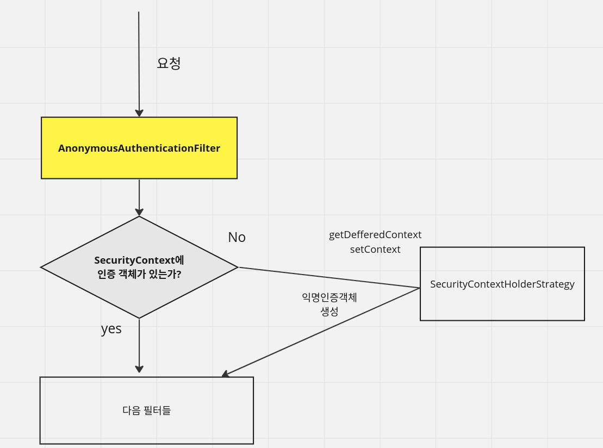

<nav>
    <a href="../../#authentication-process" target="_blank">[Spring Security Core]</a>
</nav>

# 익명 사용자 - anonymous()

---

## 1. 익명사용자 인증
- 스프링 시큐리티에서 **이 사람이 '익명 사용자(미인증 사용자)'임을 SecurityContext에 저장하기 위한 과정**
- 익명 인증필터는 인증받지 않은 사용자에게 익명 인증 객체를 만들어 전달해준다.
- 익명 인증 객체는 스프링 시큐리티에서 사용상 편의를 위해 만들어주는 것이다.
- 신분증은 발급받지만 아무 곳도 갈 수 없는 신분증이고, Null로 봐도 무방하다.
- 인증 사용자와, 익명 인증 사용자를 구분해서 사용자의 권한을 별도로 운영할 수 있다. 어떤 리소스에 대해서는 인증된 사용자가 접근할 수 없도록 구성도 가능하다.

---

## 2. AnonymousAuthenticationFilter

### 2.1 익명사용자 필터 개요
- 인증받지 않은 사용자를 위해 제공되는 필터
- **AnonymousAuthenticationFilter는 익명사용자의 Authentication을 null 로 취급하지 않기 위해 존재한다.**
- 인증을 받지 않는 사용자가 있다고 가정해보자. 그러면 이 사람은 인증 객체를 가지고 있지 않기 때문에 인증 객체가 있냐고 물어보면 항상 Null이라는 값을 보여줄 것이다. 그런데 이렇게 될 경우 Null Pointer Exception이 발생할 수 있다.
- 따라서 스프링 시큐리티는 인증되지 않은 사용자에게도 익명 인증 객체를 전달하면서 "인증 객체로 증명한다"라는 방식을 유지하려고 한다. 사실, 익명 인증객체라고 해서 뭔가 기능이 추가되지는 않는다. 익명 인증 객체는 어디에도 갈 수 없는 통행증을 얻은 것이나 다름 없다.

### 2.2 AnonymousAuthenticationFilter 흐름


익명 인증 필터는 다음과 같이 동작한다.
- 요청이 왔을 때, 인증 객체가 있는지 확인한다.
- 인증 객체가 있다면 : 인증받은 사용자기 때문에 다음 필터로 넘어간다.(`doFilter()`)
- 인증 객체가 없다면
    - 이 사용자는 이전 단계에서 인증을 받지 않았으므로 익명 사용자다.
    - 인증 방식을 통일하기 위해 인증 객체(`AnonymousAuthenticationToken`)를 생성한다.
    - 그리고 생성된 인증 객체를 SecurityContext에 넣어준다. 그리로 다음 필터로 넘어간다.

### 2.3 AnonymousAuthenticationToken
- 앞서 이야기한 것처럼 익명인증객체가 만들어진다고 하더라도 아무 소용이 없다. 왜냐하면 통행할 수 있는 곳이 아무곳도 없는 통행증이기 때문이다.
- Spring Security는 중요한 자원에 접근할 때 마다 인증이 되었는지를 확인하는데 이 때 `isAuthenticate()`를 이용해 계속 검사를 한다.
- 필터 체인 끝에 가서 익명 객체인 경우 최종적으로는 접근을 하지 못하게 된다.
- **말 그대로 익명 객체는 스레드 로컬에 있는 SecurityContext에만 저장하고 세션에는 저장하지 않는다.**
- 익명 사용자의 Authentication은 문자열 "anonymousUser" 이 저장되어 있는 principal과 ROLE_ANONYMOUS 권한 정보를 가지고 있다.
    - principal : “anonymousUser”
    - authorities : ROLE_ANONYMOUS

---

## 3. 익명 사용자 API

### 3.1 설정
```kotlin
@EnableWebSecurity
@Configuration
class SecurityConfig {

    @Bean
    fun filterChain(http: HttpSecurity): SecurityFilterChain {
        http {
            authorizeRequests {
                authorize("/anonymous", hasRole("GUEST")) // 익명사용자만 접근 가능
                authorize("/anonymousContext", permitAll)
                authorize("/authentication", permitAll)
                authorize(anyRequest, authenticated)
            }
            formLogin { }
            anonymous {
                principal = "guest"
                authorities = listOf(SimpleGrantedAuthority("ROLE_GUEST")) // 익명사용자에게 부여할 권한
            }
        }
        return http.build()
    }
}
```

### 3.2 코틀린 DSL
```kotlin
@SecurityMarker
class AnonymousDsl {
    var key: String? = null
    var principal: Any? = null
    var authorities: List<GrantedAuthority>? = null
    var authenticationProvider: AuthenticationProvider? = null
    var authenticationFilter: AnonymousAuthenticationFilter? = null

    private var disabled = false

    /**
     * Disable anonymous authentication
     */
    fun disable() {
        disabled = true
    }
}
```
Kotlin DSL의 지원을 받을 수 있다.
- key : 익명 인증을 위해 생성된 토큰을 식별하는 키
- principal : 익명 사용자의 Authentication 객체에 대한 주체
- authorities : 인증 결과 부여되는 권한 목록 설정
- authenticationProvider : 커스텀 AnonymousAuthenticationProvider 를 등록할 수 있다.
- authenticationFilter : 커스텀 AnonymousAuthenticationFilter를 등록할 수 있다.
- `disable()` : 익명 인증필터를 비활성화한다.

---

## 4. 익명사용자 인증 흐름 - 소스코드로 확인

### 4.1 AnonymousAuthenticationFilter 흐름
```java
@Override
public void doFilter(ServletRequest req, ServletResponse res, FilterChain chain)
		throws IOException, ServletException {

		Supplier<SecurityContext> deferredContext = this.securityContextHolderStrategy.getDeferredContext();
		this.securityContextHolderStrategy
				.setDeferredContext(defaultWithAnonymous((HttpServletRequest) req, deferredContext));
		chain.doFilter(req, res);

}

private Supplier<SecurityContext> defaultWithAnonymous(HttpServletRequest request,
			Supplier<SecurityContext> currentDeferredContext) {
		return SingletonSupplier.of(() -> {
			SecurityContext currentContext = currentDeferredContext.get();
			return defaultWithAnonymous(request, currentContext);
		});
}

private SecurityContext defaultWithAnonymous(HttpServletRequest request, SecurityContext currentContext) {
		Authentication currentAuthentication = currentContext.getAuthentication();
		
		// 인증객체가 없는 지 확인
		**if (currentAuthentication == null) {**
			Authentication anonymous = createAuthentication(request);
			if (this.logger.isTraceEnabled()) {
				this.logger.trace(LogMessage.of(() -> "Set SecurityContextHolder to " + anonymous));
			}
			else {
				this.logger.debug("Set SecurityContextHolder to anonymous SecurityContext");
			}
			SecurityContext anonymousContext = this.securityContextHolderStrategy.createEmptyContext();
			anonymousContext.setAuthentication(anonymous); // 익명인증토큰을 SecurityContext에 저장
			return anonymousContext;
		}
		else {
				// 생략
		}
		return currentContext;
}
```
- 익명 필터로 들어온다. 이 때, Security Context에 인증 객체가 있는지를 확인해본다.
- 인증 객체가 없는 경우 createAuthentication를 통해서 '익명 인증 객체'를 만들고 SecurityContext에 저장한다. 그리고 다음 필터로 넘어간다.

### 4.2 AuthorizationFilter
```java
		try {
			AuthorizationDecision decision = this.authorizationManager.check(this::getAuthentication, request);
			this.eventPublisher.publishAuthorizationEvent(this::getAuthentication, request, decision);
			if (decision != null && !decision.isGranted()) {
				throw new AccessDeniedException("Access Denied");
			}
			chain.doFilter(request, response);
		}
		finally {
			request.removeAttribute(alreadyFilteredAttributeName);
		}
```
- AuthorizationFilter에서 인가 작업을 수행
- 이 과정에서 익명사용자로 충분히 접근 불가능할 경우 예외가 발생(AccessDeniedException)

### 4.3 ExceptionTranslationFilter
```java
private void handleAccessDeniedException(HttpServletRequest request, HttpServletResponse response,
			FilterChain chain, AccessDeniedException exception) throws ServletException, IOException {
		Authentication authentication = this.securityContextHolderStrategy.getContext().getAuthentication();
		boolean isAnonymous = this.authenticationTrustResolver.isAnonymous(authentication);
		
		// 익명 사용자인 지 여부를 판단하는 로직
		if (isAnonymous || this.authenticationTrustResolver.isRememberMe(authentication)) {
			if (logger.isTraceEnabled()) {
				logger.trace(LogMessage.format("Sending %s to authentication entry point since access is denied",
						authentication), exception);
			}
			sendStartAuthentication(request, response, chain,
					new InsufficientAuthenticationException(
							this.messages.getMessage("ExceptionTranslationFilter.insufficientAuthentication",
									"Full authentication is required to access this resource")));
		}
		else {
				// 생략
		}
}
```
- Exception이 발생할 경우 ExceptionTranslationFilter로 넘어오게 되는데, 여기서 isAnonymous 등으로 실제로 익명인증 객체인지를 한번 더 확인을 해서 처리를 해준다.
- 익명 사용자에 대해 인가 예외가 발생했을 경우, 이곳에서는 예외를 인증 예외 처리 로직으로 위임한다.

---

## 5.1 Spring MVC에서 익명 인증 사용하기

### 5.1 익명사용자 Authentication 얻어오기?
```kotlin
@GetMapping("/authentication")
fun authentication(authentication: Authentication?): String {
    // 스프링 MVC가 HttpServletRequest 를 사용하여 파라미터를 해결하려 시도
    return if (authentication is AnonymousAuthenticationToken) {
        "anonymous"
    } else {
        // 익명사용자일 경우, 여기서 전달되는 Authentication은 null이다.
        "null"
    }
}
```
- 컨트롤러에서 Authentication을 파라미터로 받을 경우 스프링 MVC가 HttpServletRequest를 사용하여 파라미터를 해결하려 시도한다.
- 이 결과 익명사용자에 대한 Authentication은 null 이 되고, 정확하게 우리가 원한 결과가 아니게 된다.

### 5.2 `@CurrentSecurityContext`
```kotlin

    @GetMapping("/anonymousContext")
    fun anonymousContext(@CurrentSecurityContext context: SecurityContext): String {
        // SecurityCOntext를 얻어옴. 이 과정에서 CurrentSecurityContextArgumentResolver가 요청을 가로채서 처리한다.
        return context.authentication.name
    }
```
- 익명 요청에서 Authentication 을 얻고 싶다면 `@CurrentSecurityContext`를 사용하면 된다.
- CurrentSecurityContextArgumentResolver에서 요청을 가로채어 처리한다.

---

## 6. 참고 - Thymeleaf
- Thymeleaf 와 연동하여, 화면에서 인증 여부를 구현할 때 isAnonymous() 와 isAuthenticated() 로 구분해서 사용할 수 있다.
  - https://yenjjun187.tistory.com/694

---
