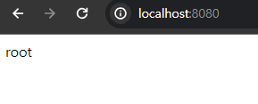

<nav>
    <a href="../../#authentication-process" target="_blank">[Spring Security Core]</a>
</nav>

# 폼 인증 - `formLogin()`

---

## 1. form 인증
- Http 기반의 폼 로그인 인증 메커니즘을 활성화하는 API
- 기본적으로 스프링 시큐리티가 제공하는 기본 로그인 페이지를 사용하며, 사용자 이름과 비밀번호 필드가 포함된 간단한
로그인 방식을 제공한다.
- 사용자는 웹 폼을 통해, 자격 증명(사용자 이름)을 제공하고 Spring Security는 HttpServeletRequest에서 이 값을 읽어온다.

---

## 2. form 인증 흐름

### 2.1 권한 없는 사용자의 요청을 로그인 페이지로 리다이렉트
- 사용자는 특정 url로 요청을 보낸다.
- 권한검사 필터(AuthorizationFilter)에서 인가 예외(AccessDeniedException) 발생
- 예외처리 필터(ExceptionTranslationFilte)에서 인증 실패 후속처리를 위해 AuthenticationEntryPoint 호출
- 이 때 기본 AuthenticationEntryPoint 는 사용자를 로그인 페이지로 리다이렉트 시킨다.

### 2.2 디폴트 로그인페이지
- 스프링 시큐리티 폼 로그인 설정이 활성화되면 기본적으로 스프링 시큐리티는 기본 로그인 페이지를 렌더링해준다.
- 이 과정에서 DefaultLoginPageGeneratingFilter 가 기본 페이지를 html을 응답으로 제공해준다.

### 2.3 로그인 페이지
- 브라우저는 html을 받고 렌더링한다.
- 사용자는 로그인 페이지를 통해 id, password 를 작성하고 서버에 로그인 요청을 보낸다.

### 2.4 로그인 처리
- 스프링 시큐리티 폼 로그인 설정이 활성화되면 서버의 UsernamePasswordFilter가 이 요청을 가로채고 로그인을
처리한다.

---

## 3. formLogin Api
- HttpSecurity의 `formLogin(...)` 메서드에 FormLoginConfigurer 설정 클래스 객체를 전달하여 커스텀하게
formLogin 설정을 할 수 있다.
  - 기본값: `Customizer.withDefaults<HttpSecurity>()` 전달하기
- 이 결과, 내부적으로 UsernamePasswordAuthenticationFilter가 생성되어 폼 방식의 인증 처리를 담당하게 된다.
- 주요 Api
  - `loginPage(...)` : 사용자 정의 로그인 페이지로 전환. 기본 로그인 페이지 무시. 
  - `loginProcessingUrl(...)` : 사용자 이름과 비밀번호를 검증할 URL 지정 (form action 지정)
  - `defaultSuccessUrl("/xxx", [alwaysUse])` : 로그인 성공 이후 이동할 페이지. alwaysUse가 true이면 무조건 지정 위치로 이동(기본은 false)
  - `failureUrl("/xxx")` : 인증 실패 시 보내질 URL 지정. 기본 값은 "/login?error"이다.
  - `usernameParameter("username")` : 인증을 수행할 때 사용자 이름(아이디)을 찾기 위해 확인하는 HTTP 매개변수 설정. 기본값은 password
  - `passwordParameter("password")` : 인증을 수행할 때 비밀번호를 찾기 위해 확인하는 HTTP 매개변수 설정. 기본값은 password
  - `successHandler(AuthenticationSuccessHandler)` : 인증 성공시 사용할 AuthenticationSuccessHandler를 지정
  - `failureHandler(AuthenticationFailureHandler)` : 인증 실패 후속처리를 수행하는 AuthenticationFailure 지정. 기본값은 SimpleUrlAuthenticationFailureHandler 를 지정하여, "/login?error"로 리다이렉션
  - `permitAll()` : `failureUrl()`, `loginPage()`, `loginProcessingUrl()`에서 지정한 URL에 대한 모든 사용자의 접근 권한을 허용함

---

## 4. 실습을 위한 소스코드

### 4.1 컨트롤러
```kotlin
@RestController
class HelloController {

    @GetMapping("/")
    fun index(): String {
        return "root"
    }

    @GetMapping("/home")
    fun home(): String {
        return "home"
    }

    @GetMapping("/loginPage")
    fun login(): String {
        return "loginPage"
    }
}
```

### 4.2 설정 클래스(자바, 코틀린 기본형)
```kotlin
@Configuration
class SecurityConfig {

    @Bean
    fun securityFilterChain(http: HttpSecurity): SecurityFilterChain {
        http
            .authorizeHttpRequests { auth -> auth.anyRequest().authenticated() }
            .formLogin { form ->
                form
                    .loginPage("/loginPage")
                    .loginProcessingUrl("/loginProc")
                    .defaultSuccessUrl("/", true)
                    .failureUrl("/failed")
                    .usernameParameter("userId")
                    .passwordParameter("passwd")
                    .successHandler { request, response, authentication ->
                        println("authentication: ${authentication.name}")
                        response.sendRedirect("/home")
                    }
                    .failureHandler { request, response, authenticationException ->
                        println("exception: ${authenticationException.message}")
                        response.sendRedirect("/login")
                    }
                    .permitAll()
            }
        return http.build()
    }
}
```

### 4.3 코틀린 DSL
```kotlin
@EnableWebSecurity
@Configuration
class SecurityConfig {

    @Bean
    fun securityFilterChain(http: HttpSecurity): SecurityFilterChain {
        http {
            authorizeHttpRequests {
                authorize(anyRequest, authenticated)
            }
            formLogin {
                loginPage = "/loginPage"
                loginProcessingUrl = "/loginProc"
                defaultSuccessUrl("/", true)
                failureUrl = "/failed"
                // usernameParameter, passwordParameter 설정 불가능
                authenticationSuccessHandler = AuthenticationSuccessHandler { request, response, authentication ->
                    println("authentication: ${authentication.name}")
                    response.sendRedirect("/home")
                }
                authenticationFailureHandler = AuthenticationFailureHandler { request, response, authenticationException ->
                    println("exception: ${authenticationException.message}")
                    response.sendRedirect("/login")
                }
                permitAll()
            }
        }
        return http.build()
    }
}
```
- 코틀린 DSL을 사용할 경우 usernameParameter, PasswordParameter 의 커스텀 설정은 불가능하다는 단점이 있다

---

## 5. 폼 로그인 관련 필터 구성

### `formLogin()`, `build()`


- SecurityFilterChain을 구성할 때 우리가 `formLogin()`을 통해 전달한 설정이 전달됨
- 이 설정값은 `HttpSecurit#build()`를 호출한 시점에 init, configure 과정을 거치면서 필터를 구성하고 HttpSecurity 객체에 연결된다.
  - 이 설정이 구체적으로 어떻게 되는지 확인하고 싶다면, FormLoginConfigure 의 init, 부모 클래스 AbstractAuthenticationFilterConfigurer 의 configurer 메서드를 확인하면 된다.

---

## 6. 실습

### 6.1 디폴트 로그인페이지 설정 실습
```kotlin
    @Bean
    fun securityFilterChain(http: HttpSecurity): SecurityFilterChain {
        http {
            authorizeHttpRequests {
                authorize(anyRequest, authenticated)
            }
        }
        http.formLogin { form ->
            form
                .loginPage("/loginPage")
                .loginProcessingUrl("/loginProc")
                .defaultSuccessUrl("/", true)
                .failureUrl("/failed")
                .usernameParameter("userId")
                .passwordParameter("passwd")
//                .successHandler { request, response, authentication ->
//                    println("authentication: ${authentication.name}")
//                    response.sendRedirect("/home")
//                }
//                .failureHandler { request, response, authenticationException ->
//                    println("exception: ${authenticationException.message}")
//                    response.sendRedirect("/login")
//                }
                .permitAll()
        }
        return http.build()
    }
```
- 디폴트 로그인 페이지를 지정하면 스프링 시큐리티의 디폴트 로그인 페이지 렌더링이 수행되지 않는다.
  - DefaultLoginPageGeneratingFilter가 작동하지 않음


- 루트 페이지로 접속시도하면 인증에 실패하고 우리가 커스텀하게 지정된 loginPage로 리다이렉트 된다

### 6.2 로그인 페이지 파라미터 변경 확인
```kotlin
//                .loginPage("/loginPage")
```
- `loginPage(...)` 에 대해 주석을 처리하고 다시 서버를 실행해보자.
  - `/login` 으로 리다이렉트, 디폴트 페이지 렌더링

- `http://localhost:8080/home` 으로 접근해보자.


- 로그인 페이지로 리다이렉트 되는데 하면 스프링 시큐리티에서 만들어준 디폴트 페이지가 렌더링된다.
- 관리자도구를 통해 소스코드를 열어보면 form의 action 및 사용자 이름/비밀번호 파라미터가 변경된 것을 확인할 수 있다

### 6.3 로그인 성공 시 루트로 이동됨


- 로그인에 성공하면 "/"로 리다이렉트된다.

```kotlin
//                .defaultSuccessUrl("/", true)
```


- 로그인 성공시 무조건 "/"로 이동하도록 설정했기 때문인데, 이 설정을 비활성화하면 처음 로그인 시도했던 경로로 리다이렉트된다.
  - 왜 처음 시도한 로그인 페이지로 리다이렉트 되는지에 관해서는 뒤에서 배울 RequestCache를 참고하자.
  - 여기서 `?continue` 는 캐싱된 최초 요청을 꺼내서 요청 객체를 변경할 수 있도록 넣은 플래그인데 뒤에서 함께 다룬다.

### 6.4 AuthenticationSuccessHandler, AuthenticationFailureHandler
```kotlin
        http.formLogin { form ->
            form
//                .loginPage("/loginPage")
                .loginProcessingUrl("/loginProc")
                .defaultSuccessUrl("/", true)
                .failureUrl("/failed")
                .usernameParameter("userId")
                .passwordParameter("passwd")
                .successHandler { request, response, authentication ->
                    println("authentication: ${authentication.name}")
                    response.sendRedirect("/home")
                }
                .failureHandler { request, response, authenticationException ->
                    println("exception: ${authenticationException.message}")
                    response.sendRedirect("/login")
                }
                .permitAll()
        }
```
- 이번에는 successHanlder, FailureHandler 주석을 해제해보자.


- 위 클래스에 대한 설정을 활성화하면 그 위에서 설정했던 인증 성공 후 이동 url, 인증 실패시 어떻게 할 것인지에 대한 전략은 사용되지 않고
successHandler, failureHandler 가 우선시된다.
- 이 두 클래스는 폼 로그인 인증 성공, 실패에 대한 후속처리를 담당할 책임을 가지며 스프링 시큐리티는 기본 successHandlder, failureHandler를 사용하지 않고
사용자가 등록시 이를 우선적으로 실행하게 된다.

---
