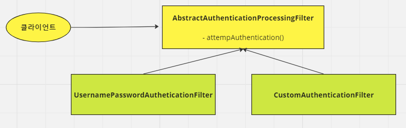

<nav>
    <a href="../../#authentication-process" target="_blank">[Spring Security Core]</a>
</nav>

# 폼 인증 필터 - UsernamePasswordAuthenticationFilter

---

## 1. 폼 로그인 필터 : UsernamePasswordAuthenticationFilter


- 스프링 시큐리티는 AbstractAuthenticationProcessingFilter 클래스를 사용자의 자격 증명을 인증하는 기본 필터로 사용
- UsernamePasswordAuthenticationFilter는 AbstractAuthenticationProcessingFilter 를 확장한 클래스로서, HttpServletRequest에서
제출한 사용자 이름과 비밀번호로부터 인증을 수행한다.
- 인증 프로세스가 초기화될 때 로그인 페이지와 로그아웃 페이지 생성을 위한 DefaultLoginPageGeneratingFilter 및 DefaultLogoutPageGeneratingFilter가 초기화됨
  - FormLoginConfigurer 참고

---

## 2. UsernamePasswordAuthenticationFilter 흐름도


- 기본적인 이 필터의 흐름은 다음과 같다
  - 요청 가로채기 : `RequestMatcher`에 매칭되는 요청이면 가로챈다. 아닐 경우 doFilter를 호출하여 다음 필터로 요청을 통과시킨다.
    - 기본적으로 `RequestMatcher`의 구현체는 POST 요청, /login 경로로 오는 요청일 경우 matches 메서드를 호출 시 true를 반환한다.
  - 인증: `AuthenticationManager`에게 인증을 위임한다. 인증에 성공하면 인증된 Authentication 객체가 반환된다.
  - 인증 성공: 인증에 성공할 경우 인증 성공 처리를 수행한다.
  - 인증 실패: 인증에 실패할 경우 예외가 발생하는데, 바깥의 try catch문을 통해 잡히고 인증 실패처리가 시작된다.

---

## 3. 인증 성공, 실패 후속처리

### 3.1 성공 후속처리
```java
this.sessionStrategy.onAuthentication(authenticationResult, request, response);
if (this.continueChainBeforeSuccessfulAuthentication) {
    chain.doFilter(request, response);
}

this.successfulAuthentication(request, response, chain, authenticationResult);
```
```java
protected void successfulAuthentication(HttpServletRequest request, HttpServletResponse response, FilterChain chain, Authentication authResult) throws IOException, ServletException {
    SecurityContext context = this.securityContextHolderStrategy.createEmptyContext();
    context.setAuthentication(authResult);
    this.securityContextHolderStrategy.setContext(context);
    this.securityContextRepository.saveContext(context, request, response);
    if (this.logger.isDebugEnabled()) {
        this.logger.debug(LogMessage.format("Set SecurityContextHolder to %s", authResult));
    }

    this.rememberMeServices.loginSuccess(request, response, authResult);
    if (this.eventPublisher != null) {
        this.eventPublisher.publishEvent(new InteractiveAuthenticationSuccessEvent(authResult, this.getClass()));
    }

    this.successHandler.onAuthenticationSuccess(request, response, authResult);
}
```
- SessionStrategy : 세션 관련 후속처리 위임
- SecurityContextHolderStrategy : SecurityContext 생성 후 Authentication을 보관(요청-응답 사이에서 공유)
- SecurityContextRepository : SecurityContext 장기 저장(세션, 토큰)
- RememberMeServices : 리멤버미 서비스가 활성화됐다면, 로그인 성공을 통지 후 후속처리 위임(remember-me 토큰 발급 등의 작업)
- ApplicationEventPublisher: 로그인 성공 이벤트 발행
- AuthenticationSuccessHandler : 성공 후속처리 위임

### 3.2 실패 후속처리
```java
protected void unsuccessfulAuthentication(HttpServletRequest request, HttpServletResponse response, AuthenticationException failed) throws IOException, ServletException {
  this.securityContextHolderStrategy.clearContext();
  
  // 생략
  this.rememberMeServices.loginFail(request, response);
  this.failureHandler.onAuthenticationFailure(request, response, failed);
}
```
- SecurityContextHolderStrategy : 현재 요청-응답 사이에서 사용되는 SecurityContext 말소
- rememberMeServices : 로그인 실패를 통지하고 후속처리를 위임(remember-me 토큰 말소 등의 작업)
- AuthenticationFailureHandler :  인증 실패 후속처리를 위임

---

## 4. DefaultLoginPageGeneratingFilter
- 폼로그인 기능을 활성화했고 우리가 디폴트 로그인 페이지 설정을 크게 건들지 않았다면 이 필터가 활성화된다.
- 기본 로그인 페이지를 렌더링해준다.
- 로그인 페이지를 향하는 요청은 이쪽에서 가로채지고 여기서 렌더링되어 응답된다

---

## 5. DefaultLogoutPageGeneratingFilter
- 로그아웃 페이지 렌더링

---
