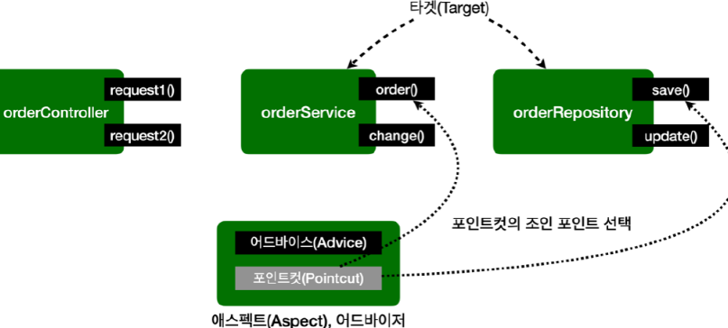
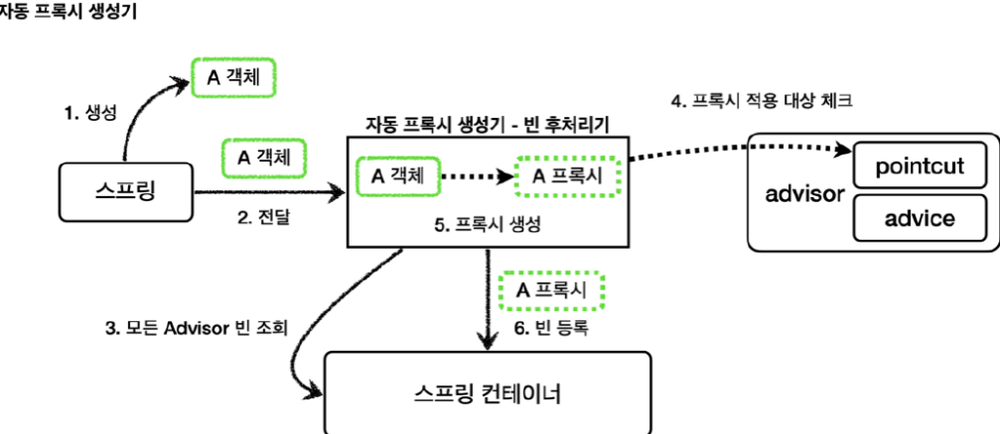
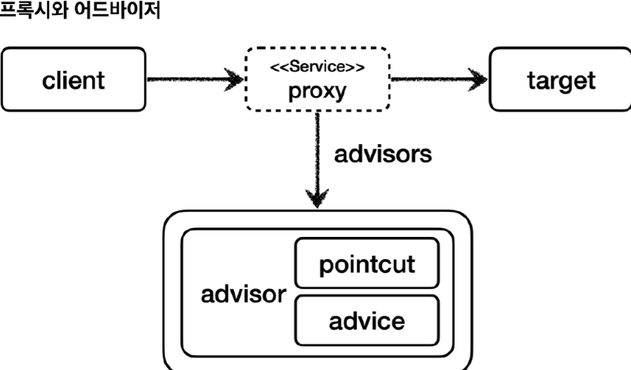

<nav>
    <a href="../../#authorization-architecture" target="_blank">[Spring Security Core]</a>
</nav>

# AOP 메서드 보안 구현 - Advice, Pointcut, Advisor

---

## 1. AOP 용어



### 1.1 조인포인트(JoinPoint): AOP를 적용할 수 있는 모든 지점
- 어드바이스가 적용될 수 있는 위치, 메소드 실행, 생성자 호출, 필드 값 접근, static 메서드 접근 같은 프로그램 상의 모든 실행 지점
- 조인 포인트는 추상적인 개념이다. AOP를 적용할 수 있는 모든 지점이라 생각하면 된다.
- 이때 스프링 AOP는 프록시 방식을 사용하므로 조인 포인트는 항상 메소드 실행 지점으로 제한된다.

### 1.2 포인트컷(Pointcut) : 어드바이스가 적용될 위치를 지정
- 조인 포인트 중에서 어드바이스가 적용될 위치를 선별하는 기능
- 주로 AspectJ 표현식을 사용해서 지정
- 프록시를 사용하는 스프링 AOP는 메서드 실행 지점만 포인트컷으로 선별 가능

### 1.3 타겟(Target) : 어드바이스를 받는 객체
- 어드바이스를 받는 대상 객체
- 포인트컷으로 결정된다.

### 1.4 어드바이스(Advice) : 부가 기능
- 부가 기능
- 특정 조인 포인트에서 Aspect에 의해 취해지는 조치
- Around(주변), Before(전), After(후)와 같은 다양한 종류의 어드바이스가 있음

### 1.5 애스펙트(Aspect)
- 어드바이스 + 포인트컷을 모듈화 한 것
- `@Aspect` 를 생각하면 됨.
- 여러 어드바이스와 포인트 컷이 함께 존재

### 1.6 어드바이저(Advisor)
- 하나의 어드바이스와 하나의 포인트 컷으로 구성
- 스프링 AOP에서만 사용되는 특별한 용어

---

## 2. AOP 초기화 이해


- spring-boot-starter-aop 를 적용하면 AspectJAwareAdvisorAutoProxyCreator 빈 후처리기가 활성화된다.
- 이것은 현재 애플리케이션 컨텍스트 내의 모든 AspectJ 어노테이션과 스프링 어드바이저들을 처리한다.
- 포인트컷에 매칭되는 조인포인트들에 대해서 부가 기능(어드바이스)를 적용할 수 있도록 프록시를 생성한다.

---

## 3. AOP 적용 순서


- 클라이언트가 메서드를 호출할 때마다 프록시는 자신에게 적용된 어드바이저들에 순서대로 접근한다.
- 포인트컷 적용 대상인지 확인하고 포인트컷 적용 대상이면 어드바이스 통해 부가로직을 수행한다.

---

## 4. 커스텀 어드바이스
```kotlin
class CustomMethodInterceptor(
    private val authorizationManager: AuthorizationManager<MethodInvocation>,
) : MethodInterceptor {

    override fun invoke(methodInvocation: MethodInvocation): Any? {
        val authentication = Supplier {
            SecurityContextHolder.getContextHolderStrategy().context.authentication
        }

        val isGranted = authorizationManager.check(authentication, methodInvocation)?.isGranted ?: false

        if (isGranted) {
            return methodInvocation.proceed()
        }
        throw AccessDeniedException("권한 없음")
    }

}
```
- 내부적으로 AuthorizationManager 를 통해 인가처리를 먼저 수행하게 하고, 메서드를 호출한다.

---

## 5. 커스텀 어드바이저
```kotlin
@Configuration
class MethodSecurityConfig {

    @Bean
    fun serviceAdvisor(): Advisor {
        val pointCut = AspectJExpressionPointcut()
        pointCut.expression = "execution(* com.security.domain.DataService.*(..))"

        val advice = CustomMethodInterceptor(AuthenticatedAuthorizationManager())

        return DefaultPointcutAdvisor(pointCut, advice)
    }

}
```
- 포인트컷: com.security.domain.DataService 하위의 모든 메서드 지정
- 어드바이스 : 우리가 만든 커스텀 어드바이스

---
