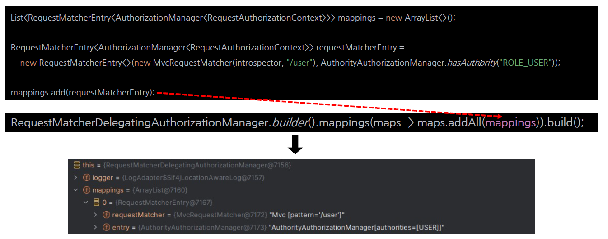
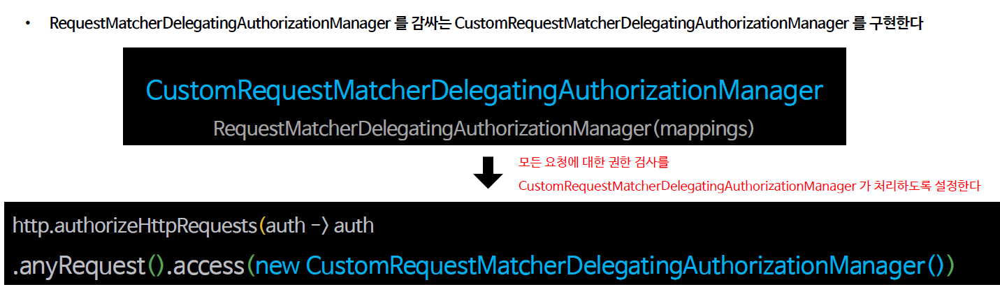
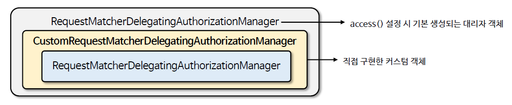

<nav>
    <a href="../../#authorization-architecture" target="_blank">[Spring Security Core]</a>
</nav>

# RequestMatcherDelegatingAuthorizationManager 인가 설정 응용하기

---

## 1. RequestMatcherEntry
```java
public class RequestMatcherEntry<T> {
	private final RequestMatcher requestMatcher;
	private final T entry;
    
	public RequestMatcherEntry(RequestMatcher requestMatcher, T entry) {
		this.requestMatcher = requestMatcher;
		this.entry = entry;
	}

	public RequestMatcher getRequestMatcher() {
		return this.requestMatcher;
	}

	public T getEntry() {
		return this.entry;
	}

}
```
- RequestMatcher와 다른 어떤 대상 객체를 연결하기 위한 객체
  - `requestMatcher`와 어떤 무언가(entry) : 요청을 가로챌 지 말지 기준을 제공
  - `entry` : 실제 사용될 무언가 (주로 AuthorizationManager)

---

## 2. RequestMatcherDelegatingAuthorizationManager 의 mappings 구성


- RequestMatcherDelegatingAuthorizationManager 를 생성할 때 mappings 속성에 직접 RequestMatcherEntry 객체를 생성하고 추가하는 것도 가능하다.
- 어떻게?
    ```java
    RequestMatcherDelegatingAuthorizationManager.builder().mappings(maps -> maps.addAll(mappings)).build());
    ```
    - `RequestMatcherDelegatingAuthorizationManager.builder()` 를 통해 빌더를 얻어온다.
    - `.mappings(...)` 에는 Consumer를 제공할 수 있는데, 여기서 manager 내부의 mappings를 통해 수행하고 싶은 작업을 지정하면 된다.
    - `mappings`에 우리가 만든 RequestMatcherEntry 단일 객체 혹은 목록을 제공하면 된다.

---

## 3. 적용 아이디어


- 기본적으로 AuthorizeHttpRequests API를 사용하여 지정한 설정들은 RequestMatcherEntry로 구성되고
RequestMatcherDelegatingAuthorizationManager의 mappings 속성으로 구성된다.
- 우리는 여기서 모든 요청에 대해서 우리가 만든 CustomRequestMatcherDelegatingAuthorizationManager에게 전부 위임하도록 할 수 있다.
- 그리고 이 내부에 다른 RequestMatcherDelegatingAuthorizationManager를 감싸게 하여 구현하는 것도 가능하긴 하다.(다만 비효율적이다.)



- 이 구조는 위와 같다.

---

## 4. 실습

### 4.1 CustomRequestMatcherDelegatingAuthorizationManager
```kotlin
class CustomRequestMatcherDelegatingAuthorizationManager(
    mappings: List<RequestMatcherEntry<AuthorizationManager<RequestAuthorizationContext>>>
): AuthorizationManager<RequestAuthorizationContext> {

    private val delegate = RequestMatcherDelegatingAuthorizationManager
        .builder()
        .mappings{ it.addAll(mappings) }
        .build()

    override fun check(
        authentication: Supplier<Authentication>,
        context: RequestAuthorizationContext
    ): AuthorizationDecision? {
        return delegate.check(authentication, context.request)
    }

}
```
- 내부적으로 RequestMatcherDelegatingAuthorizationManager 를 가지고 있고 이곳으로 요청을 위임한다.
- 생성 시점에 RequestMatcherEntry 목록을 받아서, 이걸 내부적으로 가지고 있는 RequestMatcherDelegatingAuthorizationManager 의
mappings로 가지게 한다.

### 4.2 AuthorizationManagerConfig
```kotlin
@Configuration
class AuthorizationManagerConfig {

    @Bean(name= ["customAuthorizationManager"])
    fun customAuthorizationManager(introspector: HandlerMappingIntrospector): AuthorizationManager<RequestAuthorizationContext> {
        val mappings = listOf<RequestMatcherEntry<AuthorizationManager<RequestAuthorizationContext>>>(
            RequestMatcherEntry(
                MvcRequestMatcher(introspector, "/user"),
                AuthorityAuthorizationManager.hasAuthority("ROLE_USER")
            ),
            RequestMatcherEntry(
                MvcRequestMatcher(introspector, "/db"),
                AuthorityAuthorizationManager.hasAuthority("ROLE_DB")
            ),
            RequestMatcherEntry(
                MvcRequestMatcher(introspector, "/admin"),
                AuthorityAuthorizationManager.hasRole("ADMIN")
            ),
            RequestMatcherEntry(
                AnyRequestMatcher.INSTANCE,
                AuthenticatedAuthorizationManager()
            )
        )
        return CustomRequestMatcherDelegatingAuthorizationManager(mappings)
    }
}
```
- mappings를 구성하고 CustomRequestMatcherDelegatingAuthorizationManager 생성자로 전달하여 빈으로 등록한다.

### 4.3 SecurityConfig
```kotlin
@EnableWebSecurity
@Configuration
class SecurityConfig {

    @Bean
    fun securityFilterChain(
        http: HttpSecurity,
        @Qualifier("customAuthorizationManager") authorizationManager: AuthorizationManager<RequestAuthorizationContext>): SecurityFilterChain {
        http {
            authorizeHttpRequests {
                authorize(anyRequest, authorizationManager)
            }
            formLogin { }
        }
        return http.build()
    }

    @Bean
    fun userDetailsService(): UserDetailsService {
        val user = User.withUsername("user").password("{noop}1111").roles("USER").build()
        val db = User.withUsername("db").password("{noop}1111").roles("DB").build()
        val admin = User.withUsername("admin").password("{noop}1111").roles("ADMIN", "SECURE").build()
        return InMemoryUserDetailsManager(user, db, admin)
    }

}
```
- 모든 요청을 CustomRequestMatcherDelegatingAuthorizationManager 로 위임시키도록 한다.
- 이 구조는 실질적으로
  - `AuthorizationManager` -> `RequestMatcherDelegatingAuthorizationManager(스프링 시큐리티가 만듬)` -> `CustomRequestMatcherDelegatingAuthorizationManager(우리가 만듬)` ->
  `RequestMatcherDelegatingAuthorizationManager(우리가 만듬)` 의 흐름을 타게 된다.

---
