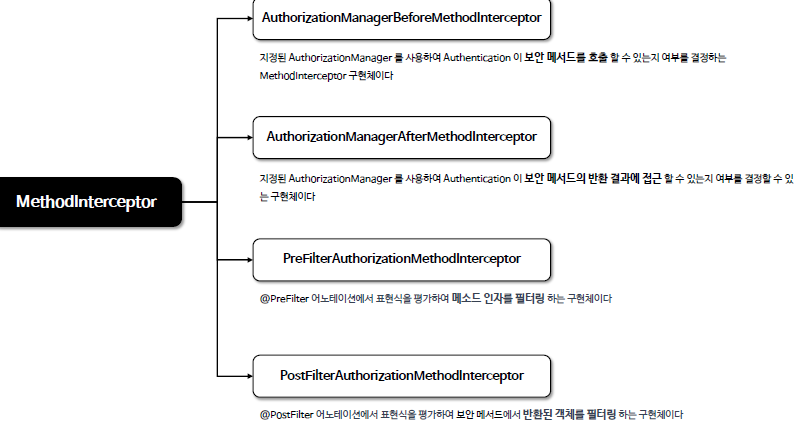

<nav>
    <a href="../../#authorization-architecture" target="_blank">[Spring Security Core]</a>
</nav>

# 메서드 기반 인가 관리자

---

## 1. 메서드 기반 인가처리

### 1.1 메서드 기반 인가처리란?


- 메서드 단위, 혹은 클래스 단위로 인가 기능을 적용하는 방식

### 1.2 개요
- 스프링 시큐리티는 메서드 기반의 인증된 사용자 및 특정권한을 가진 사용자의 자원접근 허용여부를 결정하는 인가 관리자 클래스들을 제공한다
  - `PreAuthorizeAuthorizationManager`, `PostAuthorizeAuthorizationManager`, `Jsr250AuthorizationManager`, `SecuredAuthorizationManager` 가 있다
- 메서드 기반 권한 부여는 내부적으로 AOP 방식에 의해 초기화 설정이 이루어지며 메서드의 호출을 어드바이저가 가로채어 처리하고 있다.
  - 어드바이저 : Pointcut + Advice
    - 포인트컷 : 어디에 부가기능을 적용할 것인지. 어디에 프록시 생성을 적용할 것인지 결정하는 기준이 됨
    - 어드바이스 : 어떤 부가기능을?(`org.aopalliance.intercept.MethodInterceptor`)
  - 여기서 실질적인 부가 기능을 수행하는 어드바이스는 내부적으로 인가 기능을 AuthorizationManager에게 위임하여 처리하게 한다.

---

## 2. 메서드 권한부여 흐름


1. 스프링의 빈 후처리기는 초기화 시 생성되는 전체 빈을 조회하여 빈이 가진 메소드 중에서 보안이 설정된 메소드가 있는지 탐색한다
   - (어드바이저 각각의 포인트컷을 이용)
2. 보안이 설정된 메서드가 있다면 스프링은 그 빈의 프록시 객체를 자동으로 생성한다 (기본적으로 Cglib 방식으로 생성한다)
   - 이 프록시는 내부적으로 인가처리 기능을 하는 어드바이스(MethodInterceptor)를 사용한다.
3. 실질적으로 빈 후처리기를 통해 생성된 프록시가 빈으로 등록된다.(초기화과정 종료)
   - 이후 프록시로 등록된 빈이 의존성으로 주입되므로 런타임에는 프록시가 실행된다.
4. 이후 프록시 객체는 메서드 실행 시 어드바이저가 적용되어 있다면, 어드바이스를 작동 시킨다.
   - 어드바이스는 메서드 진입 전 인가 처리를 한다.(PreAuthorize 기준)
     - 인가처리가 승인되면 실제 객체의 메소드를 호출하고
     - 인가처리가 거부되면 예외가 발생하고 메소드 진입이 실패한다

---

## 3. 여러가지 스프링 시큐리티 어드바이스(MethodInterceptor)


- `AuthorizationManagerBeforeMethodInterceptor`
  - 지정된 AuthorizationManager 를 사용하여 Authentication 이 보안 메서드를 호출 할 수 있는지 여부를 결정
- `AuthorizationManagerAfterMethodInterceptor`
  - 지정된 AuthorizationManager 를 사용하여 uthentication 이 보안 메서드의 반환 결과에 접근 할 수 있는지 여부를 결정
- `PreFilterAuthorizationMethodInterceptor`
  - `@PreFilter` 어노테이션에서 표현식을 평가하여 메소드 인자를 필터링
- `PostFilterAuthorizationMethodInterceptor`
  - `@PostFilter` 어노테이션에서 표현식을 평가하여 보안 메서드에서 반환된 객체를 필터링 하는 구현체이다

---

## 4. 메서드 권한부여 초기화 과정


- 빈 후처리기 : InfrastructureAdvisorAutoProxyCreator
  - Spring 자체에서 제공하는 인프라스트럭처 어드바이저를 기반으로 프록시를 생성
  - 보안이 설정되어 있는 모든 클래스들을 찾고 해당 메서드와 매핑된 Advisor 들을 가지고 프록시 객체를 생성함
- 프록시는 이제 내부적으로 Advisor 목록을 갖고 있고, 실제 target 로직 호출 전후에 어드바이스(MethodInterceptor)를 호출하여 부가기능을 수행한다.

---

## 5. 예시 - `@PreAuthorize` 처리구조 이해


- 예를 들어 실제 `@PreAuthorize` 어노테이션이 메서드에 적용되어있을 경우 런타임에 해당 클래스는 프록시로 생성된다.
- 프록시는 어드바이스 `AuthorizationManagerBeforeMethodInterceptor`를 실행하여 인가 로직을 수행한다.
  - 이 어드바이스는 target 메서드를 호출 전에 `PreAuthorizeAuthorizationManager`에게 인가 처리를 위임한다.
  - `PreAuthorizeAuthorizationManager`는 내부적으로 `MethodSecurityExpressionHandler` 가 어노테이션에 적용된 표현식(`hasAuthority('ROLE_USER')`)을 평가하고, `Authentication` 의
  GrantedAuthority 권한이 일치하는지 검사한다.
- 여기서 인가에 실패하면 AccessDeniedException이 발생한다.
  - 주의할 점 : DispatcherServlet 이후의 빈이 프록시일 경우 이 예외 처리는 별도의 HandlerExceptionResolver를 통해 처리하도록 할 것
- 인증에 성공하면 실제 target의 메서드가 호출된다.

---

## 6. 예시 - `@PostAuthorizae` 처리구조 이해


- 전체적으로 `@PreAuthorize`와 비슷하게 돌아가는데, 어드바이스 구현체의 동작 차이가 있다.
- 프록시는 어드바이스 `AuthorizationManagerAfterMethodInterceptor`를 실행하여 인가 로직을 수행한다.
    - 이 어드바이스는 target 메서드를 호출 후에 `PostAuthorizeAuthorizationManager`에게 인가 처리를 위임한다.
    - `PostAuthorizeAuthorizationManager`는 내부적으로 `MethodSecurityExpressionHandler`를 사용하고 이것은 어노테이션에 적용된 표현식(`returnObject.owner == authentication.name`)을 평가하고, 반환 객체의 owner와 `Authentication` 의
    name이 같은지 검사한다.
- 여기서 인가에 실패하면 AccessDeniedException이 발생한다.
    - 주의할 점 : DispatcherServlet 이후의 빈이 프록시일 경우 이 예외 처리는 별도의 HandlerExceptionResolver를 통해 처리하도록 할 것
- 인증에 성공하면 반환 결과값은 그대로 호출된 쪽으로 전달된다.

---

## 7. 디버깅 포인트
- `AbstractAutoProxyCreator` : 런타임에 동작하는 빈 후처리기의 부모 추상 클래스
  - wrapIfNecessary -> createProxy -> buildProxy -> proxyFactory.getProxy
  - postProcessAfterInitialization
- 런타임
  - AuthorizationManagerBeforeMethodInterceptor / AuthorizationManagerAfterMethodInterceptor
  - PreAuthorizeAuthorizationManager / PostAuthorizeAuthorizationManager

---

## 8. 실습

### 8.1 설정
```kotlin
@Configuration
@EnableWebSecurity
@EnableMethodSecurity(securedEnabled = true, jsr250Enabled = true)
class SecurityConfig {

    @Bean
    fun securityFilterChain(http: HttpSecurity): SecurityFilterChain {
        http {
            authorizeHttpRequests {
                authorize(anyRequest, authenticated)
            }
            formLogin { }
        }
        return http.build()
    }

    @Bean
    fun userDetailsService(): UserDetailsService {
        val user = User.withUsername("user").password("{noop}1111").roles("USER").build()
        val db = User.withUsername("db").password("{noop}1111").roles("DB").build()
        val admin = User.withUsername("admin").password("{noop}1111").roles("ADMIN", "SECURE").build()
        return InMemoryUserDetailsManager(user, db, admin)
    }

}
```
- 기본적으로 SecurityFilterChain에서는 인증 여부만 체크하도록 했다

### 8.2 Account
```kotlin
package com.security.domain

class Account(
    val owner: String,
    val isSecure: Boolean
)
```
- 간단하게 owner, isSecure 변수만 담은 객체

### 8.3 DataService
```kotlin
@Service
class DataService {

    @PreAuthorize("hasAuthority('ROLE_USER')")
    fun getUser(): String {
        return "user"
    }

    @PostAuthorize("returnObject.owner == authentication.name")
    fun getOwner(name: String): Account {
        return Account(name, false)
    }

    fun display(): String {
        return "display"
    }
}
```
- `getUser()` : `ROLE_USER` 권한이 있어야만 메서드 실행됨
- `getOwner()` : 실제 반환 객체의 owner와 Authentication의 name이 같아야 결과가 반환됨
- `display()` : 메서드 보안이 적용되지 않음

### 8.4 컨트롤러
```kotlin
@RestController
class SecurityController(
    private val dataService: DataService
) {

    @GetMapping("/user")
    fun user(): String {
        return dataService.getUser()
    }

    @GetMapping("/owner")
    fun owner(name: String): Account {
        return dataService.getOwner(name)
    }

    @GetMapping("/display")
    fun display(): String {
        return dataService.display()
    }
}
```

### 8.5 실행 결과
- `/user`
  - 컨트롤러는 실행되지만 DataService 메서드 실행 전에 ADMIN 사용자는 인가 실패 예외가 발생함
- `/owner?name=user`
  - 컨트롤러는 실행되지만 DataService 메서드 실행 후 반환 과정에서 admin 사용자는 인가 실패 예외가 발생함
- `/display`
  - 모든 인증된 사용자는 정상적으로 모든 로직이 실행됨

---
