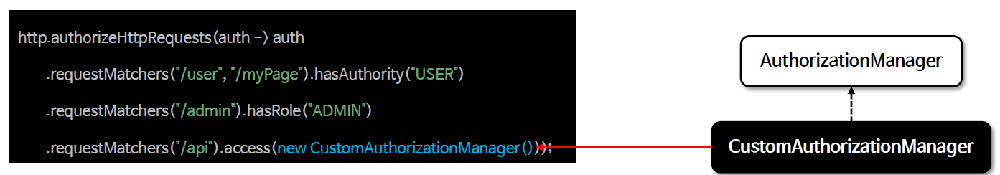

<nav>
    <a href="../../#authorization-architecture" target="_blank">[Spring Security Core]</a>
</nav>

# 요청 기반 CustomAuthorizationManager 구현

---

## 1. 개요
```java
http.authorizeHttpRequests(auth ->
    auth.requestMatcher().access(AuthorizationManager)
```
- 스프링 시큐리티 인가 설정 시 선언적 방식이 아닌 프로그래밍 방식으로 구현할 수 있으며 `access(AuthorizationManager)` API 를 사용한다
- `access()` 에는 `AuthorizationManager<RequestAuthorizationContext>` 타입의 객체를 전달할 수 있으며 사용자의 요청에 대한 권한 검사를 `access()`에 지정한 `AuthorizationManager` 가 처리하게 된다
- `access()` 에 지정한 `AuthorizationManager` 객체는 `RequestMatcherDelegatingAuthorizationManager` 의 매핑 속성에 저장된다

---

## 2. 적용 방법


- 특정한 엔드포인트에 대한 권한 검사를 수행하기 위해 AuthorizationManager 를 구현하여 설정한다
- 예를 들면 위 상황에서는
  - "/user", "/myPage", "/admin" 요청 패턴의 권한 검사는 AuthorityAuthorizationManager 가 처리한다
  - "/api“ 요청 패턴의 권한 검사는 CustomAuthorizationManager 가 처리한다

---

## 3. 실습

### 3.1 CustomAuthorizationManager
```kotlin
class CustomAuthorizationManager : AuthorizationManager<RequestAuthorizationContext> {

    companion object {
        const val REQUIRED_ROLE = "ROLE_SECURE"
    }

    override fun check(
        supplier: Supplier<Authentication?>,
        `object`: RequestAuthorizationContext?

    ): AuthorizationDecision {
        val authentication = supplier.get()

        return AuthorizationDecision(
            authentication !== null
                    && authentication.isAuthenticated
                    && authentication !is AnonymousAuthenticationToken
                    && authentication.authorities.any { REQUIRED_ROLE == it.authority }
        )
    }

}
```
- Authentication이 존재하고, 인증된 상태이며, 익명사용자가 아닌 사용자에 대해
하나라도 요구한 역할이 존재하면 `AuthorizationDecision(true)`, 아니면 `AuthorizationDecision(false)` 를 반환

### 3.2 컨트롤러
```kotlin
@RestController
class SecurityController {

    @GetMapping("/")
    fun index(): String {
        return "index"
    }

    @GetMapping("/user")
    fun user(): String {
        return "user"
    }

    @GetMapping("/db")
    fun db(): String {
        return "db"
    }

    @GetMapping("/admin")
    fun admin(): String {
        return "admin"
    }

    @GetMapping("/secure")
    fun api(): String {
        return "secure"
    }
}
```
- `/secure` 엔드포인트를 생성했다.

### 3.3 설정
```kotlin
@EnableWebSecurity
@Configuration
class SecurityConfig {

    @Bean
    fun securityFilterChain(http: HttpSecurity): SecurityFilterChain {
        http {
            authorizeHttpRequests {
                authorize("/user", hasRole("USER"))
                authorize("/admin", hasAuthority("ROLE_ADMIN"))
                authorize("/db", WebExpressionAuthorizationManager("hasRole('DB')"))
                authorize("/secure", CustomAuthorizationManager())
                authorize(anyRequest, authenticated)
            }
            formLogin { }
        }
        return http.build()
    }

    @Bean
    fun userDetailsService(): UserDetailsService {
        val user = User.withUsername("user").password("{noop}1111").roles("USER").build()
        val db = User.withUsername("db").password("{noop}1111").roles("DB").build()
        val admin = User.withUsername("admin").password("{noop}1111").roles("ADMIN", "SECURE").build()
        return InMemoryUserDetailsManager(user, db, admin)
    }
}

```
- admin 사용자는 "ROLE_ADMIN", "ROLE_SECURE" 역할을 가진다.
- "/secure" 엔드포인트는 CustomAuthorizationManager 의 인가를 거친다.

---
