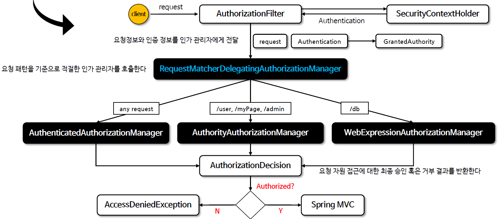
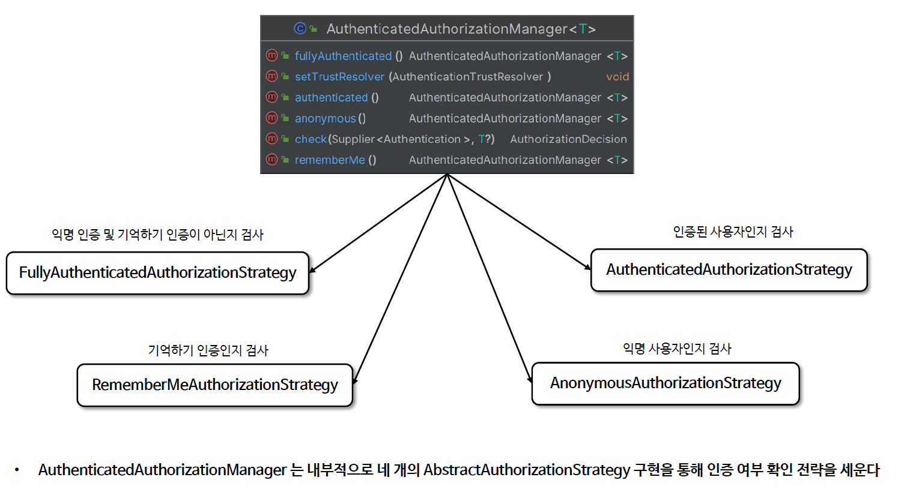
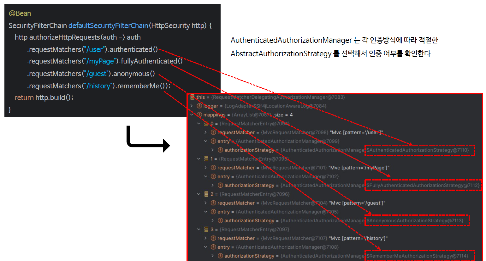
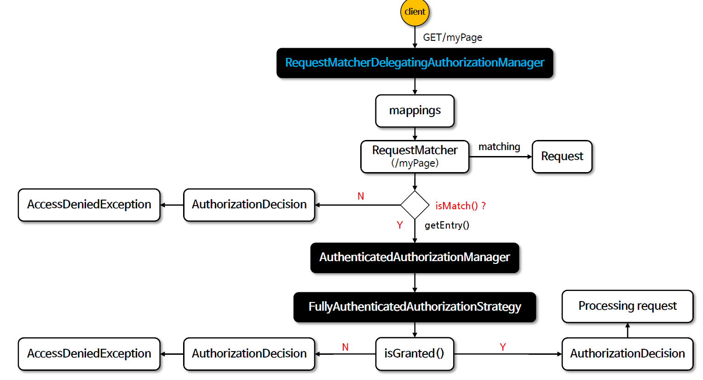
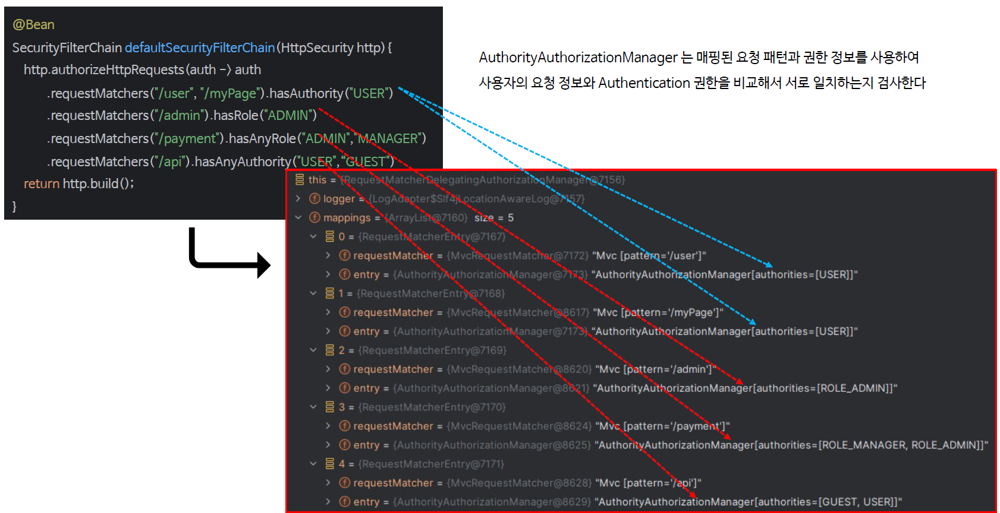
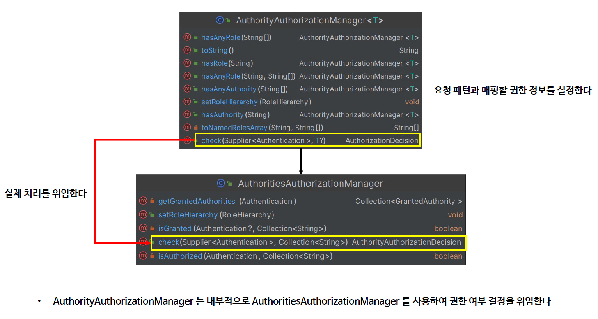
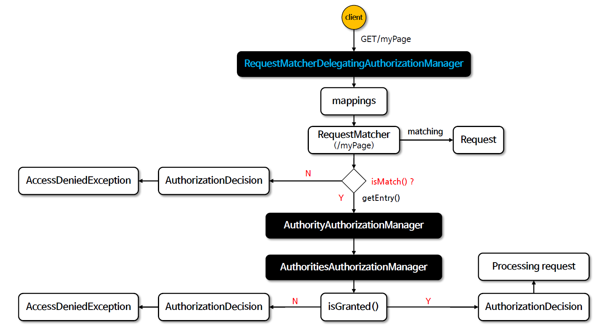
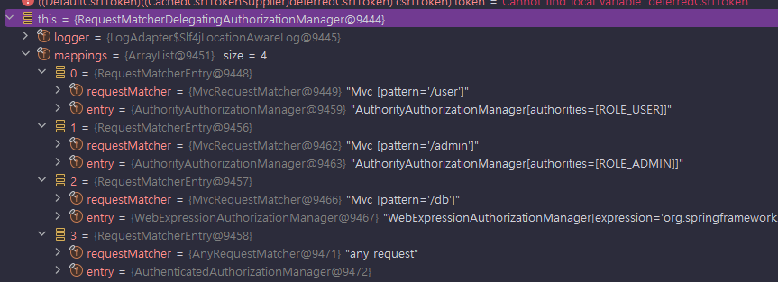

<nav>
    <a href="../../#authorization-architecture" target="_blank">[Spring Security Core]</a>
</nav>

# 요청 기반 인가 관리자

---

## 1. 개요
- 스프링 시큐리티는 요청 기반의 인증된 사용자 및 특정권한을 가진 사용자의 자원접근 허용여부를 결정하는 인가 관리자 클래스들을 제공한다.
- 대표구현체
  - RequestMatcherDelegatingAuthorizationManager: 요청기반 인증 위임 관리자
  - AuthenticatedAuthorizationManager: 인증 여부 검사
  - AuthorityAuthorizationManager : 권한 심사
  - 그 외 : WebExpressionAuthorizationManager(표현식 기반), ...

---

## 2. 스프링 시큐리티에서 인가 처리시 체크하는 것들
```kotlin
 http
            .authorizeHttpRequests {
                it
                    .requestMatchers("/user").hasRole("USER")
```
- 위 설정에 따르면, `/user` 엔드포인트 접근은 인증 객체에서 `ROLE_USER` 권한을 필요로 한다
- 인가처리를 위해서, 다음 세 가지 요소를 확인해야한다.
  - 요청(HttpServletRequest): 어느 URL, 어느 메서드?
  - 인증(Authentication): 이 사용자는 누구인가? <- 요청(HttpServletRequest)을 통해 앞의 필터들을 거치며 획득됐다.
  - 권한(GrantedAuthority): 이 사용자가 가진 권한들은? <- Authentication을 통해 얻을 수 있다.
- 요청 기반 인가 처리에서는 위 세가지를 확인하여 인가에 사용한다.
  - 서버측 : 설정 클래스를 통해 해당 자원에 대해 필요한 권한, 인증 여부 등을 확인
  - 인증에 필요한 것 : 요청, 인증, 권한 세가지를 서버측의 인가 컴포넌트에 제출해야함.

---

## 3. 요청 기반 인가 처리 흐름


- AuthorizationFilter 는 최종적으로 인가를 담당하는 필터이다.
  - 인증정보를 조회하는 Supplier를 준비한다. (SecurityContextHolderStrategy를 통해 사용자의 인증정보를 실제 가져오는 함수인데, 지연로딩을 위해 supplier를 통해 제공)
  - AuthorizationManager에게 실질적 인가 처리를 위임한다.
- 여기서 사용되는 AuthorizationManager의 기본 구현체는 `RequestMatcherDelegatingAuthorizationManager`이다.
  - 큰 흐름으로 놓고보면 이것은 우리가 작성한 인가설정에 맞게, AuthorizationManager를 목록으로 가지고 있고, 가장 먼저 매칭되는 AuthorizationManager에게 실질적인 인가처리를 위임한다.
- AuthorizationManager 에게 위임한 인가처리 결과를 반환받은 뒤 인가에 실패하면 AccessDeniedException을 발생시키고, 성공할 경우 통과시킨다.

---

## 4. RequestMatcherDelegatingAuthorizationManager
```java
public final class RequestMatcherDelegatingAuthorizationManager implements AuthorizationManager<HttpServletRequest> {

	private static final AuthorizationDecision DENY = new AuthorizationDecision(false);
	private final List<RequestMatcherEntry<AuthorizationManager<RequestAuthorizationContext>>> mappings;

	@Override
	public AuthorizationDecision check(Supplier<Authentication> authentication, HttpServletRequest request) {
        
        // mappings를 순회
		for (RequestMatcherEntry<AuthorizationManager<RequestAuthorizationContext>> mapping : this.mappings) {

			RequestMatcher matcher = mapping.getRequestMatcher();
			MatchResult matchResult = matcher.matcher(request);
            
            // 가장 먼저 match되는 mapping의 AuthorizationManager에게 인가처리를 위임
			if (matchResult.isMatch()) {
				AuthorizationManager<RequestAuthorizationContext> manager = mapping.getEntry();
				return manager.check(authentication,
						new RequestAuthorizationContext(request, matchResult.getVariables()));
			}
		}
		return DENY;
	}

}
```
- 요청 기반 인가 처리는 기본구현체로 `RequestMatcherDelegatingAuthorizationManager` 가 사용된다.
- RequestMatcherDelegatingAuthorizationManager 는 내부적으로 여러개의 RequestMatcherEntry 목록을 mappings 변수에 할당하여 관리한다.
  - RequestMatcherEntry : RequestMatcher, AuthorizationManager 쌍으로 구성
- check 메서드가 호출되면, 내부적으로 mappings를 순회하면서 가장 먼저 조건에 맞는 RequestMatcherEntry의 manager에게 실질적 인가처리를 위임한다.
  - 조건에 맞는 entry를 찾지 못 할 경우 DENY(`AuthorizationDecision(false)`) 를 반환한다.

---

## 5. AuthenticatedAuthorizationManager : 인증 여부 기반 인가 매니저
단순히 인증 여부 기반으로 인가설정을 했을 경우 이 인가 매니저가 사용된다.



- AuthenticatedAuthorizationManager 는 내부적으로 AuthenticatedAuthorizationManagerStrategy 를 의존하고 있다.
- 크게 아래 4개의 구현체가 있으며 이 4개 중 하나의 구현체를 통해 인증 여부 확인 전략을 위임하여 처리한다.
  - AuthenticatedAuthorizationStrategy: 인증된 사용자만 허용
  - FullyAuthenticatedAuthorizationStrategy : 통상적인 인증 방식이 아닌 리멤버미 인증의 사용자는 걸러냄
  - RememberMeAuthorizationStrategy: 리멤버미 사용자만 허용
  - AnonymousAuthorizationStrategy: 익명사용자인지 검사



- authenticated -> AuthenticatedAuthorizationStrategy
- fullyAuthenticated -> FullyAuthenticatedAuthorizationStrategy
- rememberMe -> RememberMeAuthorizationStrategy
- anonymous -> AnonymousAuthorizationStrategy




- 예를 들면 설정 클래스에서 "/mypage" matcher에 대해 fullyAuthenticated 권한 설정을 했을 경우
위와 같이 FullyAuthenticatedAuthorizationStrategy 작동하여 인가 심사를 한다.


---

## 6. AuthorityAuthorizationManager
권한을 기준으로 인가설정을 했을 경우 이 인가 매니저가 사용된다.



- AuthorityAuthorizationManager 는 인가 승인에 필요한 권한 이름을 모아둔 Set을 가지고 있다.
- 이 정보를 기반으로 사용자의 요청정보, Authentication에 담긴 권한을 비교하여 인가처리를 한다.
- 예를 들어 우리가 `hasAuthority("USER")` 설정을 했다면, "USER" 권한을 담아둔 Set을 정보로 가지고 있고
요청이 들어오면 요청, Authentication과 내부 정보와 비교해서 인가처리를 수행한다.




- 사실 AuthorityAuthorizationManager는 내부적으로 AuthoritiesAuthorizationManager 를 의존하고 있으며 실질적 인가처리는 이곳에서 수행된다.
- AuthoritiesAuthorizationManager는 내부적으로 `RoleHierarchy`를 가지고 있고 이를 사용하여 계층적 권한을 고려한 인가 처리를 할 수 있다.
    ```java
    public final class AuthoritiesAuthorizationManager implements AuthorizationManager<Collection<String>> {
    
        private RoleHierarchy roleHierarchy = new NullRoleHierarchy();
    
        @Override
        public AuthorityAuthorizationDecision check(Supplier<Authentication> authentication,
                Collection<String> authorities) {
            boolean granted = isGranted(authentication.get(), authorities);
            return new AuthorityAuthorizationDecision(granted, AuthorityUtils.createAuthorityList(authorities));
        }
    ```



실제 흐름은 위와 같다.

---

## 7. 예시

### 7.1 설정
```kotlin
@Bean
fun securityFilterChain(http: HttpSecurity): SecurityFilterChain {
    http {
        authorizeHttpRequests {
            authorize("/user", hasRole("USER"))
            authorize("/admin", hasAuthority("ROLE_ADMIN"))
            authorize("/db", WebExpressionAuthorizationManager("hasRole('DB')"))
            authorize(anyRequest, authenticated)
        }
        formLogin { }
    }
    return http.build()
}
```

### 7.2 동작


- 실제 런타임에 확인해보면 RequestMatcherDelegatingAuthenticationManager가 인가처리를 위임받고
내부적으로 mappings를 가지고 있는 것을 볼 수 있다.
- 이들 내부적으로 RequestMatcher, AuthorizationManager 쌍이 함께 묶여있다.
- 우리의 설정을 기반으로 AuthorizationManager 구현체들이 배치된 것을 볼 수 있다.

---
