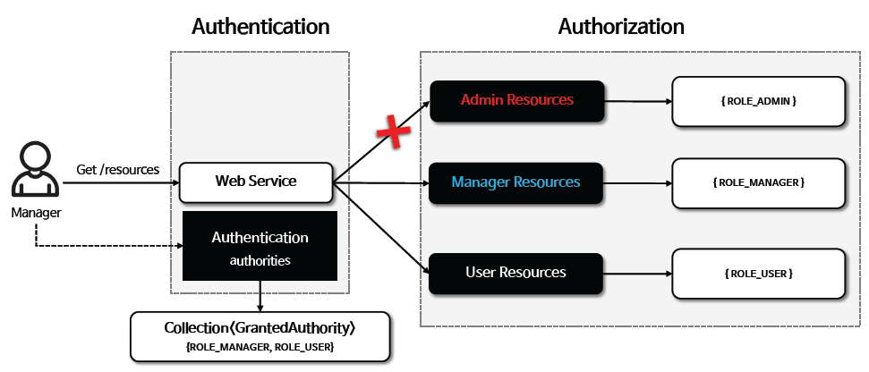

<nav>
    <a href="../../#authorization-architecture" target="_blank">[Spring Security Core]</a>
</nav>

# 인가 - GrantedAuthority

---

## 1. Spring Security에서의 인가



```java
public interface Authentication extends Principal, Serializable {
    // ... 생략
    
	Collection<? extends GrantedAuthority> getAuthorities();
}
```

- 인가, 즉 권한 부여는 특정 자원에 접근할 수 있는 사람을 결정하는 것을 의미한다.
- Spring Security 는 GrantedAuthority 클래스를 통해 권한 목록을 관리하고 있으며 사용자의 Authentication 객체와 연결한다.
- 즉 SecurityContext에 저장된 인증 객체를 통해, getAuthorities를 통해 권한 정보를 얻어오고 인가 프로세스에서 사용할 수 있다.

---

## 2. GrantedAuthority
```java
public interface GrantedAuthority extends Serializable {
	String getAuthority();
}
```
```java
public final class SimpleGrantedAuthority implements GrantedAuthority {

	private final String role;

	@Override
	public String getAuthority() {
		return this.role;
	}
    // 생략
}
```
- 스프링 시큐리티는 Authentication 에 GrantedAuthority 권한 목록을 저장하며 이를 통해 인증 주체에게 부여된 권한을 사용하도록 한다.
- `GrantedAuthority` 객체는 AuthenticationManager 에 의해 Authentication 객체에 삽입되며 스프링 시큐리티는 인가 결정을 내릴 때 `AuthorizatioinManager` 를 사용하여
Authentication 즉, 인증 주체로부터 GrantedAuthority 객체를 읽어들여 처리한다. 이 과정을 거침으로서 해당 사용자가 접근하고자하는 자원을 사용할 권한이 있는지 확인한다.
- 가장 기본적인 구현체로는 SimpleGrantedAuthority가 있는데, 단순하게 해당 역할 또는 권한의 이름을 반환하는 역할만 수행하는 구현체이다.
- getAuthority를 통해 해당 역할 또는 권한의 이름을 얻어오고 인가에 사용한다.

---

## 3. 사용자 정의 역할 접두사
```java
    private String rolePrefix = "ROLE_";

	public AuthorizeHttpRequestsConfigurer(ApplicationContext context) {
        // 생략
		String[] grantedAuthorityDefaultsBeanNames = context.getBeanNamesForType(GrantedAuthorityDefaults.class);

        // GrantedAuthorityDefaults 빈이 있는 지 확인하고, 존재할 경우 해당 빈의 접두사를 사용
        if (grantedAuthorityDefaultsBeanNames.length > 0) {
			GrantedAuthorityDefaults grantedAuthorityDefaults = context.getBean(GrantedAuthorityDefaults.class);
			this.rolePrefix = grantedAuthorityDefaults.getRolePrefix();
		}
	}
```
```java
public final class GrantedAuthorityDefaults {

	private final String rolePrefix;

	public GrantedAuthorityDefaults(String rolePrefix) {
		this.rolePrefix = rolePrefix;
	}
	public String getRolePrefix() {
		return this.rolePrefix;
	}

}
```
```kotlin
@Bean
fun grantedAuthorityDefaults(): GrantedAuthorityDefaults {
    return GrantedAuthorityDefaults("MYPREFIX_")
}
```
- 스프링 시큐리티의 authorizeHttpRequests API를 기반으로 인가 설정이 이루어질 때는 AuthorizeHttpRequestsConfigurer가 작동한다.
- 이 때 기본 역할 접두사는 "ROLE_"이며, 사용자가 GrantedAuthorityDefaults 빈을 등록했을 경우 해당 클래스에 지정한 접두사가 우선시되어 사용된다.
- 이 설정을 기반으로 AuthorizationManager가 구성되고 역할 존재 여부를 확인할 때, 여기서 지정한 rolePrefix가 사용되는 것이다.
- 참고: Spring Security 6.3 기준 KotlinDSL 에서는 GrantedAuthorityDefaults 빈등록 설정이 무시되는데(RoleroleHierarchy도 마찬가지다.) 이에 대해 Issue를 올려뒀다.

### 주의
- `org.springframework.security.core.userdetails.User` 생성시 사용하는 roles 메서드를 통해 지정한 역할명은 "ROLE_" 가 붙어지므로 커스텀 접두사를 다르게 지정할 경우 문제가 발생할 수 있다.
    ```java
      User.withUsername("db").password("{noop}1111").roles("DB").build();
    ```
    ```java
    public UserBuilder roles(String... roles) {
        List<GrantedAuthority> authorities = new ArrayList<>(roles.length);
        for (String role : roles) {
            Assert.isTrue(!role.startsWith("ROLE_"),
                    () -> role + " cannot start with ROLE_ (it is automatically added)");
            authorities.add(new SimpleGrantedAuthority("ROLE_" + role));
        }
        return authorities(authorities);
    }
    ```
- 이 때는 authorities 메서드를 사용하자.

---

## 4. 예제
```kotlin
@EnableWebSecurity
@Configuration
class SecurityConfig {

    @Bean
    fun securityFilterChain(http: HttpSecurity): SecurityFilterChain {
        http
            .authorizeHttpRequests {
                it
                    .requestMatchers("/user").hasRole("USER")
                    .requestMatchers("/admin").hasRole("ADMIN")
                    .requestMatchers("/db").hasRole("DB")
                    .anyRequest().authenticated()
            }
            .formLogin(Customizer.withDefaults())
        return http.build()
    }

    @Bean
    fun grantedAuthorityDefaults(): GrantedAuthorityDefaults {
        return GrantedAuthorityDefaults("MYPREFIX_")
    }

    @Bean
    fun userDetailsService(): UserDetailsService {
        val user = User.withUsername("user").password("{noop}1111").authorities("MYPREFIX_USER").build()
        val db = User.withUsername("db").password("{noop}1111").authorities("MYPREFIX_DB").build()
        val admin = User.withUsername("admin").password("{noop}1111").authorities("MYPREFIX_ADMIN").build()
        return InMemoryUserDetailsManager(user, db, admin)
    }
}
```

---
