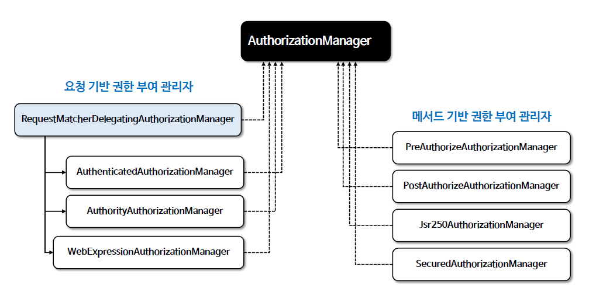

<nav>
    <a href="../../#authorization-architecture" target="_blank">[Spring Security Core]</a>
</nav>

# 인가 관리자 - AuthorizationManager

---

## 1. AuthorizationManager 란?
- `AuthorizationManager` 는 인증된 사용자가 요청 자원에 접근할 수 있는지 여부를 결정하는 인터페이스로서
인증된 사용자의 권한 정보와 요청 자원의 보안 요구 사항을 기반으로 권한 부여 결정을 내린다.
- `AuthorizationManager` 는 Spring Security 의 요청 기반, 메서드 기반의 인가 구성 요소에서 호출되며 최종 액세스 제어 결정을 수행한다.
- `AuthorizationManager` 는 Spring Security의 필수 구성 요소이다. 스프링 시큐리티 필터체인 상에서, 권한 부여 처리는 제일 끝의 AuthorizationFilter 를 통해 이루어지는데
여기서 `AuthorizationFilter` 는 `AuthorizationManager` 를 호출하여 권한 부여 결정을 내린다.

---

## 2. AuthorizationManager 인터페이스
```java
public interface AuthorizationManager<T> {
	default void verify(Supplier<Authentication> authentication, T object) {
		AuthorizationDecision decision = check(authentication, object);
		if (decision != null && !decision.isGranted()) {
			throw new AccessDeniedException("Access Denied");
		}
	}
	@Nullable
	AuthorizationDecision check(Supplier<Authentication> authentication, T object);
}
```
- `check()`
  - 권한 부여 결정을 내릴 때 필요한 모든 관련 정보(인증객체, 체크 대상(권한정보, 요청정보, 호출정보 등..)가 전달된다.
  - 액세스가 허용되면 true 를 포함하는 `AuthorizationDecision`
  - 거부되면 false 를 포함하는 `AuthorizationDecision`
  - 결정을 내릴 수 없는 경우 null 을 반환한다
- `verify()`
  - 디폴트 메서드
  - check 를 호출해서 반환된 값이 false 가진 `AuthorizationDecision` 인 경우 `AccessDeniedException`을 throw 한다.

---

## 3. 여러가지 AuthorizationManager 구현체


- 요청 기반 권한 부여 관리자는 기본 구현체로 RequestMatcherDelegatingAuthorizationManager가 사용된다.
  - 이것은 내부적으로 여러개의 요청 기반 권한부여 관리자들을 가지고 있으며, 사용자 요청 패턴을 기준으로 가장 먼저 매칭되는 인가 관리자가 요청을 가로채서 처리하는 식으로 작동한다.
- 메서드 기반 권한 부여는 AOP를 통해 동작하는데 내부적으로 메서드 기반 권한부여 관리자가 사용된다.

### 구현체들
- AuthorityAuthorizationManager
    - 특정 권한을 가진 사용자에게만 접근을 허용한다. 주로 사용자의 권한(예: ROLE_USER, ROLE_ADMIN)을 기반으로 접근을 제어한다
    - 내부적으로 AuthoritiesAuthorizationManager 에게 위임하여 처리한다. AuthoritiesAuthorizationManager는 RoleHierarchy 를 포함하고 있는데 이를 활용하여 인가에 사용한다.
- AuthenticatedAuthorizationManager
  - 인증된 사용자에게 접근을 허용한다. 이 클래스는 사용자가 시스템에 로그인했는지 여부를 기준으로 결정한다
- WebExpressionAuthorizationManager
  - 웹 보안 표현식을 사용하여 권한을 관리한다. 예를 들어, "hasRole('ADMIN')" 또는 "hasAuthority('WRITE_PERMISSIONS')"과 같은 표현식을 사용할 수 있다
- RequestMatcherDelegatingAuthorizationManager
  - 인가설정에서 지정한 모든 요청패턴과 권한 규칙을 매핑한 정보를 가지고 있으며 권한 검사 시 가장 적합한 AuthorizationManager 구현체를 선택해 위임한다
- PreAuthorizeAuthorizationManager
  - 메소드 실행 전에 권한을 검사한다. `@PreAuthorize` 어노테이션과 함께 사용되며, 메소드 실행 전에 사용자의 권한을 확인한다
- PostAuthorizeAuthorizationManager
  - 메소드 실행 후에 권한을 검사한다. `@PostAuthorize` 어노테이션과 함께 사용되며, 메소드 실행 후 결과에 따라 접근을 허용하거나 거부한다
- Jsr250AuthorizationManager
  - JSR-250 어노테이션(`@RolesAllowed`, `@DenyAll`, `@PermitAll`)을 사용하여 권한을 관리한다
- SecuredAuthorizationManager
  - `@Secured` 어노테이션을 사용하여 메소드 수준의 보안을 제공한다. 이 어노테이션은 특정 권한을 가진 사용자만 메소드에 접근할 수 있게 한다

---
