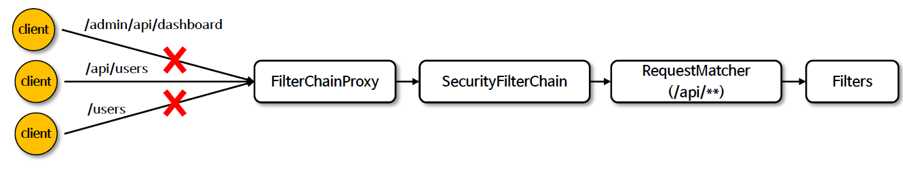
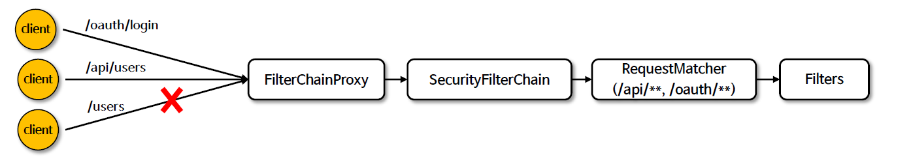

<nav>
    <a href="../../#authorization-process" target="_blank">[Spring Security Core]</a>
</nav>

# SecurityFilterChain 매칭 - securityMatcher()

---

## 1. `securityMatcher(...)`

### 1.1 API 사용법


```java
// 특정 자원 보호가 필요한 경로를 정의한다
http.securityMatcher(String... urlPatterns)
// 1개 이상의 RequestMatcher를 지정. AntPathRequestMatcher, MvcRequestMatcher 등의 구현체를 사용할 수 있다
http.securityMatcher(RequestMatcher... requestMatchers)
```
```kotlin

// 코틀린 DSL
http {
        securityMatcher("/admin/**")
}
```
- securityMatcher 메서드를 통해 그 필터체인을 처리할 것인지 말 것인지 결정하는 RequestMatcher를 지정할 수 있다.
- 패턴은 문자열 url 기반으로 설정하거나 RequestMatcher 클래스를 지정하여 전달할 수 있다.
    - 여러개 가변인자 형태로 전달할 수 있다.
    - 이 경우 or 기반이다. 즉 복수의 인자를 전달할 경우 해당 패턴 중 하나라도 일치하면 매칭된다.(다만 코틀린 DSL 기준 문자열 가변인자 방식은 지원 X)

### 1.2 주의점
```kotlin
    @Order(0)
    @Bean
    fun securityFilterChain1(http: HttpSecurity, introspector: HandlerMappingIntrospector): SecurityFilterChain {
        http {
            securityMatcher(MvcRequestMatcher(introspector, "/api/**"), MvcRequestMatcher(introspector, "/oauth/**"))
            authorizeHttpRequests {
                authorize(anyRequest, permitAll)
            }
        }
        return http.build()
    }


    @Order(1)
    @Bean
    fun securityFilterChain2(http: HttpSecurity): SecurityFilterChain {
        http {
            authorizeHttpRequests {
                authorize(anyRequest, authenticated)
            }
            formLogin {}
        }
        return http.build()
    }
```
- SecurityFilterChain을 여러개 등록했다면 가장 먼저 matches가 true를 반환하는 SecurityFilterChain이 적용된다.
    - 이것 때문에 SecurityFilterChain의 순서가 중요하다.
    - `@Order(...)` 를 사용하여 명시적으로 순서를 지정하는 것이 좋다. 순서값이 낮을 수록 우선순위가 높다.
    - 넓은 범위의 엔드포인트일 수록 우선순위가 낮아야한다.

### 1.3 참고
- 별도로 `securityMatcher` 메서드를 호출하지 않으면 항상 true를 반환하는 AnyRequestMatcher가 설정된다.
- Spring MVC가 클래스 경로에 있으면 MvcRequestMatcher 가 사용되고, 그렇지 않으면 AntPathRequestMatcher 가 사용된다

---

## 2. 다중패턴 설정


```java
// 패턴 1
http. securityMatchers((matchers) -> matchers.requestMatchers("/api/**", "/oauth/**"));

// 패턴 2
http. securityMatchers((matchers) -> matchers.requestMatchers("/api/**").requestMatchers("/oauth/**"));

// 패턴 3
http.securityMatchers((matchers) -> matchers.requestMatchers("/api/**")
    .securityMatchers((matchers) -> matchers.requestMatchers("/oauth/**"));
```
- securityMatchers 메소드는 특정 패턴에 해당하는 요청을 단일이 아닌 다중 설정으로 구성해서 보안 규칙을 적용할 수 있으며 현재의 규칙은 이전의 규칙을 대체하지 않는다
- Kotlin DSL에서 지원되지는 않는다.

---

## 참고
- securityMatchers 설정이 어떻게 작동하는 지에 대한 부분은 '다중 보안 설정' 파트에서 다룬다.
- 간단히 설명하면, FilterChainProxy 에서 각 필터체인에 대해 matches를 호출한뒤 match가 되면 먼저 match된 쪽으로 필터체인쪽으로 요청을 포워딩시킨다.

---
