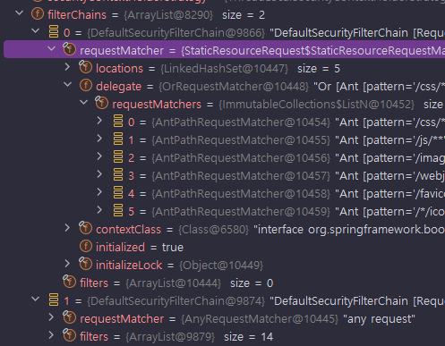

<nav>
    <a href="../../#authorization-process" target="_blank">[Spring Security Core]</a>
</nav>

# 정적 자원 관리

---

## 1. 정적 자원 관리
- html, css, js, jpg, gif, … 등 정적 리소스 등에 대해서는 보안 처리가 심하게 필요하지 않다.
- 정적 자원에 대한 인가 처리 방법은 크게 두 방법이 존재한다.
  - WebSecurityCustomizer 설정 방식 : 아예 필터체인을 통과시키지 않는 방법
  - RequestMatcher 설정 방식: AuthorizationFilter에서 정적 자원에 대해서는 통과를 허락하는 방법

---

## 2. WebSecurityCustomizer 설정 방식

### 2.1 설정
```kotlin
    @Bean
    fun webSecurityCustomizer(): WebSecurityCustomizer {
        return WebSecurityCustomizer { webSecurity: WebSecurity ->
            webSecurity.ignoring().requestMatchers(
                PathRequest.toStaticResources().atCommonLocations()
            )
        }
    }
```
- 정적 리소스에 대해서 요청을 무시하는 설정을 하는 WebSecurityCustomizer 를 등록하는 방식이다.
- 실질적으로 FilterChainProxy에 어떤 필터도 존재하지 않는 필터체인이 등록되고 여기서 정적 리소스 접근을 우선적으로 가로챈다.

### 2.2 참고 -  StaticResourceLocation
```java
public enum StaticResourceLocation {
    CSS(new String[]{"/css/**"}),
    JAVA_SCRIPT(new String[]{"/js/**"}),
    IMAGES(new String[]{"/images/**"}),
    WEB_JARS(new String[]{"/webjars/**"}),
    FAVICON(new String[]{"/favicon.*", "/*/icon-*"});
}
```
- 위 설정을 하면 스프링 시큐리티는 StaticResourceLocation에 위치한 패턴들을 기반으로 RequestMatcher를 생성하고 정적 요청을 이 matcher에서 가로채도록 한다.

### 2.3 동작원리
- WebSecurityConfiguration : 개발자가 등록한 WebSecurityCustomizer 빈이 주입된다.
    ```java
        @Autowired(required = false)
        void setFilterChains(List<SecurityFilterChain> securityFilterChains) {
            this.securityFilterChains = securityFilterChains;
        }
    
        @Autowired(required = false)
        void setWebSecurityCustomizers(List<WebSecurityCustomizer> webSecurityCustomizers) {
            this.webSecurityCustomizers = webSecurityCustomizers;
        }
    ```
- IgnoredRequestConfigurer : WebSecurity 설정 과정에서, innoredRequests에 설정한 RequestMatchers가 등록된다.
    ```java
        @Override
        protected IgnoredRequestConfigurer chainRequestMatchers(List<RequestMatcher> requestMatchers) {
            WebSecurity.this.ignoredRequests.addAll(requestMatchers);
            return this;
        }
    ```
- WebSecurity : FilterChainProxy 구성시 ignoredRequests에 등록된 RequestMatcher마다, 필터가 하나도 없는 SecurityFilterChain이 만들어지고 우선시되어 등록된다.
    ```java
    @Override
        protected Filter performBuild() throws Exception {
            // 생략
        
            int chainSize = this.ignoredRequests.size() + this.securityFilterChainBuilders.size();
            List<SecurityFilterChain> securityFilterChains = new ArrayList<>(chainSize);
            List<RequestMatcherEntry<List<WebInvocationPrivilegeEvaluator>>> requestMatcherPrivilegeEvaluatorsEntries = new ArrayList<>();
            for (RequestMatcher ignoredRequest : this.ignoredRequests) {
                SecurityFilterChain securityFilterChain = new DefaultSecurityFilterChain(ignoredRequest);
                securityFilterChains.add(securityFilterChain);
                requestMatcherPrivilegeEvaluatorsEntries
                    .add(getRequestMatcherPrivilegeEvaluatorsEntry(securityFilterChain));
            }
            // 생략
        }
    ```
- 런타임: 필터가 하나도 없는 필터체인에서 요청을 가로채고 정적인 리소스는 이 필터체인을 거치게 되어, 실제 보안처리가 일어나지 않는다.
    

---

## 3. RequestMatcher 설정 방식

### 3.1 설정
```kotlin
    @Bean
    fun securityFilterChain(http: HttpSecurity): SecurityFilterChain {
        http {
            authorizeHttpRequests {
                authorize(PathRequest.toStaticResources().atCommonLocations(), permitAll)
                authorize(anyRequest, authenticated)
            }
            formLogin { }
            csrf { disable() }
        }
        return http.build()
    }
```
- 정적 resource에 대해 우선적으로 가로채고 permitAll을 하도록 필터체인 설정을 추가한다.
- 물론, 우리가 직접 패턴을 문자열로 지정하고 permitAll을 지정해도 된다.

### 3.2 동작원리
- AuthorizationFilter : AuthorizationManager를 통해 실질적 인가 처리를 위임한다. 여기서 Authentication의 Supplier를 전달함에 집중하자.
    ```java
        @Override
        public void doFilter(ServletRequest servletRequest, ServletResponse servletResponse, FilterChain chain)
                throws ServletException, IOException {
            // 생략
                AuthorizationDecision decision = this.authorizationManager.check(this::getAuthentication, request);
        }
    ```
- RequestMatcherDelegatingAuthorizationManager : 내부적으로 다른 AuthorizationManager를 갖고 있고 이들의 RequestMatcher를 확인하고 매칭되면 해당 AuthorizationManager를 위임한다.
    ```java
        @Override
        public AuthorizationDecision check(Supplier<Authentication> authentication, HttpServletRequest request) {
            for (RequestMatcherEntry<AuthorizationManager<RequestAuthorizationContext>> mapping : this.mappings) {
                RequestMatcher matcher = mapping.getRequestMatcher();
                MatchResult matchResult = matcher.matcher(request);
                if (matchResult.isMatch()) {
                    AuthorizationManager<RequestAuthorizationContext> manager = mapping.getEntry();
                    return manager.check(authentication,
                            new RequestAuthorizationContext(request, matchResult.getVariables()));
                }
            }
            return DENY;
        }
    ```
- PermitAll: 무조건 `AuthorizationDecision(true)`를 반환하는 AuthorizationManager가 작동한다. Authentication을 실제 로딩하지 않으므로 성능 문제가 사라졌다.
    ```kotlin
        val permitAll: AuthorizationManager<RequestAuthorizationContext> =
            AuthorizationManager { _: Supplier<Authentication>, _: RequestAuthorizationContext -> AuthorizationDecision(true) }
    ```

---

## 4. ignore보다 RequestMatcher 방식을 쓰자.
- 이전 버전에서는 Auhentication을 즉시 로딩하는 문제가 있어서 정적 자원 로딩에 있어서 WebSecurityCustomizer 방식을 사용했다.
  - SecurityContextPersistenceFilter 에서 SecurityContext을 즉시 로딩했었다. 따라서 시큐리티 필터체인을 거치게되면 무조건 SecurityContext 로딩이 일어났다. 데이터베이스, 세션 등에 이를 저장했다면 그만큼의 오버헤드가 발생했다.
  - 현재는 SecurityContextHolderFilter에서 지연 컨텍스트 로딩을 사용한다. 
- 현재 버전에서는 Autentication을 지연 로딩하는 방식을 사용하고, 정적 자원에 대해서 Authentication을 로딩하지 않도록 할 수 있기 때문에
성능상의 문제가 거의 없어졌다. 또한 필터체인을 거치는 과정에서 추가적인 보안처리(헤더 추가, ...)를 할 수 있다는 장점이 있기에 보다 안전한
RequestMatcher 방식을 사용하는 것을 권장한다.

---

