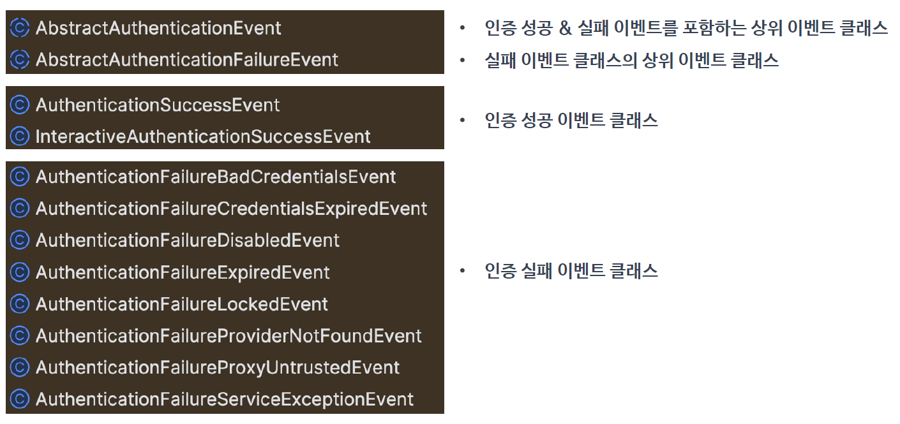

<nav>
    <a href="../../#event-handling" target="_blank">[Spring Security Core]</a>
</nav>

# 인증 이벤트 - Authentication Events

---

## 1. 인증 이벤트
- 스프링 시큐리티는 인증이 성공하거나 실패하게 되면 AuthenticationSuccessEvent 또는 AuthenticationFailureEvent 를 발생시킨다
- 이벤트를 발행하려면 ApplicationEventPublisher 를 사용하거나 시큐리티에서 제공하는 AuthenticationEventPublisher 를 사용해야한다.
- AuthenticationEventPublisher 의 구현체로 DefaultAuthenticationEventPublisher 가 제공된다

---

## 2. 발행 방법
```kotlin
            formLogin {
                authenticationSuccessHandler = AuthenticationSuccessHandler { request, response, authentication ->
                    applicationContext.publishEvent(CustomAuthenticationSuccessEvent(authentication))
                    response.sendRedirect("/")
                }
            }
```
- 발행 메서드
  - `ApplicationEventPublisher.publishEvent(ApplicationEvent)`
  - `AuthenticationEventPublisher.publishAuthenticationSuccess(Authentication)`
  - `AuthenticationEventPublisher.publishAuthenticationFailure(AuthenticationException, Authentication)`
- 위와 같이 인증 성공 또는 실패가 발생하였을 때 이벤트를 발행시켜주면 된다.

---

## 3. 인증 이벤트의 종류


- 최상위: AbstractAuthenticationEvent (추상)
- 인증 성공
  - AuthenticationSuccessEvent
  - InteractiveAuthenticationSuccessEvent : 대화형 인증(로그인, ...)
- 인증 실패
  - AbstractAuthenticationFailureEvent : 최상위 (추상)
  - AuthenticationFailureBadCredentialsEvent
  - AuthenticationFailureCredentialsExpiredEvent
  - AuthenticationFailureDisabledEvent
  - AuthenticationFailureExpiredEvent
  - AuthenticationFailureLockedEvent
  - AuthenticationFailureProviderNotFoundEvent
  - AuthenticationFailureProxyUntrustedEvent
  - AuthenticationFailureServiceExceptionEvent
  - ...
- 스프링의 이벤트 리스닝 메커니즘은 자바의 클래스 상속 구조를 따르기 때문에 특정 이벤트의 리스너는 해당 이벤트 뿐만 아니라 그 이벤트의 부모 클래스
(또는 인터페이스)들로부터 발생하는 이벤트도 처리 할 수 있다


---

## 4. 이벤트 처리
```kotlin
@Component
class AuthenticationEventInputAdapter {

    companion object {
        val log = getLogger(AuthenticationEventInputAdapter::class.java)
    }

    @EventListener
    fun onAuthenticationSuccess(successEvent: AuthenticationSuccessEvent) {
        log.info { "success = ${successEvent.authentication.name}" }
    }

    /**
     * 대화형 인증 성공
     */
    @EventListener
    fun onSuccess(successEvent: InteractiveAuthenticationSuccessEvent) {
        log.info { "success = ${successEvent.authentication.name}" }
    }

    @EventListener
    fun onSuccess(successEvent: CustomAuthenticationSuccessEvent) {
        log.info { "success = ${successEvent.authentication.name}" }
    }

    @EventListener
    fun onFailure(failures: AbstractAuthenticationFailureEvent) {
        log.info {"failures = ${failures.exception.message}" }
    }

    @EventListener
    fun onFailure(failures: AuthenticationFailureBadCredentialsEvent) {
        log.info {"failures = ${failures.exception.message}" }
    }

    @EventListener
    fun onFailure(failures: CustomAuthenticationFailureEvent) {
        log.info {"failures = ${failures.exception.message}" }
    }

}
```
- `@EventListener` 를 메서드에 걸고, 파라미터로 이벤트를 지정하면 해당 메서드가 이벤트를 처리함

---

## 5. 이벤트 발행되는 지점 예시

### 5.1 AbstractAuthenticationProcessingFilter
```java
    protected void successfulAuthentication(HttpServletRequest request, HttpServletResponse response, FilterChain chain, Authentication authResult) throws IOException, ServletException {
        // 생략
        if (this.eventPublisher != null) {
            this.eventPublisher.publishEvent(new InteractiveAuthenticationSuccessEvent(authResult, this.getClass()));
        }

        this.successHandler.onAuthenticationSuccess(request, response, authResult);
    }
```
- 인증 성공 후 InteractiveAuthenticationSuccessEvent 가 발행된다.

### 5.2 ProviderManager
```java
	private AuthenticationEventPublisher getAuthenticationEventPublisher(ApplicationContext context) {
		if (context.getBeanNamesForType(AuthenticationEventPublisher.class).length > 0) {
			return context.getBean(AuthenticationEventPublisher.class);
		}
		return this.objectPostProcessor.postProcess(new DefaultAuthenticationEventPublisher());
	}
```
- HttpSecurity 에 기본으로 등록되는 ProviderManager 에 대한 기본 설정은 AuthenticationConfiguration 에서 이루어진다.
- 여기서는, AuthenticationEventPublisher 빈을 조회해서 있으면 그것을 사용하고 없으면 DefaultAuthenticationEventPublisher 를 주입한다.
  - 만약 우리가 커스텀한 AuthenticationEventPublisher 를 사용하고 싶다면, 스프링 빈으로 등록하면 된다.
  - 그렇지 않다면 DefaultAuthenticationEventPublisher 가 사용된다.

```java
if (parentResult == null) {
    this.eventPublisher.publishAuthenticationSuccess(result);
}
```
- 인증 결과가 존재하면서, 부모 AuthenticationManager 로부터 발급받은 인증 결과가 없으면 성공 이벤트가 발행된다.

```java
private void prepareException(AuthenticationException ex, Authentication auth) {
    this.eventPublisher.publishAuthenticationFailure(ex, auth);
}

```
- 인증에 실패하면 인증 실패 이벤트가 발행된다.


---

## 6. 실습

### 6.1 CustomAuthenticationProvider
```kotlin
class CustomAuthenticationProvider(
    private val applicationEventPublisher: ApplicationEventPublisher,
) : AuthenticationProvider {

    override fun authenticate(authentication: Authentication): Authentication {
        if (authentication.name != "user") {
            val exception = BadCredentialsException("아이디가 user가 아님...")
            applicationEventPublisher.publishEvent(CustomAuthenticationFailureEvent(authentication, exception))
            throw exception
        }

        val user = User.withUsername("user").password("{noop}1111").roles("USER").build()
        return UsernamePasswordAuthenticationToken.authenticated(user, user.password, user.authorities)
    }

    override fun supports(authentication: Class<*>?): Boolean {
        return true
    }
}
```
- 사용자 이름이 user가 아닐 때 BadCredentialsException 이 발생하도록 했다.
- 이를 ApplicationEventPublisher 를 통해 CustomAuthenticationFailureEvent 형태로 발행
- 그대로 예외를 throw
  - 이 예외는 ProviderManager를 통해 전달되어 AuthenticationEventPublisher 를 통해 발행
- 이제 인증에 실패하면 이벤트는 총 2개 발행된다.
  - CustomAuthenticationFailureEvent
  - AuthenticationFailureBadCredentialsEvent
- 그리고 이것의 부모에 해당하는 AbstractAuthenticationFailureEvent 를 잡는 리스너에서도 이것들이 잡히므로
이벤트 리스너에서 4번(2회, 2회) 잡혀야한다.


### 6.2 보안 설정
```kotlin
@Configuration
@EnableWebSecurity
@EnableMethodSecurity
class SecurityConfig(
    private val applicationContext: ApplicationContext,
) {

    @Bean
    fun securityFilterChain(http: HttpSecurity): SecurityFilterChain {
        http {
            authorizeHttpRequests {
                authorize(anyRequest, permitAll)
            }
            formLogin {
                authenticationSuccessHandler = AuthenticationSuccessHandler { request, response, authentication ->
                    applicationContext.publishEvent(CustomAuthenticationSuccessEvent(authentication))
                    response.sendRedirect("/")
                }
            }
            csrf { disable() }
        }
        return http.build()
    }

    @Bean
    fun customAuthenticationProvider(applicationEventPublisher: ApplicationEventPublisher): AuthenticationProvider {
        return CustomAuthenticationProvider(applicationEventPublisher)
    }

```
- CustomAuthenticationProvider 를 빈으로 등록했다.
  - 이를 빈으로 등록하면 기본 ProviderManager 에서 사용된다.
- AuthenticationProvider 로는 CustomAuthenticationProvider 를 지정했다.
- 이 상태로 폼 로그인을 user가 아닌 사용자로 해보자.

### 6.3 이벤트 처리
```kotlin
    @EventListener
    fun onFailure(failures: AbstractAuthenticationFailureEvent) {

        log.info {"failures = ${failures.exception.message}" }
    }

    @EventListener
    fun onFailure(failures: AuthenticationFailureBadCredentialsEvent) {
        log.info {"failures = ${failures.exception.message}" }
    }

    @EventListener
    fun onFailure(failures: CustomAuthenticationFailureEvent) {
        log.info {"failures = ${failures.exception.message}" }
    }
```
- CustomAuthenticationFailureEvent, AbstractAuthenticationFailureEvent 이벤트 처리 실행
- CustomAuthenticationFailureEvent, AbstractAuthenticationFailureEvent 이벤트 처리 실행

---
