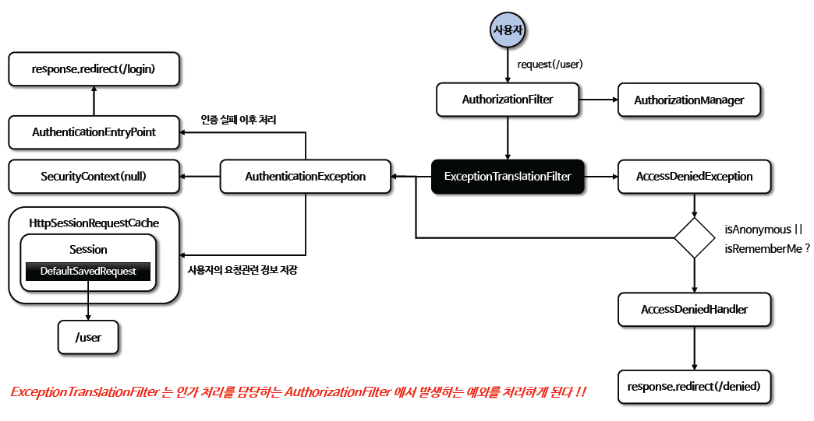

<nav>
    <a href="../../#exception-handling" target="_blank">[Spring Security Core]</a>
</nav>

# ExceptionTranslationFilter

---

## 1. ExceptionTranslationFilter
### 1.1 위치
- SecurityFilterChain 제일 끝에 위치한 필터는 `AuthorizationFilter` 이다.
- ExceptionTranslationFilter는 AuthorizationFilter 바로 앞에 위치해있다.
- **따라서 ExceptionTranslationFilter는 AuthorizationFilter에서 발생한 인증 예외, 인가 예외를 처리해주는 필터라고 보면 된다.**

### 1.2 인증 예외(AuthenticationException) 처리
1. 인증예외 발생 이유
    - ExceptionTranslationFilter에서 직접적으로 발생한 AuthenticationExcepition
    - 아래에서 후술할 익명사용자/RememberMe 사용자의 인가 예외가 변환된 경우
2. AuthenticationEntryPoint 호출
    - 로그인 페이지 이동, 401 오류 코드 전달 등
    - AuthenticationEntryPoint 는 인증 예외의 후속 처리를 담당한다.
3. SecurityContext 비우기
4. 인증 예외가 발생하기 전의 요청 정보를 저장
    - `RequestCache` - 사용자의 이전 요청 정보을 세션에 저장하고 이를 꺼내 오는 캐시 메커니즘을 수행하는 역할
        - 인터페이스다.
        - 메서드 : `saveRequest` , `getRequest` , …
    - `SavedRequest`- 사용자가 요청했던 request 파라미터 값들, 그 당시의 헤더값들 등을 저장한 형태
        - 이것도 인터페이스다.
        - 캐싱한 요청 정보를 얻어올 때 이 인터페이스로 얻어와진다.
        - 사용자는 로그인을 하고 다시 전에 요청했던 정보의 캐싱내역을 꺼내서 사용할 수 있다.

### 1.3 인가 예외(AccessDeniedException) 처리
- `AccessDeniedHandler` 에서 예외 처리하도록 제공
- 참고로 rememberMe 사용자 또는 익명 사용자는 AuthenticationException의 하위 클래스 예외로 변경하여 인증 예외 처리 쪽으로 위임한다.

---

## 2. ExceptionTranslationFilter 흐름



### 2.1 AuthorizationFilter에서 예외 throw
```java
private void doFilter(HttpServletRequest request, HttpServletResponse response, FilterChain chain)
			throws IOException, ServletException {
		try {
			chain.doFilter(request, response);
		}
		catch (IOException ex) {
			throw ex;
		}
		catch (Exception ex) {
            // 생략
			handleSpringSecurityException(request, response, chain, securityException);
		}
}
```
- AuthorizaionFilter에서 발생한 예외가 throw되어 ExceptiontranslationFilter에 온다.

### 2.2 예외 분류
```java
	private void handleSpringSecurityException(HttpServletRequest request, HttpServletResponse response,
			FilterChain chain, RuntimeException exception) throws IOException, ServletException {
		if (exception instanceof AuthenticationException) {
			handleAuthenticationException(request, response, chain, (AuthenticationException) exception);
		}
		else if (exception instanceof AccessDeniedException) {
			handleAccessDeniedException(request, response, chain, (AccessDeniedException) exception);
		}
	}
```
```java
	private void handleAccessDeniedException(HttpServletRequest request, HttpServletResponse response,
			FilterChain chain, AccessDeniedException exception) throws ServletException, IOException {
		Authentication authentication = this.securityContextHolderStrategy.getContext().getAuthentication();
		boolean isAnonymous = this.authenticationTrustResolver.isAnonymous(authentication);
		if (isAnonymous || this.authenticationTrustResolver.isRememberMe(authentication)) {
			if (logger.isTraceEnabled()) {
				logger.trace(LogMessage.format("Sending %s to authentication entry point since access is denied",
						authentication), exception);
			}
			sendStartAuthentication(request, response, chain,
					new InsufficientAuthenticationException(
							this.messages.getMessage("ExceptionTranslationFilter.insufficientAuthentication",
									"Full authentication is required to access this resource")));
		}
		else {
			if (logger.isTraceEnabled()) {
				logger.trace(
						LogMessage.format("Sending %s to access denied handler since access is denied", authentication),
						exception);
			}
			this.accessDeniedHandler.handle(request, response, exception);
		}
	}
```
- 인증 예외 : handleAuthenticationException -> sendStartAuthentication
- 인가 예외 : handleAccessDeniedException
  - 익명 사용자(미인증 사용자)또는 `rememberMe` 사용자의 경우 인가 예외를 인증 예외로 바꿔서 인증 예외 처리 로직으로 위임(sendStartAuthentication)
  - 그 외의 경우는 AccessDeniedHandler로 처리 위임

### 2.3 인증 예외 처리
```java
	protected void sendStartAuthentication(HttpServletRequest request, HttpServletResponse response, FilterChain chain,
			AuthenticationException reason) throws ServletException, IOException {
		// SEC-112: Clear the SecurityContextHolder's Authentication, as the
		// existing Authentication is no longer considered valid
		SecurityContext context = this.securityContextHolderStrategy.createEmptyContext();
		this.securityContextHolderStrategy.setContext(context);
		this.requestCache.saveRequest(request, response);
		this.authenticationEntryPoint.commence(request, response, reason);
	}
```
- SecurityContextHolderStrategy를 통해 현재 요청의 인증 컨텍스트를 제거
- RequestCache에 현재 요청 정보를 저장(캐싱하지 않는 구현을 가진 RequestCache를 등록해두면 실제 캐싱은 이루어지지 않을 것이다.)
- AuthenticationEntryPoint 를 통해 인증 예외 추가 후속처리

### 2.4 인가 예외 처리
```java
this.accessDeniedHandler.handle(request, response, exception);
```
- AccessDeniedHandler로 처리 위임

---
