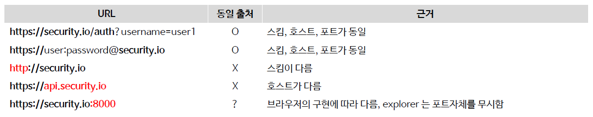

<nav>
    <a href="../../#exploit-protection" target="_blank">[Spring Security Core]</a>
</nav>

# CORS(Cross Origin Resource Sharing, 교차 출처 리소스 공유)

---

## 1. CORS(Cross Origin Resource Sharing)

- 브라우저에서는 보안을 위해 기본적으로 한 웹 페이지(출처 A)에서 다른 웹 페이지(출처 B)의 데이터를 직접 불러오는 것을 제한하는데 이를 '동일 출처 정책(Same-Origin Policy)' 이라고 한다.
- CORS는 특별한 HTTP 헤더를 통해 한 웹 페이지가 다른 출처의 리소스에 접근할 수 있도록 '허가'를 구하는 방법이다. 즉, 웹 애플리케이션이
다른 출처의 데이터를 사용하고자 할 때, 브라우저가 그 요청을 대신해서 해당 데이터를 사용해도 되는지 다른 출처에게 물어보는 것이라 할 수 있다.
- 출처를 비교하는 로직은 서버에 구현된 스펙이 아닌 브라우저에 구현된 스펙 기준으로 처리되며 브라우저는 클라이언트의 요청 헤더와 서버의 응답헤더를 비교해서 최종 응답을 결정한다

### 예시


- `https://domain-a.com` 의 프론트엔드 JavaScript 코드가 XMLHttpRequest를 사용하여 `https://domain-b.com/data.json` 을 요청하는 경우 보안 상의 이유로,
브라우저는 스크립트에서 시작한 교차 출처 HTTP 요청을 제한한다.
- XMLHttpRequest와 Fetch API는 동일 출처 정책을 따르기 때문에이 API를 사용하는 웹 애플리케이션은 자신의 출처와 동일한 리소스만 불러올 수 있으며, 다른 출처의 리소스를 불러오
려면 그 출처(서버)에서 올바른 CORS 관련 헤더를 포함한 응답을 반환해야 한다.

---

## 2. 동일 출처의 기준


두개의 출처를 비교하는 방법은 URL의 구성요소 중 Protocol, Host, Port 이 세가지가 동일한지 확인하면 되고 나머지는 틀려도 상관없다
- 프로토콜
- 호스트
- 포트

---

## 3. CORS 방법 1 - Simple Request


- Simple Request 는 예비 요청(Prefilght) 과정 없이 자동으로 CORS 가 작동하여 서버에 본 요청을 한 후,
서버가 응답의 헤더에 Access-Control-Allow-Origin 과 같은 값을 전송하면 브라우저가 서로 비교 후 CORS 정책 위반여부를 검사하는 방식이다
- 제약사항
  - GET, POST, HEAD 중의 한가지 Method를 사용해야 한다.
  - 헤더는 Accept, Accept-Language, Content-Language, Content-Type, DPR, Downlink, Save-Data, Viewport-Width Width 만 가능하고
  **Custom Header 는 허용되지 않는다**
  - Content-type 은 application/x-www-form-urlencoded, multipart/form-data, text/plain 만 가능하다

---

## 4. CORS 방법 2 - Preflight Request


- 브라우저는 요청을 한번에 보내지 않고, 예비 요청과 본 요청으로 나누어 서버에 전달하는데 브라우저가 예비요청을 보내는 것을 Preflight 라고 하며 이 예비요청의 메소드에는
`OPTIONS` 가 사용된다
- 예비요청의 역할은 본 요청을 보내기 전에 브라우저 스스로 안전한 요청인지 확인하는 것으로 요청 사양이 Simple Request 에 해당하지 않을 경우 브라우저가 Preflight
Request 을 실행한다

### Preflight Request - 예시


- 브라우저가 보낸 요청을 보면 Origin에 대한 정보 뿐만 아니라 예비 요청 이후에 전송할 본 요청에 대한 다른
정보들도 함께 포함되어 있는 것을 볼 수 있다.
- 이 예비 요청에서 브라우저는 `Access-Control-Request-Headers` 를 사용하여 자신이 본 요청에서
Content-Type 헤더를 사용할 것을 알려주거나, `Access-Control-Request-Method`를 사용하여 GET
메소드를 사용할 것을 서버에게 미리 알려주고 있다


- 서버가 보내준 응답 헤더에 포함된 `Access-Control-Allow-Origin: https://security.io` 의 의미는 해당
URL 외의 다른 출처로 요청할 경우에는 CORS 정책을 위반했다고 판단하고 오류 메시지를 내고 응답을 버리게 된다


---

## 5. CORS 설정
```kotlin
@EnableWebSecurity
@Configuration
class SecurityConfig {


    @Bean
    fun filterChain(http: HttpSecurity): SecurityFilterChain {
        http {
            authorizeRequests {
                authorize(anyRequest, permitAll)
            }
            cors {
                configurationSource = corsConfigurationSource()
            }
        }
        return http.build()
    }


    @Bean
    fun corsConfigurationSource(): CorsConfigurationSource {
        val corsConfiguration = CorsConfiguration()
        corsConfiguration.addAllowedOrigin("http://localhost:8080")
        corsConfiguration.addAllowedMethod("*")
        corsConfiguration.addAllowedHeader("*")
        corsConfiguration.allowCredentials = true
        corsConfiguration.maxAge = 3600L

        val source = UrlBasedCorsConfigurationSource()
        source.registerCorsConfiguration("/**", corsConfiguration)
        return source
    }
}
```
- `cors()`에 CorsConfigurationSource 를 제공하면, Spring Security와 통합하여 CORS 설정을 구성할 수 있다.

---

## 6. CORS 필터
```java
public class CorsFilter extends OncePerRequestFilter {

	private final CorsConfigurationSource configSource;

	private CorsProcessor processor = new DefaultCorsProcessor();
    
    // 생략

	@Override
	protected void doFilterInternal(HttpServletRequest request, HttpServletResponse response,
			FilterChain filterChain) throws ServletException, IOException {

		CorsConfiguration corsConfiguration = this.configSource.getCorsConfiguration(request);
		boolean isValid = this.processor.processRequest(corsConfiguration, request, response);
		if (!isValid || CorsUtils.isPreFlightRequest(request)) {
			return;
		}
		filterChain.doFilter(request, response);
	}

}
```
- 우리가 전달한 CorsConfigurationSource는 CorsFilter에 전달되어 CORS 처리에 사용된다.
- 스프링 시큐리티는 CorsProcessor 및 기본 구현체를 설정해두고, 이곳에서 해당 요청에 대한 각종 Cors 처리를 해준다.
  - Access-Control-Allow-Origin 와 같은 헤더 설정
  - Cors 본요청의 경우 본요청이 Cors 정책에 위반되는 지 체크하고 우리 서버에서 설정한 정책에 위반되면 요청을 거절


- Cors 필터는 스프링 시큐리티 인가 필터(AuthorizationFilter) 앞에서 처리되어야 한다.
  - 사전 요청은 쿠키(JSESSIONID)가 포함되지 않다.
  - AuthorizationFilter가 먼저 동작하게 되면 사용자가 인증되지 않았다고 판단하고 거부될 수 있기 때문이다.
- 그래서 스프링 시큐리티에서 CORS 처리를 하려면 CORS 처리는 스프링 시큐리티쪽에 두어야하며, CorsFilter를 통해 처리되도록 설정을 해야한다.

---
