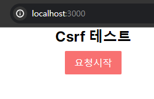
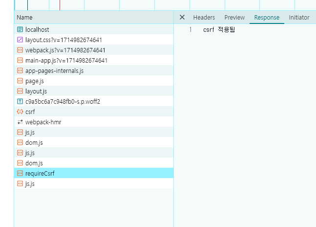

<nav>
    <a href="../../#exploit-protection" target="_blank">[Spring Security Core]</a>
</nav>


# CSRF 통합(클라이언트 + 백엔드)
- CSRF 공격을 방지하기 위한 토큰 패턴을 사용하려면 실제 CSRF 토큰을 HTTP 요청에 포함해야 한다
- 그래서 브라우저에 의해 HTTP 요청에 자동으로 포함되지 않는 요청 부분(폼 매개변수, HTTP 헤더 또는 기타 부분) 중 하나에 포함되어야 한다
- 클라이언트 어플리케이션이 CSRF 로 보호된 백엔드 애플리케이션과 통합하는 여러 가지 방법을 살펴보자.

---

# 1. 결정

### 1.1 원본 토큰을 어디에 저장할 것인가?
- 세션 : HttpSessionCsrfTokenRepository
- 쿠키 : CookieCsrfTokenRepository

### 1.2 요청을 어떻게 처리하는가?
- CsrfTokenRequestHandler: 클라이언트에게 원본 토큰을 전달하고, 이를 요청마다 함께 보내게한다.
- XorCsrfTokenRequestHandler: 클라이언트에게 인코딩된 토큰을 전달하고 이를 요청마다 함께 보내게 한다.

### 1.3 요청 토큰을 클라이언트에 어떻게 보내고, 어떻게 클라이언트가 보내게 할 것인가?
- 이 부분을 어떻게 할 것인지에 대한 사례는 아래에서 다룬다.

---

## 2. 요청 Csrf 토큰 발급 및 통합 - 단일 서버 HTML Form 방식
백엔드와 프론트가 분리되지 않았고, HTML Form 방식을 사용할 때 Csrf 토큰을 발급 및 처리하는 방식이다.

### 2.1 발급
```html
<form action="/memberJoin" method="post">
<input type="hidden" name="_csrf" value="4bfd1575-3ad1-4d21-96c7-4ef2d9f86721"/>
</form>
```
- 브라우저에 HTML 파일을 전송할 때 요청 Csrf 토큰을 form 요소의 자식 hidden input 요소로 함께 렌더링한다.
```html
<form th:action="@{/formCsrf}" method="post">
    <div class="form-group">
        <label for="username">Username</label>
        <input type="text" class="form-control" id="username" name="username" required>
    </div>
    <div class="form-group">
        <label for="password">Password</label>
        <input type="password" class="form-control" id="password" name="password" required>
    </div>
    <button type="submit" class="btn btn-primary">Login</button>
</form>
```
- CSRF 토큰을 자동으로 포함시켜주는 view는 다음과 같다.
  - Thymeleaf : `th:...`를 사용하여야 자동으로 csrf input 요소를 함께 렌더링해준다.
  - Spring 의 폼 태그 라이브러리 - `<%@ taglib prefix="form" uri="http://www.springframework.org/tags/form" %>`

### 2.2 처리
- 브라우저에서 form 요소의 데이터를 submit 할 때 hidden input 요소의 값도 함께 전송되고 서버는 이를 받아서 함께 처리하면 된다.

---

## 3. 요청 Csrf 토큰 발급 및 통합 - 단일 서버 HTML + JavaScript 방식
백엔드와 프론트가 분리되지 않았고, Javascript를 이용해 api를 호출하는 방식이다.

### 3.1 발급
```html
<!DOCTYPE html>
<html xmlns:th="http://www.thymeleaf.org">
<meta name="_csrf" th:content="${_csrf.token}"/>
<meta name="_csrf_header" th:content="${_csrf.headerName}"/>
</html>
```
- meta 요소를 통해 csrf 토큰을 발급한다.
- 요청(HttpServletRequest)의 파라미터 값을 meta 요소에 삽입시켜서 HTML 페이지를 구성하고 사용자에게 내려준다.
  - `_csrf_header` : 어떤 헤더명으로 보낼 것인가
  - `_csrf.token` : 인증 토큰값

### 3.2 요청
```javascript
function login() {
    const csrfHeader = $('meta[name="_csrf_header"]').attr('content');
    const csrfToken = $('meta[name="_csrf"]').attr('content')
    fetch('/api/login', {
        method: 'POST',
        headers: {[csrfHeader]: csrfToken},
        body: JSON.stringify({/* 데이터 객체 */}), // 서버로 보낼 데이터
        credentials: 'include' // 쿠키를 포함시키기 위해 필요    )
    })
    // 생략
}
```
- 브라우저에서 javascript를 통해 요청을 보낼 때 meta요소에 있는 csrf 토큰을 헤더에 담아 요청한다.
- fetch api를 쓸 때 `credentials: 'include'` 옵션을 함께 전달해야 인증에 필요한 쿠키를 함께 전달하니 주의

---

## 4. 요청 Csrf 토큰 발급 및 통합 - 프론트엔드/백엔드 분리 + JavaScript 방식

### 4.1 발급
```typescript
export const CsrfTokenProvider = ({children}: Props) => {
    const [csrfToken, setCsrfToken] = useState<CsrfToken | undefined>(undefined)
    const [isLoading, setIsLoading] = useState<boolean>(false)
    const [error, setError] = useState<Error | undefined>(undefined)

    useEffect(() => {
        setIsLoading(true)
        fetch("http://localhost:8080/csrf", {
            method: 'GET',
            credentials: 'include'
        }).then(res => {
            if (res.status >= 400) {
                throw Error("인증 csrf 토큰 로딩 실패")
            }
            return res.json()
        }).then(data => {
            setCsrfToken({
                headerName: data.headerName,
                parameterName: data.parameterName,
                value: data.token
            })
        }).catch(err => {
            // CsrfToken 로딩 실패 예외처리
            setError(err)
        }).finally(() => {
            setIsLoading(false)
        })
    }, []);

    return (
        <CsrfTokenContext.Provider value={{csrfToken, isLoading, error}}>
            {children}
        </CsrfTokenContext.Provider>
    );
}

export const useCsrf = () => useContext(CsrfTokenContext);
```
- 브라우저에서 HTML페이지를 전달받고, 자바스크립트가 실행될 떄 api 호출을 통해 백엔드로부터 csrf 토큰을 발급받는다.
  - body에 담아 보내거나, 헤더에 담아 보내거나 클라이언트와의 협의를 통해 결정한다.

### 4.2 요청
```typescript
'use client';

import React from 'react';
import {useCsrf} from "@/shared/context";

type Props = {
    text: string
}

const CsrfButton = ({text}: Props) => {
    const {csrfToken, isLoading, error} = useCsrf();
    const handleClick = (e: React.MouseEvent<HTMLButtonElement>) => {
        fetch("http://localhost:8080/requireCsrf", {
            method: 'POST',
            headers: {
                [csrfToken!!.headerName] : csrfToken!!.value
            },
            credentials: "include"
        }).then(res => {
            if (res.status >= 400) {
                throw Error("Csrf 토큰이 필요한 요청에 실패")
            }
            return res.text()
        }).then(data => {
            console.log(data)
        }).catch(err => {
            console.log(err)
        })
    }

    if (isLoading) {
        return <p>버튼 로딩 중...</p>
    }
    if (error) {
        return <p>버튼 로딩에 실패했습니다.</p>
    }

    return (
        <button className={'bg-red-400 py-2 px-4 text-white rounded-sm hover:brightness-110 disabled:bg-gray-500 disabled:brightness-100'} onClick={handleClick}>
            {text}
        </button>
    );
};

export {CsrfButton};
```
- 브라우저에서 javascript를 통해 요청을 보낼 때 위에서 발급받은 csrf 토큰을 헤더에 담아 요청한다.

### 4.3 실행





- Next.js 애플리케이션을 통해 Csrf 연동을 해보았다.
- 최초 페이지 로딩 시점에 csrf 토큰을 가져오는 것을 확인할 수 있고, 요청 시 csrf 토큰을 함께
HTTP 헤더에 담아 전송하여 POST 요청을 정상적으로 처리하는 것을 확인할 수 있다.

---
