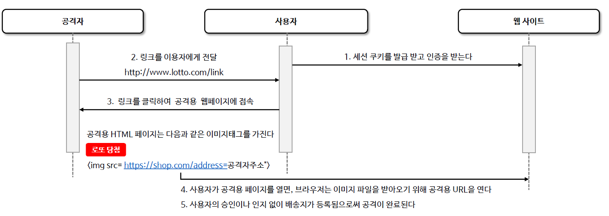

<nav>
    <a href="../../#exploit-protection" target="_blank">[Spring Security Core]</a>
</nav>

# CSRF(Cross Site Request Forgery, 사이트 간 요청 위조)

---

## 1. CSRF(Cross Site Request Forgery, 사이트 간 요청 위조)
- 웹 애플리케이션의 보안 취약점으로 공격자가 사용자로 하여금 이미 인증된 다른 사이트에 대해 원치 않는 작업을 수행하게 하는 기법
- 이 공격은 사용자의 브라우저가 자동으로 보낼 수 있는 인증 정보(예: 쿠키, Basic 인증 세션)을 이용하여 사용자가 의도하지 않은 요청을
서버로 전송하게 만든다.
- 이는 사용자가 로그인한 상태에서 악의적인 웹 사이트를 방문하거나 이메일 등을 통해 악의적인 링크를 클릭할 때 발생할 수 있다.

---

## 2. CSR 진행 순서


1. 사용자가 로그인 인증을 통해 세션 쿠키를 발급받는다.
2. 공격자는 사용자에게 자신의 사이트 링크를 전달한다.
   - 예) “Adobe Photoshop 2023 다운로드”, “한글 2022.torrent”, …
3. 사용자는 공격자의 링크를 클릭하여 공격용 웹 페이지에 접속한다.
   - 이 공격용 HTML 페이지에는 아래와 같은 이미지 태그를 가진다.
   - `<imgs src="https://shop.com/password-change/newPassword=xxx" />`
4. 사용자가 공격용 페이지를 열면, 브라우저는 이미지 파일을 받아오기 위해 공격용 URL을 연다.
5. 사용자의 승인이나 인지 없이 비밀번호가 변경된다거나, 상품의 배송지가 변경되는 작업이 진행되고 공격이 완료된다.

---

## 3. Spring Security CSRF 기능 활성화
```kotlin

    @Bean
    fun securityFilterChain(http: HttpSecurity): SecurityFilterChain {
        http {
            authorizeHttpRequests {
                authorize("/csrf", permitAll)
                authorize(POST,"/ignoreCsrf", permitAll)
                authorize(anyRequest, authenticated)
            }
            formLogin {}
            csrf {}
            // 생략
        }
        return http.build()
    }
```
- csrf 기능을 명시적으로 선언하여 활성화할 수 있다. 기본적으로 활성화되어 있다.
- CSRF 인증에 있어 CSRF 토큰을 사용한다. 여기서 사용되는 토큰은 서버에 의해 생성되어 클라이언트의 세션에 저장되고 HTML 폼 또는 API 통해 서버로
전송되는 모든 변경 요청에 포함되어야 하며 서버는 이 토큰을 검증하여 요청의 유효성을 확인한다
- 기본 설정은 'GET', 'HEAD', 'TRACE', 'OPTIONS’ 와 같은 안전한 메서드를 무시하고 'POST', 'PUT', 'DELETE’ 와 같은 변경 요청 메서드에 대해서만
CSRF 토큰 검사를 수행한다
- 중요한 점은 실제 CSRF 토큰이 브라우저에 의해 자동으로 포함되지 않는 요청 부분에 위치해야 한다는 것으로서 HTTP 폼 요청 매개변수나
헤더에 인증에 필요한 CSRF 토큰을 요구하는 것이 CSRF 공격을 방지하는데 효과적이라 할 수 있다
- 반면 쿠키를 통해 CSRF 토큰을 요구하는 것은 브라우저가 쿠키를 자동으로 요청에 포함시키기 때문에 효과적이지 않다고 볼 수 있다.


---

## 4. Spring Security CSRF 기능 비활성화

### 4.1 전체 기능 비활성화
```kotlin
csrf {
    disable()
}
```

### 4.2 특정 엔드포인트에 대해서만 비활성화
```kotlin
csrf {
    ignoringRequestMatchers("/ignoreCsrf")
}
```

---

## 5. 실습

### 5.1 컨트롤러
```kotlin
@RestController
class SecurityController {

    private val log = getLogger(javaClass)

    @GetMapping("/csrf")
    fun csrf(csrfToken: CsrfToken): CsrfToken {
        return csrfToken
    }

    @PostMapping("/csrf")
    fun csrf(): String {
        log.info { "csrf 검증 거침" }
        return "csrf 적용됨"
    }

    @PostMapping("/ignoreCsrf")
    fun ignoreCsrf(): String {
        log.info { "csrf 검증 무시" }
        return "csrf 무시됨"
    }
}
```

### 5.2 설정
```kotlin
@EnableWebSecurity
@Configuration
class SecurityConfig {

    @Bean
    fun securityFilterChain(http: HttpSecurity): SecurityFilterChain {
        http {
            authorizeHttpRequests {
                authorize("/csrf", permitAll)
                authorize(POST,"/ignoreCsrf", permitAll)
                authorize(anyRequest, authenticated)
            }
            formLogin {}
            csrf {
                ignoringRequestMatchers("/ignoreCsrf")
            }
            exceptionHandling {
                accessDeniedHandler = AccessDeniedHandler { request,response, ex ->
                    response.status = 403
                    response.writer.println(ex.message)
                }
            }
        }
        return http.build()
    }

    @Bean
    fun userDetailsService(): UserDetailsService {
        val user = User.withUsername("user").password("{noop}1111").roles("USER").build()
        return InMemoryUserDetailsManager(user)
    }
}
```


### 5.3 http 파일
```kotlin
### obtain csrfToken
GET http://localhost:8080/csrf


### with csrfToken
POST http://localhost:8080/csrf
Content-Type: application/json
X-CSRF-TOKEN: G7eMntLuy-Vz5JeMMODlFKYRZzXGxibjCJHiLWuk9z8aq3X3fY-9-rOPqoRe0_TuVM3Rd5VySgz19kPOPqTUG1mWwAh_k0SU

### Ignore CSrf
POST http://localhost:8080/ignoreCsrf
Content-Type: application/json
```
- `GET http://localhost:8080/csrf`
  - CSRF 토큰을 획득하기 위한 엔드포인트이다.
  - 응답을 통해 전달되는 CSRFToken을 이후 변경 요청에 함께 전달한다.
- `POST http://localhost:8080/csrf`
  - POST 요청을 테스트하기 위한 엔드포인트이다.
  - X-CSRF-TOKEN 헤더를 통해 CSRF 토큰을 전달한다. (전달하지 않으면 권한 검증에서 실패하여 403 응답을 받는다)
- `POST http://localhost:8080/ignoreCsrf`
  - POST 요청을 테스트하기 위한 엔드포인트이다.
  - 스프링 시큐리티 상에서, 해당 경로는 CSRF 검증을 받지 않도록 설정했으므로 통과한다.

---
