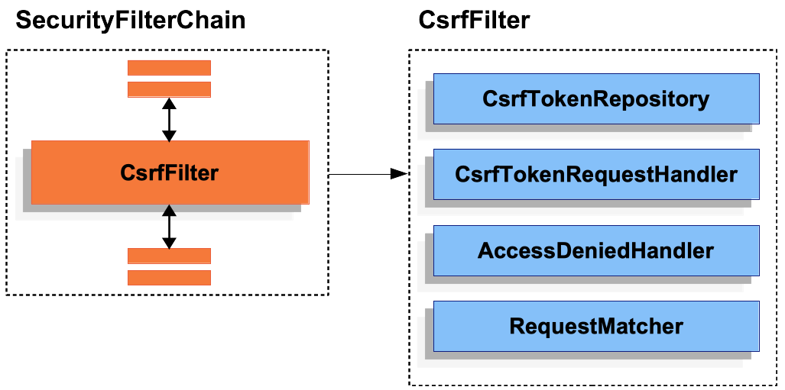
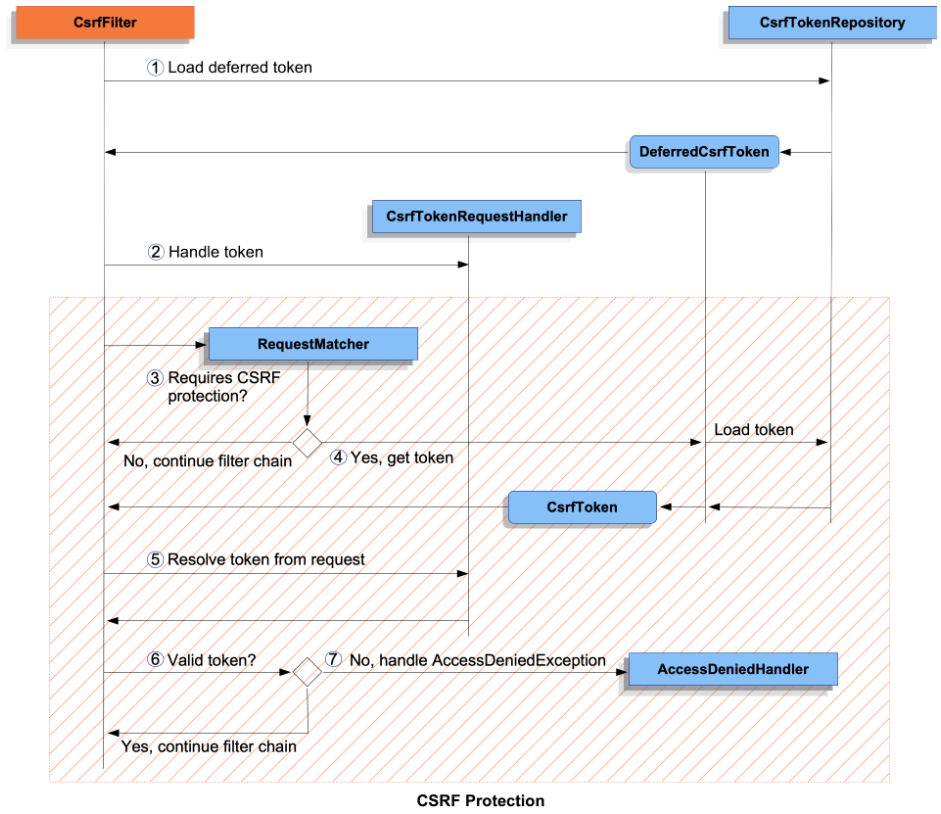

<nav>
    <a href="../../#exploit-protection" target="_blank">[Spring Security Core]</a>
</nav>

# CsrfFilter

---

## 1. CsrfFilter


- Csrf 보안에 대해서, 스프링 시큐리티는 CsrfFilter를 사용한다.
- CsrfFilter는 내부적으로 크게 4개의 컴포넌트를 의존하고 있다.
  - CsrfTokenRepository : 영속 Csrf토큰의 생성/조회
  - CsrfTokenRequestHandler : 요청에 영속 Csrf 토큰을 담거나, 요청에서 전달된 인증 Csrf 토큰값을 파싱하는 역할
    - 클라이언트에게 내려주기 위함이 목적인데, 암호화 기능이 덧붙여진 CsrfTokenRequestHandler 는 인코딩/디코딩 기능도 수행한다.
  - AccessDeniedHandler : Csrf 토큰 검증에서 실패했을 때 후속 예외 처리
  - RequestMatcher : 요청을 매칭하여 true, false를 반환하는 전략

---

## 2. CsrfFilter 흐름


```java
@Override
protected void doFilterInternal(HttpServletRequest request, HttpServletResponse response, FilterChain filterChain)
					throws ServletException, IOException {
		// 요청, 응답을 기반으로 토큰 리포지토리에서 영속 토큰을 가져옴(토큰이 없더라도 초기화가 예정됨)
		DeferredCsrfToken deferredCsrfToken = this.tokenRepository.loadDeferredToken(request, response);
		
		// 요청에 영속 토큰(실제 토큰)을 지연토큰 클래스 이름으로 저장함
		request.setAttribute(DeferredCsrfToken.class.getName(), deferredCsrfToken);
		
		// RequestHandler -> 요청 객체에 영속 토큰을 저장, 갱신하여 저장
		this.requestHandler.handle(request, response, deferredCsrfToken::get);
		
		// CSRF 인증이 필요없으면 스킵
		if (!this.requireCsrfProtectionMatcher.matches(request)) {
			filterChain.doFilter(request, response);
			return;
		}

		// 지연 토큰 실제 로딩
		CsrfToken csrfToken = deferredCsrfToken.get();

		// 사용자가 보낸 요청의 토큰(actualToken)을 통해 실제 토큰값을 얻어옴(+파싱작업)
		String actualToken = this.requestHandler.resolveCsrfTokenValue(request, csrfToken);
		
		// 지연토큰과 요청 토큰을 비교하여 같은지 검증
		if (!equalsConstantTime(csrfToken.getToken(), actualToken)) {
			
			// 같지 않으면 AccessDenidedHandler에 예외를 전달
			boolean missingToken = deferredCsrfToken.isGenerated();
			this.logger.debug(
					LogMessage.of(() -> "Invalid CSRF token found for " + UrlUtils.buildFullRequestUrl(request)));
			AccessDeniedException exception = (!missingToken) ? new InvalidCsrfTokenException(csrfToken, actualToken)
					: new MissingCsrfTokenException(actualToken);
			this.accessDeniedHandler.handle(request, response, exception);
			return;
		}
		filterChain.doFilter(request, response);
}
```

### 2.1 사전 작업
- 지연토큰(영속 토큰)을 CsrfTokenRepository에서 가져온다.
  - 만약 영속 토큰이 없다면 이후 실제 로딩하는 `get()`을 호출하는 시점에 리포지토리에 초기값이 생성되어 저장된다.
  - 쿠키 방식을 사용한다면 원본 토큰값이 쿠키에 담겨서 사용자에게 전달된다.
- 요청에 영속 토큰(실제 토큰)을 지연토큰 클래스 이름으로 저장한다.
- RequestHandler.handle 를 통해 HttpServletRequest에 Csrf 토큰을 저장한다.(setAttribute)
  - 이 때 XorCsrfRequestAttributeHandler는 난수를 이용해 인코딩까지 함께 수행한다.
  - 이 토큰을 이후 클라이언트에게 발급하게 되므로 클라이언트 입장에서는 암호화된 토큰값을 받게 된다.

### 2.2 요청 체크
- 사용자 요청을 확인하여, 현재 요청이 Csrf 인증이 필요한 지 확인하고 필요없으면 그냥 통과시킴

### 2.3 Csrf 검증
- Csrf 검증이 필요하다면 여기서부터 Csrf 검증이 시작된다.
- 지연토큰을 실제 로딩한다.
- 사용자의 요청으로부터 Csrf 토큰을 파싱해서 가져온다.(암호화 작업까지 되어있다면 디코딩도 함께한다.)
  - 둘을 비교해서 같지 않으면 예외가 발생하고 이는 AccessDeniedHandler에서 처리된다.
  - 같으면 Csrf 검증에 성공하고 다음 필터로 체이닝된다.

---
