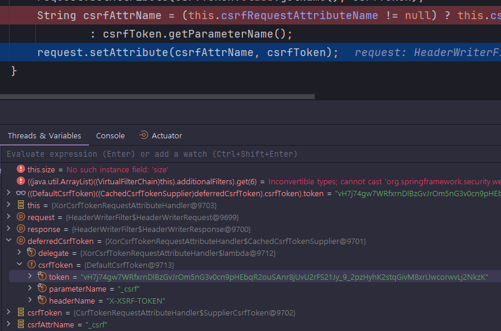

<nav>
    <a href="../../#exploit-protection" target="_blank">[Spring Security Core]</a>
</nav>

# CsrfToken, CsrfTokenRepository, CsrfTokenRequestHandler

---

## 1. CsrfToken

### 1.1 인터페이스
```java
public interface CsrfToken extends Serializable {
    
    String getHeaderName();
    
    String getParameterName();
    
    String getToken();

}
```
- Csrf 토큰을 인증에 사용하도록 하기 위해서는 어떤 HTTP 헤더 또는 어떤 HTTP 파라미터로 전달할 지에 대한 계약이 필요하다. 물론
이러한 계약은 스프링 시큐리티에서 기본값을 몇 가지 정의해두었고 수정하지 않는 한 해당 규칙을 따르면 된다.
  - getHeaderName : 헤더명
  - getParameterName : HTTP 파라미터명
- getToken : 토큰값

### 1.2 DefaultCsrfToken
```java
public final class DefaultCsrfToken implements CsrfToken {

	private final String token;

	private final String parameterName;

	private final String headerName;
    
	public DefaultCsrfToken(String headerName, String parameterName, String token) {
		this.headerName = headerName;
		this.parameterName = parameterName;
		this.token = token;
	}

	@Override
	public String getHeaderName() {
		return this.headerName;
	}

	@Override
	public String getParameterName() {
		return this.parameterName;
	}

	@Override
	public String getToken() {
		return this.token;
	}
}
```
- 문자 그대로 Csrf 토큰의 기본 역할만을 수행

### 1.3 SupplierCsrfToken
```java
	private static final class SupplierCsrfToken implements CsrfToken {

		private final Supplier<CsrfToken> csrfTokenSupplier;

		private SupplierCsrfToken(Supplier<CsrfToken> csrfTokenSupplier) {
			this.csrfTokenSupplier = csrfTokenSupplier;
		}

		@Override
		public String getHeaderName() {
			return getDelegate().getHeaderName();
		}

		@Override
		public String getParameterName() {
			return getDelegate().getParameterName();
		}

		@Override
		public String getToken() {
			return getDelegate().getToken();
		}

		private CsrfToken getDelegate() {
			CsrfToken delegate = this.csrfTokenSupplier.get();
			if (delegate == null) {
				throw new IllegalStateException("csrfTokenSupplier returned null delegate");
			}
			return delegate;
		}

	}

```
- 내부적으로 Csrf 토큰 공급자(Supplier)를 두고, 실제 호출 됐을 때 Csrf 토큰을 불러온다.
- DeferredCsrfToken 과 CsrfToken은 인터페이스 사양이 다른데, SupplierCsrfToken 에 지연토큰 공급자를 전달함으로서
CsrfToken 사양으로 토큰을 지연로딩하기 위함으로 추정된다.

---

## 2. CSRF 토큰 유지 - CsrfTokenRepository
### 2.1 CsrfTokenRepository
```java
public interface CsrfTokenRepository {

	CsrfToken generateToken(HttpServletRequest request);

	void saveToken(CsrfToken token, HttpServletRequest request, HttpServletResponse response);

	CsrfToken loadToken(HttpServletRequest request);

	default DeferredCsrfToken loadDeferredToken(HttpServletRequest request, HttpServletResponse response) {
		return new RepositoryDeferredCsrfToken(this, request, response);
	}
}
```
- 영속 CSRF 토큰을 저장하기 위한 역할
- CsrfToken은 CsrfTokenRepository 를 사용하여 영속화한다.
- 구현체
  - HttpSessionCsrfTokenRepository : 서버의 세션에 원본 토큰을 저장하고 관리하는 방식
  - CookieCsrfTokenRepository : 쿠키를 통해 원본 토큰을 저장하고 관리하는 방식

### 2.2 HttpSessionCsrfTokenRepository (기본값)
- 기본적으로 토큰을 세션에 저장하기 위해 HttpSessionCsrfTokenRepository를 사용한다.
- HttpSessionCsrfTokenRepository는 기본적으로 HTTP 요청 헤더인 X-CSRF-TOKEN 또는 요청 매개변수인 _csrf에서 토큰을 읽는다
  - save : 세션에 저장한다. 토큰값으로 null을 전달하면 제거한다. 
  - load : 세션에서 읽어온다.

### 2.3 CookieCsrfTokenRepository
- 쿠키에 XSRF-TOKEN 이름으로 보관한다.
- HTTP 요청 헤더 : X-XSRF-TOKEN
- HTTP 파라미터 헤더 : _csrf
- 기능
  - save : 쿠키에 저장한다. 토큰값으로 null을 전달하면 제거한다.
  - load : 쿠키에서 읽어온다.
- JavaScript 에서 쿠키를 읽을 수 있도록 HttpOnly를 명시적으로 false로 설정할 수 있다
  - JavaScript로 직접 쿠키를 읽을 필요가 없는 경우 보안을 개선하기 위해 HttpOnly 를 생략하는 것이 좋다


---

## 3. CSRF 토큰 관련 요청처리 - CsrfTokenRequestHandler

### 3.1 인터페이스
```java
@FunctionalInterface
public interface CsrfTokenRequestHandler extends CsrfTokenRequestResolver {
    
	void handle(HttpServletRequest request, HttpServletResponse response, Supplier<CsrfToken> csrfToken);

	@Override
	default String resolveCsrfTokenValue(HttpServletRequest request, CsrfToken csrfToken) {
		String actualToken = request.getHeader(csrfToken.getHeaderName());
		if (actualToken == null) {
			actualToken = request.getParameter(csrfToken.getParameterName());
		}
		return actualToken;
	}

}
```
- handle: 요청 핸들링(handle)
  - 요청(HttpServletRequest) 객체를 핸들링하여, 요청의 Attribute에 영속토큰 보관 하는 등의 일을 처리
  - XorCsrfTokenRequestAttributeHandler 는 여기서 기능을 확장하여, 원본 영속 토큰을 인코딩하여 요청 객체에 담는다.
  - 요청에 영속 CsrfToken을 두고, 이후 필요할 때 꺼내서 쓸 수 있게 한다.
- resolveCsrfTokenValue : 요청 CSRF 토큰값 획득
  - 요청 객체, 영속 CSRF 토큰을 기반으로 요청 CSRF 토큰 값을 획득
  - 기본동작: HTTP 파라미터 순으로 csrf 토큰(인증에 사용하기 위한)을 탐색하고 반환한다.
  - XorCsrfTokenRequestAttributeHandler 는 인코딩된 요청 토큰을 디코딩하여 원본 토큰을 얻어내는 작업까지 수행한다.
- 구현체
  - CsrfTokenRequestAttributeHandler : 기본 역할
  - XorCsrfTokenRequestAttributeHandler : 인코딩, 디코딩 기능 추가

### 3.2 CsrfTokenRequestAttributeHandler
```java
	@Override
	public void handle(HttpServletRequest request, HttpServletResponse response,
			Supplier<CsrfToken> deferredCsrfToken) {
		request.setAttribute(HttpServletResponse.class.getName(), response);
		CsrfToken csrfToken = new SupplierCsrfToken(deferredCsrfToken);
		request.setAttribute(CsrfToken.class.getName(), csrfToken);
		String csrfAttrName = (this.csrfRequestAttributeName != null) ? this.csrfRequestAttributeName
				: csrfToken.getParameterName();
		request.setAttribute(csrfAttrName, csrfToken);
	}
```
- handle : 요청 객체, 영속 CSRF 토큰을 기반으로 요청 CSRF 토큰 값을 획득
  - request 의 attribute 에 response 를 연결
  - 지연토큰 공급자를 SupplierCsrf 토큰으로 변환
  - Request의 Attribute에 영속 토큰을 보관
    - 클래스명을 통해 csrf 토큰을 얻을 수 있도록 함
    - csrf의 파라티터명을 통해 csrf 토큰을 얻을 수 있도록 함(기본값 : _csrf)
- 참고로 CsrfTokenRequestAttributeHandler의 RequestAttributeName을 null 로 설정하면 사용할 Csrf Attribute 이름을 결정하기 위해
영속 토큰을 실제 로드하게 되므로, 모든 요청에 대해 Csrf 토큰을 로딩하게 한다.

### 3.3 XorCsrfTokenRequestAttributeHandler
```java
public final class XorCsrfTokenRequestAttributeHandler extends CsrfTokenRequestAttributeHandler {

    private SecureRandom secureRandom = new SecureRandom();

    @Override
    public void handle(HttpServletRequest request, HttpServletResponse response,
                       Supplier<CsrfToken> deferredCsrfToken) {
        Supplier<CsrfToken> updatedCsrfToken = deferCsrfTokenUpdate(deferredCsrfToken);
        super.handle(request, response, updatedCsrfToken);
    }

    private Supplier<CsrfToken> deferCsrfTokenUpdate(Supplier<CsrfToken> csrfTokenSupplier) {
        return new CachedCsrfTokenSupplier(() -> {
            CsrfToken csrfToken = csrfTokenSupplier.get();
            String updatedToken = createXoredCsrfToken(this.secureRandom, csrfToken.getToken());
            return new DefaultCsrfToken(csrfToken.getHeaderName(), csrfToken.getParameterName(), updatedToken);
        });
    }

    @Override
    public String resolveCsrfTokenValue(HttpServletRequest request, CsrfToken csrfToken) {
        String actualToken = super.resolveCsrfTokenValue(request, csrfToken);
        return getTokenValue(actualToken, csrfToken.getToken());
    }

    private static String getTokenValue(String actualToken, String token) {
        byte[] actualBytes;
        try {
            actualBytes = Base64.getUrlDecoder().decode(actualToken);
        } catch (Exception ex) {
            return null;
        }
        // 생략
    }
}
```
- XorCsrfTokenRequestAttributeHandler : CsrfTokenRequestAttributeHandler 의 보안 강화버전
- handle
  - xor 연산, secureRandom(난수?) 을 이용하여 Csrf 토큰을 인코딩
  - 인코딩된 토큰을 부모 handle 클래스를 통해 처리
- resolveCsrfTokenValue
  - 부모 resolveCsrfTokenValue 를 호출하여 요청을 통해 전달된 Csrf 토큰을 얻어온다.
  - getTokenValue 메서드를 통해 요청에서 전달된 암호화된 Csrf 토큰을 디코딩한다.

---

## 4. CSRF 토큰 지연로딩

### 4.1 개요
- 기본적으로 Spring Security 는 CsrfToken 을 필요할 때까지 로딩을 지연시키는 전략을 사용한다.
그러므로 CsrfToken 은 HttpSession 에 저장되어 있기 때문에 매 요청마다 세션, 쿠키로부터 CsrfToken 을 로드할 필요가 없어져 성능을 향상시킬 수 있다.
- CsrfToken 은 POST 와 같은 안전하지 않은 HTTP 메서드를 사용하여 요청이 발생할 때와 CSRF 토큰을 응답에 렌더링하는 모든 요청에서 필요하기 때문에
그 외 요청에는 지연로딩 하는 것이 권장된다.

### 4.2 지연토큰 인터페이스
```java
public interface DeferredCsrfToken {
    
	CsrfToken get();
	boolean isGenerated();
}
```
- get : 실제 토큰을 로딩해온다.
- isGenerated : 토큰이 없다가 만들어졌는 지 여부를 반환

### 4.3 RepositoryDeferredCsrfToken
```java
final class RepositoryDeferredCsrfToken implements DeferredCsrfToken {

	private final CsrfTokenRepository csrfTokenRepository;

	private final HttpServletRequest request;

	private final HttpServletResponse response;

	private CsrfToken csrfToken;

	private boolean missingToken;

	RepositoryDeferredCsrfToken(CsrfTokenRepository csrfTokenRepository, HttpServletRequest request,
			HttpServletResponse response) {
		this.csrfTokenRepository = csrfTokenRepository;
		this.request = request;
		this.response = response;
	}

	@Override
	public CsrfToken get() {
		init();
		return this.csrfToken;
	}

	@Override
	public boolean isGenerated() {
		init();
		return this.missingToken;
	}

	private void init() {
		if (this.csrfToken != null) {
			return;
		}

		this.csrfToken = this.csrfTokenRepository.loadToken(this.request);
		this.missingToken = (this.csrfToken == null);
		if (this.missingToken) {
			this.csrfToken = this.csrfTokenRepository.generateToken(this.request);
			this.csrfTokenRepository.saveToken(this.csrfToken, this.request, this.response);
		}
	}

}
```
- 리포지토리에 대한 참조를 갖고 있다.
- init
  - csrf 토큰 참조가 아직 존재하지 않으면 실제 csrf 토큰을 리포지토리로부터 로딩한다.
  - 로딩했음에도 csrf 토큰 참조가 존재하지 않으면 토큰이 존재하지 않는다는 것이므로 토큰을 생성한 뒤 리포지토리에 저장한다.
- get
  - init 후 실제 csrf 토큰을 반환한다.
- generated
  - init 후 csrf 토큰이 지금 생성됐는 지 여부를 반환한다.

### 4.4 지연토큰 비활성화
```kotlin
    @Bean
    fun csrfTokenRequestHandler(): CsrfTokenRequestHandler {
        val requestHandler = XorCsrfTokenRequestAttributeHandler()
        requestHandler.setCsrfRequestAttributeName(null)
        return requestHandler
    }
```
- CsrfTokenRequestAttributeHandler 및 그 자손 클래스의 csrfRequestAttributeName를 null 로 설정하면 모든 요청마다
Csrf 토큰을 로딩하게 한다.
  - CsrfTokenRequestAttributeHandler 의 handle 메서드 참고

---

## 5. 실습

### 5.1 컨트롤러
```kotlin
@RestController
class SecurityController {

    private val log = getLogger(javaClass)

    @GetMapping("/csrf")
    fun csrf(csrfToken: CsrfToken): CsrfToken {
        return csrfToken
    }

    @PostMapping("/requireCsrf")
    fun requireCsrf(): String {
        log.info { "csrf 검증 거침" }
        return "csrf 적용됨"
    }
}
```
- `/csrf` : csrf 토큰을 발급받기 위한 api
- `/requireCsrf` : 접근시 csrf 토큰이 필요한 엔드포인트

### 5.2 설정
```kotlin
@EnableWebSecurity
@Configuration
class SecurityConfig {

    @Bean
    fun securityFilterChain(http: HttpSecurity): SecurityFilterChain {

        http {
            authorizeHttpRequests {
                authorize(GET,"/csrf", permitAll)
                authorize(POST,"/requireCsrf", permitAll)
                authorize(anyRequest, authenticated)
            }
            formLogin {}
            csrf {
                csrfTokenRequestHandler = csrfTokenRequestHandler()
                csrfTokenRepository = csrfTokenRepository()
            }
            exceptionHandling {
                accessDeniedHandler = AccessDeniedHandler { request,response, ex ->
                    response.status = 403
                    response.writer.println(ex.message)
                }
            }
        }
        return http.build()
    }

    @Bean
    fun userDetailsService(): UserDetailsService {
        val user = User.withUsername("user").password("{noop}1111").roles("USER").build()
        return InMemoryUserDetailsManager(user)
    }

    @Bean
    fun csrfTokenRepository(): CsrfTokenRepository {
        return CookieCsrfTokenRepository()
    }

    @Bean
    fun csrfTokenRequestHandler(): CsrfTokenRequestHandler {
        val requestHandler = XorCsrfTokenRequestAttributeHandler()
        requestHandler.setCsrfRequestAttributeName(null)
        return requestHandler
    }

}
```
- CsrfTokenRepository : 쿠키를 통해 Csrf 토큰 보관
- CsrfTokenRequestHandler : XorCsrfTokenRequestAttributeHandler
  - 클라이언트에게 암호화된 Csrf 토큰을 발급하고 요청시 함께 보내게 한다.
  - CsrfRequestAttributeName 을 null 로 하였는데 이렇게 하면 매 요청마다 CSRF 토큰을 로딩하게 된다.

### 5.3 http 파일
```shell
### obtain csrfToken
GET http://localhost:8080/csrf


### with csrfToken
POST http://localhost:8080/requireCsrf
Content-Type: application/json
X-XSRF-TOKEN: [[여기에 받은 CSRF 토큰값을 전달하세요]]
```


### 5.3 즉시로딩 확인


- handle 과정에서 CSRF 토큰이 로딩되는 것을 확인할 수 있다.


### 5.4 쿠기발급 확인
```shell
# domain	path	name	value	date
localhost	/	JSESSIONID	1C3553192EA6994828FE04075AC0FB30	-1
localhost	/	XSRF-TOKEN	15759b66-9f53-487b-8db2-3c7c0af3d466	-1
```
- Csrf 쿠키가 발급됨 : 여기에 원본 토큰을 보관하고 사용한다.

---
