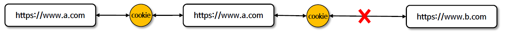
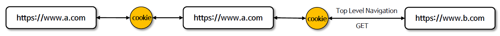
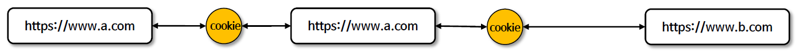
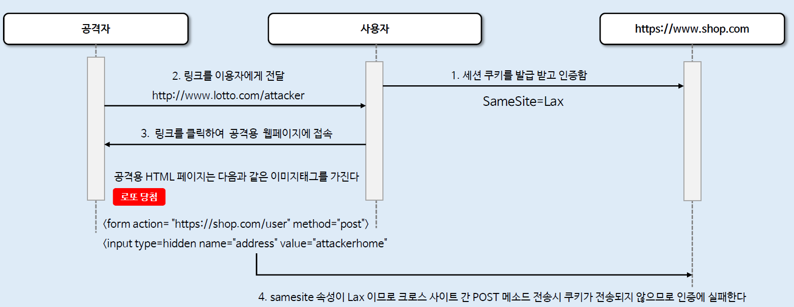
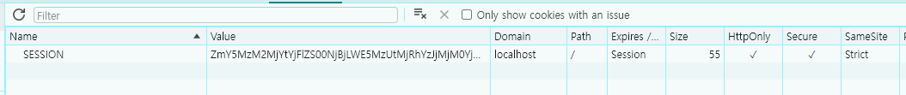

<nav>
    <a href="../../#exploit-protection" target="_blank">[Spring Security Core]</a>
</nav>

# SameSite

---

## 1. SameSite 란?
- 크로스 사이트(Cross-site)로 전송하는 요청의 경우 쿠키의 전송에 제한을 두도록 하기 위한 쿠키 정책
- SameSite 는 최신 방식의 CSRF 공격 방어 방법 중 하나로서 서버가 쿠키를 설정할 때 SameSite 속성을 지정하여 크로스 사이트 간 쿠키 전송에 대한 제어를 핸들링 할 수 있다
- Spring Security는 세션 쿠키의 생성을 직접 제어하지 않기 때문에 SameSite 속성에 대한 지원을 제공하지 않지만 Spring Session 은 SameSite 속성을 지원한다.

---

## 2. SameSite 기준

### 2.1 Domain
```text
Path=/;Domain=admin.ttasjwi.com;SameSite=Strict
```
- 쿠키에 Domain이 설정되면, 해당 도메인 및 하위 도메인에서 유효한 쿠키가 된다.
- Domain이 명시되어 있지 않다면 이 속성은 해당 도메인으로 설정되지만 하위 도메인에 사용할 수 없다.
  - 예) `Domain=ttasjwi.com` 으로 설정하지 않고 인증 쿠키를 발급했을 경우 `ttasjwi.com` 에 해당 쿠키를 통해 요청할 수 있지만, `admin.ttasjwi.com`에는 사용할 수 없다.

### 2.2 SameSite 기준
- public 도메인 접미사(최상위 도메인, TLD)와 public 접미사 앞의 도메인(TLD+1, Registrable Domain, )이 같으면 Same-Site로 간주된다.
- 최신 사양에서는 scheme이 다르면 SameSite로 간주되지 않는다.
- 예) `https://a.github.io`과 `https://b.github.io` 는 Same-Site가 아니다.
  - 이 경우 `github.io` 는 퍼블릭 도메인 접미사이고, 앞의 도메인이 다르므로 SameSite가 아니다.
- 예) `https://api.ttasjwi.com` 과 `https://ttasjwi.com` 은 Same-Site 이다.
  - `.com`는 퍼블릭 도메인 접미사이고, 앞의 도메인이 같으므로 SameSite이다.
- 예) `http://api.ttasjwi.com`과 `https://ttasjwi.com`은 Same-Site가 아니다.
  - 둘의 scheme이 다르다.

---

## 3. 쿠키의 SameSite 속성 
SameSite 쿠키의 정책으로 Strict, Lax, None 세 가지 종류를 선택할 수 있고, 각각 동작하는 방식이 다르다.

### 3.1 Strict


- 가장 보수적인 정책
- 서드 파티 쿠키는 전송되지 않고, 퍼스트 파티 쿠키만 전송
- 동일 사이트에서 오는 모든 요청에 쿠키가 포함되고 크로스 사이트간 HTTP 요청에 쿠키가 포함되지 않는다

### 3.2 Lax(기본)


- 사이트에서 오거나 Top Level Navigation 에서 오는 요청 및 메소드가 읽기 전용인 경우 쿠키가 전송되고 그렇지 않으면 HTTP 요청에 쿠키가 포함되지 않는다.
- 사용자가 링크(`<a>`)를 클릭하거나 window.location.replace , 302 리다이렉트 등의 이동이 포함된다. 그러나 `<iframe>`이나 ``를 문서에 삽입, AJAX 통신 등은
쿠키가 전송되지 않는다

### 3.3 None


- 동일 사이트 및 크로스 사이트 요청의 경우에도 쿠키가 전송된다. 이 모드에서는 HTTS 의한 Secure 쿠키로 설정되야 한다

---

## 4. SameSite 속성과 요청 흐름


### 4.1 흐름
- 사용자는 "http://www.shop.com"에 대해 인증에 성공하고 세션쿠키를 발급받는다.
  - 이 때 세션 쿠키의 속성값에는 "SameSite=Lax"가 지정되었다.
  - 이 값을 지정하지 않더라도 최신 브라우저에서는 기본값으로 SameSite=Lax로 간주한다.
- 공격자는 사용자에게 자신의 사이트 링크를 전달한다.
- 사용자가 공격자의 사이트 링크를 클릭하고, 공격용 웹 페이지에 접속한다.
- 공격자의 HTML 페이지는 `` 등 요소를 가지고 있는데 이를 통해 인증된 해당 서비스에 쿠키를 가지고 접근하지 않을까 하는
우려가 있다.
- 그런데 최신 브라우저 기준으로는 sameSite 속성이 Lax이므로 크로스사이트 간 요청에 쿠키가 전송되지 않게 되고 인증에 실패한다.

### 4.2 주의
- 대부분의 현대 브라우저는 SameSite 속성을 지원하지만, 여전히 사용 중인 오래된 브라우저는 지원하지 않을 수 있다
- SameSite 를 CSRF 공격에 대한 유일한 방어 수단으로서가 아니라 심층적으로 강화된 방어의 일환으로 사용하는 것을 권장하고 있다

---

## 5. SameSite 문제를 해결하기 위한 선택

브라우저에서 백엔드쪽으로 쿠키가 안 보내지는 문제를 어떻게 해결해야할까?

### 5.1 `SameSite=None` + `https`
- 기존 방식을 그대로 사용하되 https 를 함께 사용해야한다.
- 이 방식을 사용하면 제3의 서비스에서 우리 서비스에 쿠키를 사용하여 접근이 가능해진다.
- CSRF 토큰과 같은 추가적인 방어수단을 함께 준비하는 것이 좋다.
- 이 경우 두 서비스간의 출처가 달라지므로 CORS 문제가 발생하는데 이에 대해서 추가적인 대응이 필요하다.

### 5.2 `SameSite=Lax` 또는 `SameSite=Strict` + 같은 도메인
- 상위 도메인을 통일하여 문제를 해결하는 방법이다.
- 우선 백엔드에서는 쿠키를 발급할 때 Domain 값을 TLD로 지정한다.
  - 도메인을 지정하지 않을 시 하위 도메인에서 접근할 수 없다.
  - 도메인을 지정하면 하위 도메인도 SameSite로 인식하여 사용할 수 있게 된다.
- 프론트와 백엔드을 SameSite 기존에 맞게하면 쿠키가 전송된다.
  - TLD 가 같고 스킴이 같게 하기
- 동일 출처 기준에 따라, 출처가 다르면 CORS 문제가 달라지므로 이에 대한 CORS 대응이 필요한 것은 위와 같다.
  - 같은 출처의 기준 : scheme, host, port 일치


---

## 6. Spring Session과 SameSite 적용

### 6.1 Spring Session
- Spring이 Session을 관리해주도록 함
- 기존에는 WAS(TomCat) 차원에서 Session이 생성되었고 따라서 세션 id 이름이 'JSESSIONID'였다.
- Spring Session을 생성하면 Spring이 Session을 생성하고 관리하며, 세션 id 이름이 'SESSION'이 된다.
- 최신의 쿠키 SameSite 속성을 쿠키에 적용할 수 있게 된다.

### 6.2 의존성 등록
```kotlin
    // session
    implementation("org.springframework.session:spring-session-core:3.2.2")
```
- spring-session-core 의존성을 추가한다.

### 6.3 Spring Session 설정
```kotlin
@Configuration
@EnableSpringHttpSession
class SessionConfig {

    @Bean
    fun cookieSerializer(): CookieSerializer {
        val serializer = DefaultCookieSerializer()
        serializer.setUseHttpOnlyCookie(true) // 브라우저에서 쿠키에 접근할 수 없게 함
        serializer.setUseSecureCookie(true) // HTTPS가 아닌 통신에서는 쿠키를 전송하지 않음(localhost 제외)

        serializer.setSameSite("Strict") // SameSite 속성을 None으로 지정 => HTTPS 필수

        return serializer
    }

    @Bean
    fun sessionRepository(): SessionRepository<MapSession> {
        return MapSessionRepository(ConcurrentHashMap())
    }
}
```

### 6.4 실행


- SESSION 이름으로 쿠키가 발급됨
- 우리가 적용한 속성이 잘 적용된 것을 확인할 수 있음

---

## 참고

- <a href="https://developer.mozilla.org/en-US/docs/Web/HTTP/Cookies#define_where_cookies_are_sent" target="_blank">Define where cookies are sent</a>
- <a href="https://seob.dev/posts/%EB%B8%8C%EB%9D%BC%EC%9A%B0%EC%A0%80-%EC%BF%A0%ED%82%A4%EC%99%80-SameSite-%EC%86%8D%EC%84%B1/" target="_blank">브라우저 쿠키와 SameSite 속성</a>
- <a href="https://yangbongsoo.tistory.com/5" target="_blank">Cookie SameSite 기본편</a>
- <a href="https://cherish-it.tistory.com/12" target="_blank">SameSite Cookie속성 변경? 정책 3가지/이유/대응  (Chrome80 업데이트)</a>
- <a href="https://web.dev/articles/schemeful-samesite?hl=ko" target="_blank">스키마가 있는 Same-Site</a>
- <a href="https://www.michalspacek.com/origin-site-etld-etld-plus-one-public-suffix-psl-what-are-they" target="_blank">원본, 사이트, eTLD , eTLD+1, 공개 접미사, PSL. 그들은 무엇인가?</a>

---
