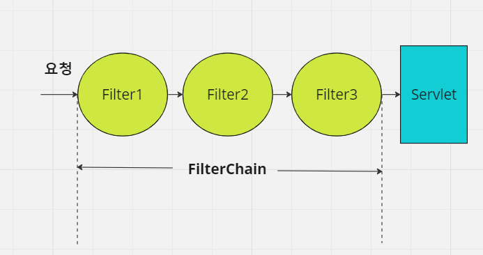
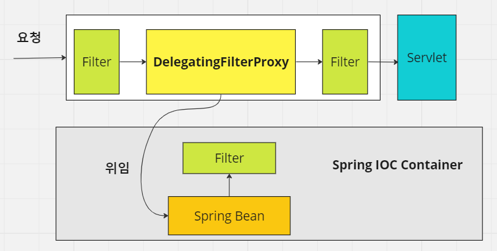
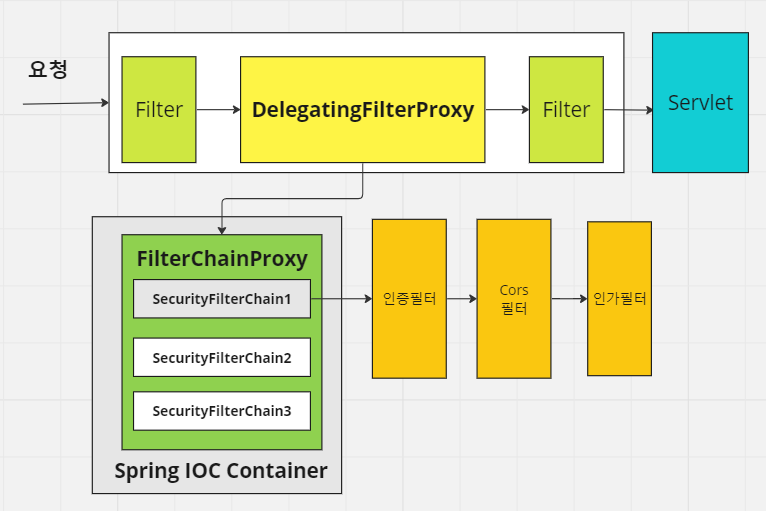
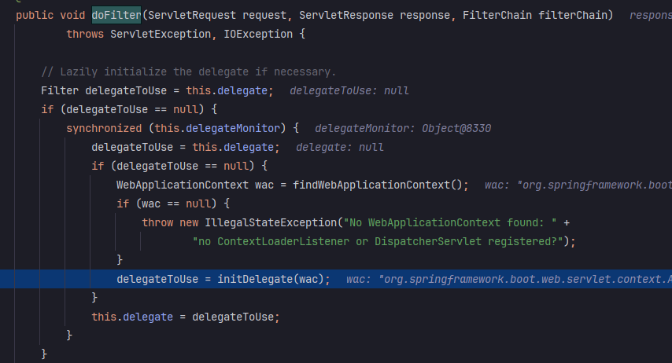
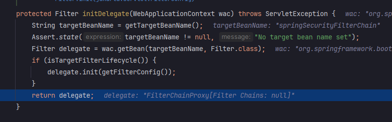
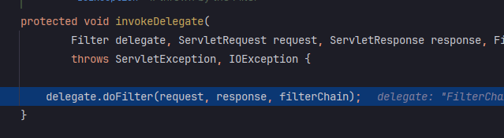
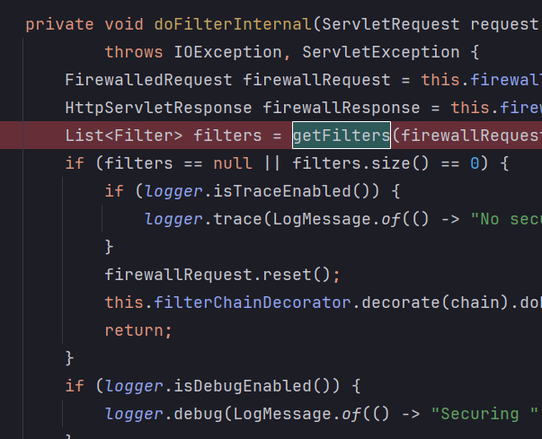
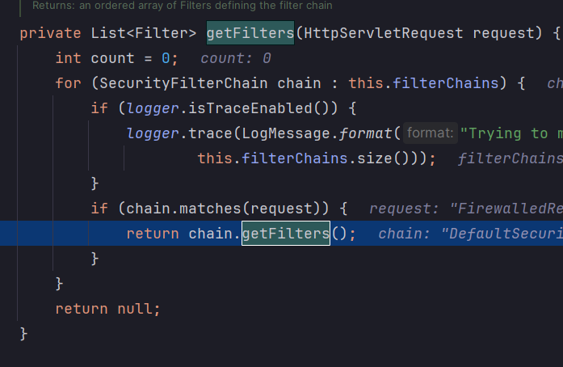
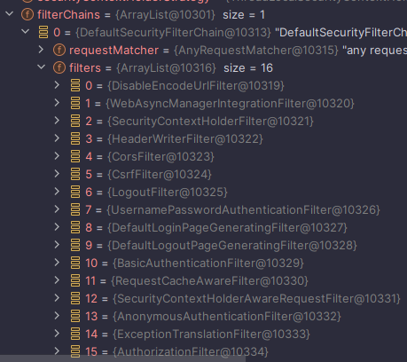
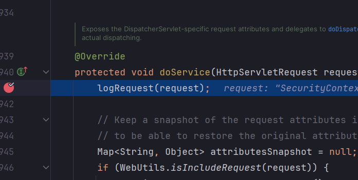

<nav>
    <a href="../../#init" target="_blank">[Spring Security Core]</a>
</nav>

# Filter, DelegatingFilterProxy, FilterChainProxy

---

## 1. 서블릿 필터


```java
public interface Filter {
    
    // 필터 초기화 작업
    default void init(FilterConfig filterConfig) throws ServletException {}
  
    // 실질적인 요청 및 응답 처리
    void doFilter(ServletRequest request, ServletResponse response, FilterChain chain)
            throws IOException, ServletException;
    
    // 필터가 제거될 때 자원 정리 작업
    default void destroy() {}
}
```
- 서블릿 필터는 웹 애플리케이션에서 클라이언트의 요청과 응답을 가공하거나, 검사하는데 사용되는 구성요소이다.
- 서블릿 필터는 클라이언트의 요청이 서블릿에 도달하기 전이나 서블릿이 응답을 클라이언트에 보내기 전에 특정 작업을 수행할 수 있다.
- 서블릿 필터는 서블릿 컨테이너(WAS)에서 생성되고 실행되고 종료된다.

---

## 2. DelegatingFilterProxy : 서블과 스프링 컨테이너를을 연결하기 위한 필터


- 서블릿 컨테이너는 자체 표준을 사용하여 Filter 인스턴스를 등록할 수 있지만, 스프링에서 정의한 빈들을 인식하지 못 한다.
- 스프링은 서블릿 컨테이너의 라이프사이클과 스프링의 애플리케이션 컨텍스트 간에 다리 역할을 하는 DelegatingFilterProxy라는 Filter 구현체를 만들고
이를 서블릿 필터에 등록한다.
- DelegatingFilterProxy는 스프링에서 사용되는 특별한 서블릿 필터로, 서블릿 컨테이너와 스프링 애플리케이션 컨텍스트 간의 연결고리 역할을 하는 필터다.
- DelegatingFilterProxy는 서블릿 필터의 기능을 수행하는 동시에, 스프링의 의존성 주입 및 빈 관리 기능과 연동되도록 설계된 필터라고 할 수 있다.
- DelegatingFilterProxy는 "springSecurityFilterChain" 이름으로 생성된 빈을 ApplicationContext에서 찾아 요청을 위임한다.
- 실질적으로 보안 처리를 수행하지 않는다.

---

## 3. FilterChainProxy


- "springSecurityFilterChain" 이름으로 생성되는 필터 빈으로서, DelegatingFilterProxy로부터 요청을 위임받고 보안 처리 역할을 한다.
- 내부적으로 하나 이상의 SecurityFilterChain 객체들을 가지고 있으며, 요청 URL 정보를 기준으로 적절한 SecurityFilterChain 을 선택하여 필터들을 호출한다.
- HttpSecurity API 호출 시 configurer 들이 추가되고 이를 기반으로 관련 필터들이 추가된다.
- 사용자의 요청을 필터 순서대로 호출함으로서 보안기능을 동작시키고 직접 필터를 생성해서 기존의 필터 전후로 추가 가능하다.

---

## 4. 코드로 확인하기

### 4.1 스프링 부트 자동설정
```text
org.springframework.boot.autoconfigure.security.servlet.SecurityAutoConfiguration
org.springframework.boot.autoconfigure.security.servlet.UserDetailsServiceAutoConfiguration
org.springframework.boot.autoconfigure.security.servlet.SecurityFilterAutoConfiguration

...

org.springframework.boot.autoconfigure.web.servlet.DispatcherServletAutoConfiguration
org.springframework.boot.autoconfigure.web.servlet.ServletWebServerFactoryAutoConfiguration
org.springframework.boot.autoconfigure.web.servlet.error.ErrorMvcAutoConfiguration
org.springframework.boot.autoconfigure.web.servlet.HttpEncodingAutoConfiguration
org.springframework.boot.autoconfigure.web.servlet.MultipartAutoConfiguration
org.springframework.boot.autoconfigure.web.servlet.WebMvcAutoConfiguration
```
- `org.springframework.boot.autoconfigure.autoconfiguration.imports` 파일에는 AutoConfiguration 들이 등록되어 있다. 이 설정들을 읽어온다.
  - `SecurityAutoConfiguration`
  - `UserDetailsServiceConfiguration`
  - `SecurityFilterAutoConfiguration` : 이번 글에서는 이 부분을 초점을 두고 보겠다.
- 파일에서 spring servlet 부분은 좀 더 뒤에 불러와진다.

### 4.2 SecurityFilterAutoConfiguration
```java
@AutoConfiguration(after = SecurityAutoConfiguration.class)
@ConditionalOnWebApplication(type = Type.SERVLET)
@EnableConfigurationProperties(SecurityProperties.class)
@ConditionalOnClass({ AbstractSecurityWebApplicationInitializer.class, SessionCreationPolicy.class })
public class SecurityFilterAutoConfiguration {

    private static final String DEFAULT_FILTER_NAME = AbstractSecurityWebApplicationInitializer.DEFAULT_FILTER_NAME;

    @Bean
    @ConditionalOnBean(name = DEFAULT_FILTER_NAME)
    public DelegatingFilterProxyRegistrationBean securityFilterChainRegistration(
            SecurityProperties securityProperties) {
        DelegatingFilterProxyRegistrationBean registration = new DelegatingFilterProxyRegistrationBean(
                DEFAULT_FILTER_NAME);
        registration.setOrder(securityProperties.getFilter().getOrder());
        registration.setDispatcherTypes(getDispatcherTypes(securityProperties));
        return registration;
    }
}
```
- 스프링 시큐리티 필터 설정 클래스가 실행되면서, DelegatingFilterProxyRegistrationBean이 생성된다.
  이 클래스는 내부적으로 "springSecurityFilterChain" 이라는 이름값을 가지고 있다.
```java
    public DelegatingFilterProxy getFilter() {
        return new DelegatingFilterProxy(this.targetBeanName, this.getWebApplicationContext()) {
            protected void initFilterBean() throws ServletException {
            }
        };
    }
```
- 서블릿 Filter들이 초기화될 때 이 클래스의 getFilter가 호출되어 DelegatingFilterProxy가 생성되고 서블릿 필터체인에 등록된다.
- DelegatingFilterProxy 는 프록시 역할을 하고, 내부적으로 target이 되는 빈 이름(기본값:springSecurityFilterChain)을 가지게 된다.

### 4.3 WebSecurityConfiguration, WebSecurity
```java
	@Bean(name = AbstractSecurityWebApplicationInitializer.DEFAULT_FILTER_NAME)
	public Filter springSecurityFilterChain() throws Exception {
        // 생략
  
		return this.webSecurity.build();
	}
```
- 이후 스프링 빈이 초기화되는 과정에서 WebSecurityConfiguration 클래스에서 springSecurityFilterChain() 메서드에서 webSecurity.build() 메서드가 호출된다.
- 여기서 FilterChainProxy 가 만들어지고 "FilterChainProxy" 이름으로 등록된다. 이 과정을 지난 글에서 확인했다.

### 4.4 (런타임) DelegatingFilterProxy.doFilter()


- 런타임에 처음 요청이 들어와서 doFilter가 호출될 때, 위임 필터 초기화가 수행된다.
- DelegatingFilterProxy가 여기서 지연 초기화를 수행함으로서 얻는 이점은 Filter 빈 인스턴스를 찾는 것을 지연시킬 수 있다는 점이다.
스프링 컨테이너가 시작하기 전에 Filter 인스턴스를 등록해야 하는데, 일반적으로 스프링은 Filter 인스턴스를 등록해야 할 때보다 더 늦게
Spring Bean을 로드하기 위해 `ContextLoaderListener`를 사용한다.



- initDelegate가 호출되고 여기서 초기화가 이루어진다.
  - "springSecurityFilterChain" 이름의 빈을 찾아서 주입시킨다.



- 이후 invokeDelegate 메서드가 호출되고, 위임 필터, 즉 FilterChainProxy의 로직이 실행된다.

---

### 4.5 FilterChainProxy


- 요청이 FilterChainProxy쪽으로 위임된다.
- 이후 내부적으로 doFilterInternal, getFilters 메서드가 호출된다.





- FilterChainProxy는 내부적으로 여러개의 filterChain들을 갖고 있는데, 현재 요청에 매칭되는 SecurityFilterChain을 찾고(matches 호출)
  먼저 매칭된 filterChain의 filter 들을 가져온다.
- 여기서 가져온 filter 리스트를 기반으로 필터체인 데코레이터를 만들고 그쪽으로 요청을 위임시킨다.
- 0번부터 15번까지 필터들이 있는데 이 순서대로 필터가 호출된다.

---

### 4.6 DispatcherServlet


모든 필터를 성공적으로 통과하면 DispatcherServlet에 도달하게 된다.

---
