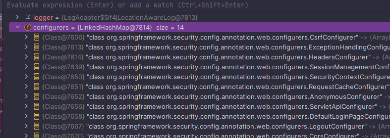
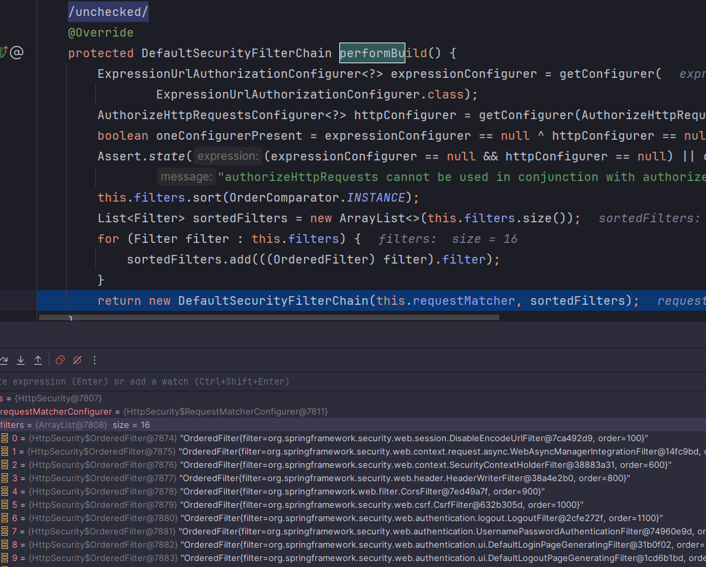
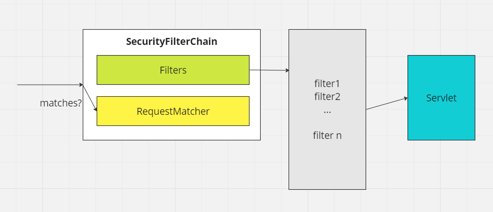

<nav>
    <a href="../../#init" target="_blank">[Spring Security Core]</a>
</nav>

# HttpSecurity & WebSecurity

---

## 1. HttpSecurity와 SecurityFilterChain

### 1.1 HttpSecurity




- HttpSecurityConfiguration 에서 HttpSecurity 를 생성하고, 초기화를 진행한다.
  - 프로토타입 빈이여서, 호출되어질 때마다 생성되어진다.
- HttpSecurity 는 보안에 필요한 각 설정 클래스(Configurers)와 필터(filter)들을 생성하고 최종적으로 SecurityFilterChain 빈을 생성한다.

### 1.2 SecurityFilterChain
```java
public interface SecurityFilterChain {

	boolean matches(HttpServletRequest request);

	List<Filter> getFilters();

}
```
- 복수의 필터들을 모아둔 컬렉션 클래스이다.
- 외부에서 요청이 들어왔을 때 matches 메서드를 통해, 해당 요청을 자신이 처리할 수 있는지 여부를 반환할 책임이 있다.

```java
public final class DefaultSecurityFilterChain implements SecurityFilterChain {
    private final RequestMatcher requestMatcher;
    private final List<Filter> filters;

    @Override
    public List<Filter> getFilters() {
        return this.filters;
    }

    @Override
    public boolean matches(HttpServletRequest request) {
        return this.requestMatcher.matches(request);
    }
}
```
- 구현체 DefaultSecurityFilterChain은 내부적으로 RequestMatcher 를 가지고 있으며, 이 RequestMatcher에게 위임하여 해당 요청을 처리할 수 있는 지 여부를
반환하게 한다.



- SecurityFilterChain을 호출하는 측은 filterChain 에 matches 를 통해 요청을 처리할 수 있는 지 확인하고 filter들을 얻어온 뒤 이들에게 요청을 포워딩시키면 된다.
- 이 호출하는 역할을 FilterChainProxy가 수행한다.

---

## 2. WebSecurity와 FilterChainProxy

### 2.1 WebSecurity
- WebSecurityConfiguration에서 WebSecurity를 생성하고, 초기화 작업을 진행한다.
- SecurityFilterChain , WebSecurityCustomizer들을 기반으로 WebSecurity 객체를 설정하고 build를 호출하여 FilterChainProxy를 생성한다.

### 2.2 FilterChainProxy
- 실질적으로 요청이 들어왔을 때 자신이 가진 FilterChain들을 불러와 matches를 호출하고 요청에 맞는 FilterChain의 Filter 들을 가져와서
요청을 포워딩한다.
- 이 객체에 대한 내용은 이후 다룬다.

---

## 3. 코드 읽기

### 3.1 `SpringBootWebSecurityConfiguration`
<a href="프로젝트 생성 & 의존성 추가.md" target="_blank">프로젝트 생성 & 의존성 추가</a> 참고

### 3.2 `@EnableWebSecurity`
```java
@Retention(RetentionPolicy.RUNTIME)
@Target(ElementType.TYPE)
@Documented
@Import({ WebSecurityConfiguration.class, SpringWebMvcImportSelector.class, OAuth2ImportSelector.class,
		HttpSecurityConfiguration.class })
@EnableGlobalAuthentication
public @interface EnableWebSecurity {

	/**
	 * Controls debugging support for Spring Security. Default is false.
	 * @return if true, enables debug support with Spring Security
	 */
	boolean debug() default false;

}
```
- SpringBootWebSecurityConfiguration 에 의해서 `@EnalbeWebSecurity` 가 가져와진다.
- 그리고, 이 안에는 `@WebSecurityConfiguration`, `@HttpSecurityConfiguration` 설정도 가져와진다.

### 3.3 HttpSecurityConfiguration
```java
	@Bean(HTTPSECURITY_BEAN_NAME)
	@Scope("prototype")
	HttpSecurity httpSecurity() throws Exception {
		LazyPasswordEncoder passwordEncoder = new LazyPasswordEncoder(this.context);
		AuthenticationManagerBuilder authenticationBuilder = new DefaultPasswordEncoderAuthenticationManagerBuilder(
				this.objectPostProcessor, passwordEncoder);
		authenticationBuilder.parentAuthenticationManager(authenticationManager());
		authenticationBuilder.authenticationEventPublisher(getAuthenticationEventPublisher());
		HttpSecurity http = new HttpSecurity(this.objectPostProcessor, authenticationBuilder, createSharedObjects());
		WebAsyncManagerIntegrationFilter webAsyncManagerIntegrationFilter = new WebAsyncManagerIntegrationFilter();
		webAsyncManagerIntegrationFilter.setSecurityContextHolderStrategy(this.securityContextHolderStrategy);
		// @formatter:off
		http
			.csrf(withDefaults())
			.addFilter(webAsyncManagerIntegrationFilter)
			.exceptionHandling(withDefaults())
			.headers(withDefaults())
			.sessionManagement(withDefaults())
			.securityContext(withDefaults())
			.requestCache(withDefaults())
			.anonymous(withDefaults())
			.servletApi(withDefaults())
			.apply(new DefaultLoginPageConfigurer<>());
		http.logout(withDefaults());
		// @formatter:on
		applyCorsIfAvailable(http);
		applyDefaultConfigurers(http);
		return http;
	}
```
- HttpSecurityConfiguration에서는 HttpSecurity 클래스가 프로토 타입 빈으로 등록되어 있다.
- 이후 외부에서 호출되어 질때, 기본 HttpSecurity 설정이 추가되고 반환되어진다.
  - 여기서 여러가지 Configurer 들이 등록되어지는 것을 볼 수 있다.

### 3.4 WebSecurityConfiguration
```java
	@Autowired(required = false)
	void setFilterChains(List<SecurityFilterChain> securityFilterChains) {
		this.securityFilterChains = securityFilterChains;
	}

	@Autowired(required = false)
	void setWebSecurityCustomizers(List<WebSecurityCustomizer> webSecurityCustomizers) {
		this.webSecurityCustomizers = webSecurityCustomizers;
	}
```
- WebSecurityConfiguration 이 구성될 때 개발자가 수동으로 등록한 SecurityFilterChain 빈들과, WebSecurityCustomizer 들이 주입된다.

```java
	@Bean(name = AbstractSecurityWebApplicationInitializer.DEFAULT_FILTER_NAME)
	public Filter springSecurityFilterChain() throws Exception {
		boolean hasFilterChain = !this.securityFilterChains.isEmpty();
		if (!hasFilterChain) {
			this.webSecurity.addSecurityFilterChainBuilder(() -> {
				this.httpSecurity.authorizeHttpRequests((authorize) -> authorize.anyRequest().authenticated());
				this.httpSecurity.formLogin(Customizer.withDefaults());
				this.httpSecurity.httpBasic(Customizer.withDefaults());
				return this.httpSecurity.build();
			});
		}
		for (SecurityFilterChain securityFilterChain : this.securityFilterChains) {
			this.webSecurity.addSecurityFilterChainBuilder(() -> securityFilterChain);
		}
		for (WebSecurityCustomizer customizer : this.webSecurityCustomizers) {
			customizer.customize(this.webSecurity);
		}
		return this.webSecurity.build();
	}
```
이 메서드에서는 FilterChainProxy가 생성되고 "springSecurityFilterChain" 이름의 빈으로 등록되어진다.

- 개발자가 수동으로 등록한 SecurityFilterChain 빈이 없다면 자동으로 기본 SecurityFilterChain을 구성하여 등록한다.
- 여러 설정들이 webSecurity에 등록되고, webSecurity.build가 호출되어 FilterChainProxy 가 구성되고 빈으로 등록되어진다.

---
