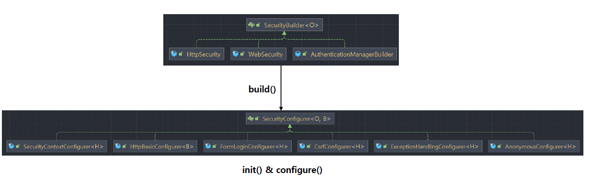
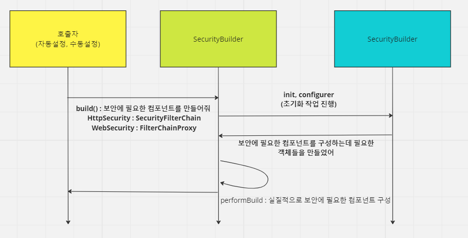

<nav>
    <a href="../../#init" target="_blank">[Spring Security Core]</a>
</nav>

# SecurityBuilder & SecurityConfigurer

---

## 1. SecurityBuilder, SecurityConfigurer 개요




```java
public interface SecurityBuilder<O> {
	O build() throws Exception;
}
```
```java
public interface SecurityConfigurer<O, B extends SecurityBuilder<O>> {

	void init(B builder) throws Exception;

	void configure(B builder) throws Exception;

}
```
- `SecurityBuilder` 는 빌더 클래스로서 웹 보안을 구성하는 빈 객체와 설정클래스들을 생성하는 역할을 하며 대표적인 구현체로는 WebSecurity, HttpSecurity 가 있다.
  - `build()` 메서드 퍼블릭 인터페이스를 제공한다.
  - 기본적으로 시큐리티 설정들은 build() 가 호출된 이후 내부적으로 여러 초기화 작업이 이루어지면서, 보안에 필요한 컴포넌트가 생성되어지는 식으로
    이루어진다.
- 이 설정 과정에서 함께 사용되어지는 것들이 SecurityConfigurer 들이다.
  - init, configurer 를 통해 보안 처리에 필요한 컴포넌트들을 구성하고 builder에 연결할 수 있다.

---

## 2. 구현체 들여보기
SecurityBuilder <- AbstractSecurityBuilder <- AbstractConfiguredSecurityBuilder <- HttpSecurity, WebSecurity

- 전반적인 HttpSecurity, WebSecurity의 흐름은 AbstractSecurityBuilder 및 AbstractConfiguredSecurityBuilder 를 참조하면 된다.

### 2.1 AbstractSecurityBuilder 
```java
public abstract class AbstractSecurityBuilder<O> implements SecurityBuilder<O> {

    private AtomicBoolean building = new AtomicBoolean();

    private O object;

    @Override
    public final O build() throws Exception {
        if (this.building.compareAndSet(false, true)) {
            this.object = doBuild();
            return this.object;
        }
        throw new AlreadyBuiltException("This object has already been built");
    }

    /**
     * Subclasses should implement this to perform the build.
     * @return the object that should be returned by {@link #build()}.
     * @throws Exception if an error occurs
     */
    protected abstract O doBuild() throws Exception;

}
```
- AbstractSecurityBuilder 클래스에 대해 build를 호출하면 하위 클래스에 doBuild를 호출하고 그 결과물을 object에 저장한 뒤 반환한다.
  - HttpSecurity는 여기에 SecurityFilterChain 를 보관한 뒤 반환하고
  - WebSecurity는 여기에 FilterChainProxy를 보관환 뒤 반환한다.

### 2.2 AbstractConfiguredSecurityBuilder
```java
public abstract class AbstractConfiguredSecurityBuilder<O, B extends SecurityBuilder<O>>
		extends AbstractSecurityBuilder<O> {

    private final Log logger = LogFactory.getLog(getClass());

    private final LinkedHashMap<Class<? extends SecurityConfigurer<O, B>>, List<SecurityConfigurer<O, B>>> configurers = new LinkedHashMap<>();

    private final List<SecurityConfigurer<O, B>> configurersAddedInInitializing = new ArrayList<>();

    private final Map<Class<?>, Object> sharedObjects = new HashMap<>();

    private final boolean allowConfigurersOfSameType;

    private BuildState buildState = BuildState.UNBUILT;

    private ObjectPostProcessor<Object> objectPostProcessor;
    
}
```
- AbstractConfiguredSecurityBuilder 는 내부적으로 SecurityConfigurer 목록들(configurers, configurersAddedInInitializing) 을 가지고 있다.
  - 우리가 설정하거나, 스프링의 자동 설정 구성으로 구성된 기본 설정들이 여기에 등록되는 것이다.
```java
	@Override
	protected final O doBuild() throws Exception {
		synchronized (this.configurers) {
			this.buildState = BuildState.INITIALIZING;
			beforeInit();
			init();
			this.buildState = BuildState.CONFIGURING;
			beforeConfigure();
			configure();
			this.buildState = BuildState.BUILDING;
			O result = performBuild();
			this.buildState = BuildState.BUILT;
			return result;
		}
	}
```
- doBuild 에서, 보안에 필요한 객체를 구성하는 작업이 실질적으로 이루어진다.
- 여기서 init, configure 메서드를 눈여겨 보면 된다.
```java
	private void init() throws Exception {
		Collection<SecurityConfigurer<O, B>> configurers = getConfigurers();
		for (SecurityConfigurer<O, B> configurer : configurers) {
			configurer.init((B) this);
		}
		for (SecurityConfigurer<O, B> configurer : this.configurersAddedInInitializing) {
			configurer.init((B) this);
		}
	}
```
```java
	private void configure() throws Exception {
		Collection<SecurityConfigurer<O, B>> configurers = getConfigurers();
		for (SecurityConfigurer<O, B> configurer : configurers) {
			configurer.configure((B) this);
		}
	}
```
- init 및 configure 에서는, 등록되어 있던 configurer 들이 불러와져서 각각 init, configure 된다.
- 이 과정을 거치면서 보안 설정 객체 구성에 필요한 객체들이 초기화, 설정되고 호출된 빌더에 연결하는 작업이 수행된다.
  - 예를 들면 HttpSecurity의 경우 SecurityFilterChain을 구성하는 필터들이 이 단계에서 설정되고 초기화되어진다.

### 2.3 HttpSecurity, WebSecurity
```java
	@Override
	protected DefaultSecurityFilterChain performBuild() {
		ExpressionUrlAuthorizationConfigurer<?> expressionConfigurer = getConfigurer(
				ExpressionUrlAuthorizationConfigurer.class);
		AuthorizeHttpRequestsConfigurer<?> httpConfigurer = getConfigurer(AuthorizeHttpRequestsConfigurer.class);
		boolean oneConfigurerPresent = expressionConfigurer == null ^ httpConfigurer == null;
		Assert.state((expressionConfigurer == null && httpConfigurer == null) || oneConfigurerPresent,
				"authorizeHttpRequests cannot be used in conjunction with authorizeRequests. Please select just one.");
		this.filters.sort(OrderComparator.INSTANCE);
		List<Filter> sortedFilters = new ArrayList<>(this.filters.size());
		for (Filter filter : this.filters) {
			sortedFilters.add(((OrderedFilter) filter).filter);
		}
		return new DefaultSecurityFilterChain(this.requestMatcher, sortedFilters);
	}
```
- HttpSecurity의 경우 앞에서 만들어진 filter들을 기반으로 SecurityFilterChain을 구성한다.

```java
	@Override
	protected Filter performBuild() throws Exception {
		Assert.state(!this.securityFilterChainBuilders.isEmpty(),
				() -> "At least one SecurityBuilder<? extends SecurityFilterChain> needs to be specified. "
						+ "Typically this is done by exposing a SecurityFilterChain bean. "
						+ "More advanced users can invoke " + WebSecurity.class.getSimpleName()
						+ ".addSecurityFilterChainBuilder directly");
		int chainSize = this.ignoredRequests.size() + this.securityFilterChainBuilders.size();
		List<SecurityFilterChain> securityFilterChains = new ArrayList<>(chainSize);
		List<RequestMatcherEntry<List<WebInvocationPrivilegeEvaluator>>> requestMatcherPrivilegeEvaluatorsEntries = new ArrayList<>();
		for (RequestMatcher ignoredRequest : this.ignoredRequests) {
			WebSecurity.this.logger.warn("You are asking Spring Security to ignore " + ignoredRequest
					+ ". This is not recommended -- please use permitAll via HttpSecurity#authorizeHttpRequests instead.");
			SecurityFilterChain securityFilterChain = new DefaultSecurityFilterChain(ignoredRequest);
			securityFilterChains.add(securityFilterChain);
			requestMatcherPrivilegeEvaluatorsEntries
				.add(getRequestMatcherPrivilegeEvaluatorsEntry(securityFilterChain));
		}
		for (SecurityBuilder<? extends SecurityFilterChain> securityFilterChainBuilder : this.securityFilterChainBuilders) {
			SecurityFilterChain securityFilterChain = securityFilterChainBuilder.build();
			securityFilterChains.add(securityFilterChain);
			requestMatcherPrivilegeEvaluatorsEntries
				.add(getRequestMatcherPrivilegeEvaluatorsEntry(securityFilterChain));
		}
		if (this.privilegeEvaluator == null) {
			this.privilegeEvaluator = new RequestMatcherDelegatingWebInvocationPrivilegeEvaluator(
					requestMatcherPrivilegeEvaluatorsEntries);
		}
		FilterChainProxy filterChainProxy = new FilterChainProxy(securityFilterChains);
		if (this.httpFirewall != null) {
			filterChainProxy.setFirewall(this.httpFirewall);
		}
		if (this.requestRejectedHandler != null) {
			filterChainProxy.setRequestRejectedHandler(this.requestRejectedHandler);
		}
		else if (!this.observationRegistry.isNoop()) {
			CompositeRequestRejectedHandler requestRejectedHandler = new CompositeRequestRejectedHandler(
					new ObservationMarkingRequestRejectedHandler(this.observationRegistry),
					new HttpStatusRequestRejectedHandler());
			filterChainProxy.setRequestRejectedHandler(requestRejectedHandler);
		}
		filterChainProxy.setFilterChainDecorator(getFilterChainDecorator());
		filterChainProxy.afterPropertiesSet();

		Filter result = filterChainProxy;
		if (this.debugEnabled) {
			this.logger.warn("\n\n" + "********************************************************************\n"
					+ "**********        Security debugging is enabled.       *************\n"
					+ "**********    This may include sensitive information.  *************\n"
					+ "**********      Do not use in a production system!     *************\n"
					+ "********************************************************************\n\n");
			result = new DebugFilter(filterChainProxy);
		}

		this.postBuildAction.run();
		return result;
	}
```
- WebSecurity의 경우 여러 설정들, 그리고 자신이 가진 SecurityFilterChain들을 기반으로 FilterChainProxy를 구성한다.

---
