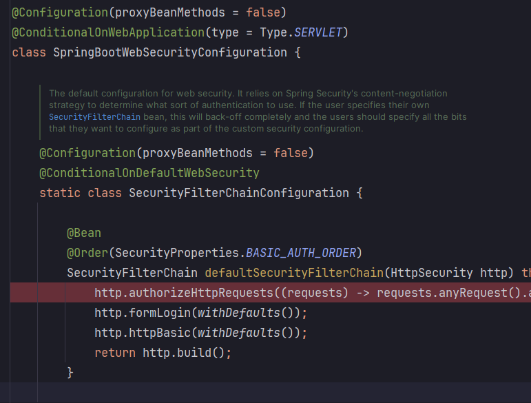
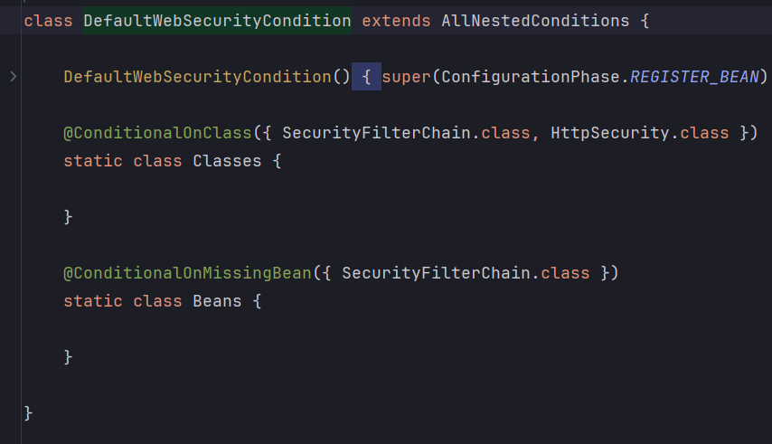

<nav>
    <a href="../../#init" target="_blank">[Spring Security Core]</a>
</nav>

# 사용자 정의 보안 설정, 기본 사용자 설정

---

## 1. 사용자 정의 보안 기능 구현

### 1.1 java
```kotlin
@EnableWebSecurity
@Configuration
class SecurityConfig {

    @Bean
    fun securityFilterChain(http: HttpSecurity): SecurityFilterChain {
        http
            .authorizeHttpRequests { auth ->
                auth.anyRequest().authenticated()
            }
            .formLogin {
                Customizer.withDefaults<HttpSecurity>()
            }
        return http.build()
    }
}
```
- `@EnableWebSecurity` 어노테이션을 활성화한다.
  - Spring Boot 의 자동설정으로 등록되긴하지만 명시적으로 등록하는게 좋다.
- 한 개 이상의 SecurityFilterChain 타입의 빈을 정의한 후 인증 API 및 인가 API를 설정하면 된다.
- 모든 코드는 람다 표현식으로 작성해야한다. (Spring Security 7 이후부터는 람다 형식만 지원될 예정이다.)
- SecurityFilterChain 을 한 개라도 빈으로 등록하면, 자동 설정에 의한 SecurityFilterChain 빈은 생성되지 않는다.

### 1.2 kotlin
```kotlin
import org.springframework.security.config.annotation.web.invoke
```
```kotlin
    @Bean
    fun securityFilterChain(http: HttpSecurity): SecurityFilterChain {
        http {
            authorizeHttpRequests { 
                authorize(anyRequest, authenticated)
            }
            
            formLogin {  }
        }
        return http.build()
    }
```
- kotlin dsl을 적용했을 때 개인적으로 가독성이 더 좋은 것 같다.

---

## 2. 실행

### 2.1 설정
- 위에서 설정한 값 그대로 실행한다.

### 2.2 SpringBootWebSecurityConfiguration 




- SpringBootWebSecurityConfiguration 에서는 SecurityFilterChain 이 없을 경우 자동으로 기본 SecurityFilterChain 을 만들어서,
빈으로 등록하는데 이 작업이 수행되지 않는다.
- 우리가 등록한 커스텀 SecurityFilterChain이 등록됐다는 뜻이다.

---

## 3. 기본 사용자 설정
- 매번 콘솔에 자동으로 생성되는 비밀번호를 입력하면서 로그인하기는 실습 과정에 있어서 불편함이 있다.

### 3.1 application.yml 또는 application.properties
```yaml
# application.yml
spring:
  security:
    user:
      name: user
      password: 1111
      roles: USER
```
- application.yml 을 통해 디폴트 사용자 이름, 패스워드, role을 설정 가능하다

### 3.2 자바 설정 클래스에 직접 정의하는 방법
```kotlin
    @Bean
    fun inMemoryUserDetailsManager():UserDetailsService {
        val user = User
            .withUsername("user")
            .password("{noop}2222")
            .roles("USER")
            .build()
        return InMemoryUserDetailsManager(user)
    }
```
- 설정 클래스에서 위와 같이 UserDetailsService 빈을 수동으로 등록해주는 것도 가능하다.
- 설정 파일과 설정 클래스를 동시에 사용할 경우, 설정 클래스가 우선시되어 적용된다.
  - 실제로 로그인을 해보면 2222 로 비밀번호를 입력해야 접속된다.

---
