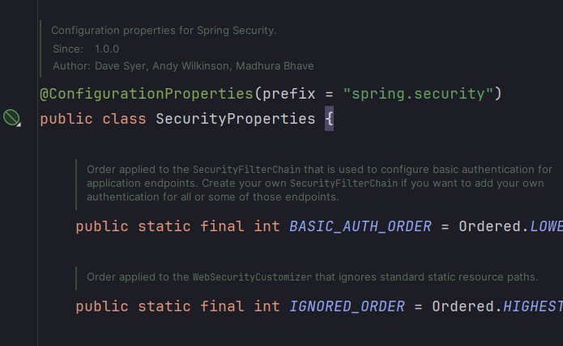
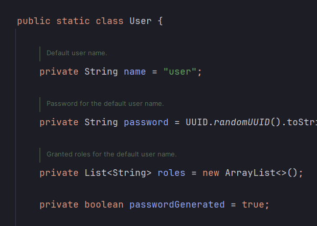
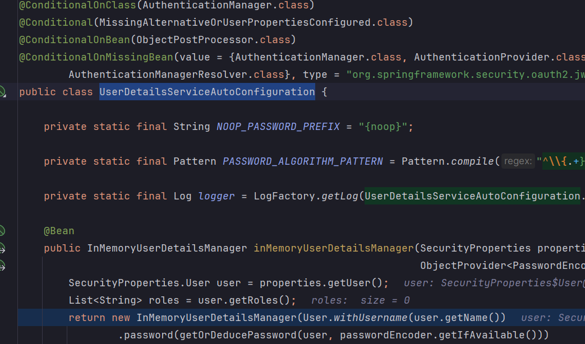
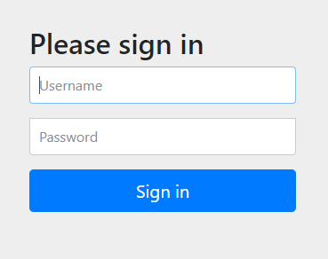
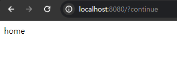

<nav>
    <a href="../../#init" target="_blank">[Spring Security Core]</a>
</nav>

# 프로젝트 생성 & 의존성 추가.md

---

## 1. 자동설정에 의한 기본 보안 작동
<a href="https://docs.spring.io/spring-security/reference/servlet/getting-started.html#servlet-hello-auto-configuration" target="_blank">스프링 시큐리티 튜토리얼 - 자동설정으로 이루어지는 일들</a> 

- 서버가 기동되면 스프링 시큐리티의 초기화 작업 및 보안 설정이 이루어진다.
- 별도의 설정이나 코드를 작성하지 않아도 기본적인 웹 보안 기능이 현재 시스템에 연동되어 작동한다.


### 기본적으로 제공되는 기능들
1) 인증 필요기본적으로 모든 요청에 대하여 인증여부를 검증하고 인증이 승인되어야 자원에 접근이 가능하다
2) 인증 방식은 form 로그인 방식과 httpBasic 로그인 방식을 제공한다
3) 인증을 시도할 수 있는 로그인 페이지가 자동적으로 생성되어 렌더링 된다
4) 인증 승인이 이루어질 수 있도록 한 개의 계정이 기본적으로 제공된다(기본계정)
    ```shell
   2024-04-02T16:37:27.546+09:00  WARN 1532 --- [           main] .s.s.UserDetailsServiceAutoConfiguration :
   Using generated security password: d3ea585b-f936-4926-9fd1-b4bb03bd2e27
   This generated password is for development use only. Your security configuration must be updated before running your application in production.
   ```
   - SecurityProperties 설정 클래스에서 생성
     - username : user
     - password : 랜덤 문자열(콘솔에 찍힌다.)

---

## 2. 자동설정 클래스

### 2.1 SpringBootWebSecurityConfiguration
```java
@Configuration(proxyBeanMethods = false)
@ConditionalOnWebApplication(type = Type.SERVLET)
class SpringBootWebSecurityConfiguration {

	@Configuration(proxyBeanMethods = false)
	@ConditionalOnDefaultWebSecurity
	static class SecurityFilterChainConfiguration {

		@Bean
		@Order(SecurityProperties.BASIC_AUTH_ORDER)
		SecurityFilterChain defaultSecurityFilterChain(HttpSecurity http) throws Exception {
			http.authorizeHttpRequests((requests) -> requests.anyRequest().authenticated());
			http.formLogin(withDefaults());
			http.httpBasic(withDefaults());
			return http.build();
		}

	}

	@Configuration(proxyBeanMethods = false)
	@ConditionalOnMissingBean(name = BeanIds.SPRING_SECURITY_FILTER_CHAIN)
	@ConditionalOnClass(EnableWebSecurity.class)
	@EnableWebSecurity
	static class WebSecurityEnablerConfiguration {

	}

}
```
```java
@Target({ ElementType.TYPE, ElementType.METHOD })
@Retention(RetentionPolicy.RUNTIME)
@Documented
@Conditional(DefaultWebSecurityCondition.class)
public @interface ConditionalOnDefaultWebSecurity {

}
```
```java
class DefaultWebSecurityCondition extends AllNestedConditions {

	DefaultWebSecurityCondition() {
		super(ConfigurationPhase.REGISTER_BEAN);
	}

	@ConditionalOnClass({ SecurityFilterChain.class, HttpSecurity.class })
	static class Classes {

	}

	@ConditionalOnMissingBean({ SecurityFilterChain.class })
	static class Beans {

	}

}
```
- 기본 SecurityFilterChain을 빈으로 등록해준다.
  - `@ConditionalOnDefaultWebSecurity` -> `@DefaultWebSecurityCondition`
    - 클래스패스에 SecurityFilterChain, HttpSecurity 클래스가 있고
    - SecurityFilterChain 빈이 등록되어 있지 않을 때(우리는 커스텀 SecurityFilterChain을 등록하지 않았음)
  - 이 설정으로 인해 우리는 모든 경로에 접근 시 기본적으로 인증을 해야하고, 폼 인증과 HttpBasic 인증이 활성화된다.
- 기본적으로 `@EnableWebSecurity`가 활성화 됨
  ```java
  @Import({ WebSecurityConfiguration.class, SpringWebMvcImportSelector.class, OAuth2ImportSelector.class,
          HttpSecurityConfiguration.class })
  @EnableGlobalAuthentication
  public @interface EnableWebSecurity {

	/**
	 * Controls debugging support for Spring Security. Default is false.
	 * @return if true, enables debug support with Spring Security
	 */
	boolean debug() default false;
  }
  ```
  - 여러가지 웹 보안에 필요한 시큐리티 설정 클래스들이 함께 Import 된다.

### 2.2 SecurityProperties






- SecurityProperties 클래스는 기본 설정값을 주입하거나, 설정 파일에 있는 값을 기반으로 보안 설정을 구성한다.
- 자동설정 과정(UserDetailsServiceAutoConfiguration)에서 위 그림처럼, 여러 자동설정 클래스가 이 클래스의 값을 기반으로 보안 설정을
구성한다.
  - 인메모리 기본 사용자 구성도 이 설정에 기반한다.

---

## 3. 실행

### 3.1 컨트롤러
```kotlin

@RestController
class HomeController {

    @GetMapping("/")
    fun home(): String {
        return "home"
    }
}
```
- 홈 컨트롤러 하나만 만들어둔다.
- "/"로 접속을 하면 "home"을 반환하는 간단한 API이다.

### 3.2 실행
```shell
Using generated security password: 35a0c4aa-75c5-4e31-9711-98abc2ea198c
This generated password is for development use only. Your security configuration must be updated before running your application in production.
```
- 자동설정으로 인해 기본 비밀번호가 생성되고 콘솔에 출력된다.

### 3.3 로그인 페이지


- `http://localhost:8080` 접근
- 인증을 받지 않아서 홈 경로로 접근 시, 인증 페이지로 리다이렉트 된다.

### 3.4 로그인


- 로그인을 해보자.
  - id: user
  - pw: 아까 받은 비밀번호
- 정상적으로 홈 API 응답을 받을 수 있다.

---
