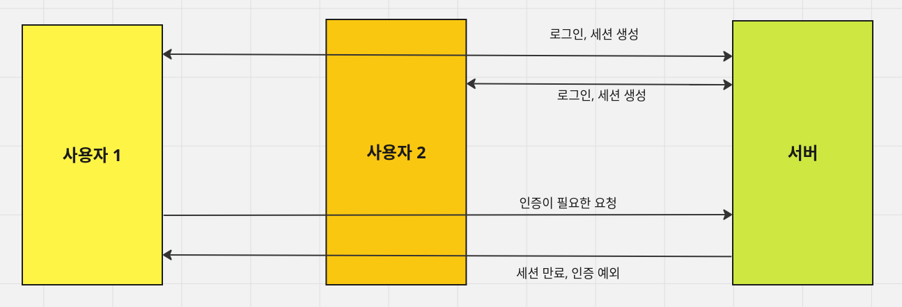
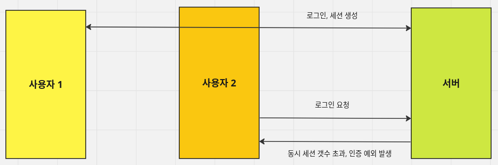
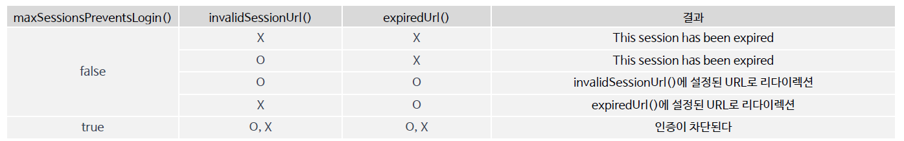
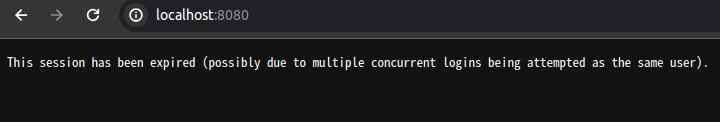
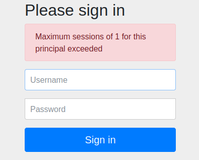

<nav>
    <a href="/#session-management" target="_blank">[Spring Security Core]</a>
</nav>

# 동시세션 제어

---

## 1. 동시세션과 동시세션 제어 전략

### 1.1 동시 세션
- **동시세션이란 동일한 계정으로 접속했을 때 만들어지는 세션을 의미한다.**
    - 사용자가 X 기기, Y 기기에서 A 계정으로 접속했을 때 X,Y 각각을 위한 세션이 각각 만들어진다.
    - 이런 세션들을 동시세션이라고 한다. 동시세션을 제어하는 것은 중요한 일이다.
- 동시세션이 생긴다는 것은 동시에 여러 사용자가 동일한 계정으로 접속할 수 있는 것을 의미한다.
  따라서 동일 계정에서 동시에 사용할 수 있는 사람을 하나만으로 설정하고 싶다면, 동시세션을 제어해야한다.

### 1.2 동시세션 제어 전략
- 동시 세션 제어 전략은 사용자가 여러 세션을 생성하는 것을 관리하는 전략이다.
- 동시 세션 제어 전략은 크게 세 가지 방법이 있다.
  - 이전 사용자 세션 만료
  - 현재 사용자 인증 실패
  - 세션 무제한 생성 : 세션 생성을 무제한으로 허용하는 방법… 추천하는 방법은 아니다

---

## 2. 이전 사용자 세션 만료 방식

1. **사용자1이 먼저 서버에 로그인 요청한다.**
2. **서버는 세션을 생성해서 응답한다.**
3. **사용자2가 세션에 로그인 요청을 한다**
4. **사용자2에게 세션을 만들어 응답해준다. 그리고 사용자1의 세션을 만료시킨다.**
5. **사용자1이 자원 접근 요청을 보낸다. 서버는 사용자1의 세션이 만료된 것을 확인하고, 세션을 만료시키고 예외를 발생시킨다.**

이전 사용자 세션 만료 전략은 동일 계정으로 누군가 로그인 했을 때, 이전에 사용하던 사용자의 세션을 만료시켜 접근하지 못하도록 한다.
그리고 현재 인증 요청한 사용자의 계정은 인증 및 세션을 생성해준다.

---

## 3. 현재 사용자 인증 실패 방식


1. **사용자 1이 로그인 요청을 한다. 서버는 인증 처리 및 세션을 만들어 사용자1에게 내려준다.**
2. **사용자 2가 로그인 요청을 한다. 이 때, 서버는 동일 계정으로 로그인 한 것을 확인한다.**
3. **서버는 사용자2에게 인증 예외를 발생시켜준다.**

현재 사용자 인증 실패 전략은 이미 동일 계정으로 접속하고 있는 사람이 있을 경우, 현재 인증 요청한 사용자의 인증 과정에서 인증 예외를 발생시키는 전략이다.
따라서, 이전 사용자만 계속 사용할 수 있다.

---

## 4. 동시세션 제어 설정
```kotlin
@Bean
fun filterChain(http: HttpSecurity): SecurityFilterChain {
    http {
        authorizeRequests {
            authorize(anyRequest, authenticated)
        }
        formLogin {  }
        sessionManagement {
            sessionConcurrency {
                maximumSessions = 1 // 최대 허용 가능 세션수 / -1 : 무제한 로그인 세션 허용(기본값)
                maxSessionsPreventsLogin = true // 현재 동시 로그인 차단함, false: 기존 세션 만료(default)
                expiredUrl = "/expired" // 세션이 만료된 경우 이동할 페이지
            }
						// 참고로 expiredUrl, invalidSessionUrl 모두 설정되면 invalidSessionUrl 이 우선시되어 이동된다.
            invalidSessionUrl = "/invalid" // 세션이 유효하지 않을 때 이동할 페이지

        }
    }
    return http.build()
}
```
- maxSessionsPreventsLogin : true로 설정하면 동시 제한 초과 사용자에 대해 새로 로그인을 못 하게 차단함(기본값 : false)
- maximumSessions : 최대 허용 가능 세션 수
- expireUrl : 세션 만료 시 이동할 페이지
- invalidSessionUrl : 세션이 유효하지 않을 때 이동할 페이지(expireUrl보다 우선시)

### 참고 : 세션 만료 후 리다이렉션 전략



---

## 5. 실습
### 5.1 이전 사용자 세션 만료 방식


- 크롬에서 로그인하고 파이어폭스에서 동일 계정으로 로그인을 시도한다.
- 크롬에서 새로고침을 하면 ConcurrentSessionFilter가 작동하여 기존 세션을 만료시킨다.
- 크롬에서는 위 화면을 보게 된다.
- (참고) 이 실습에서는 expiredUrl, invalidSessionUrl 옵션을 제거했다.

### 5.2 현재 사용자 인증 실패 방식


- 크롬에서 로그인하고, 파이어폭스에서 동일 계정으로 로그인을 시도한다.
- 나중에 접속한 파이어폭스 쪽에서 인증이 실패됐다.

---
