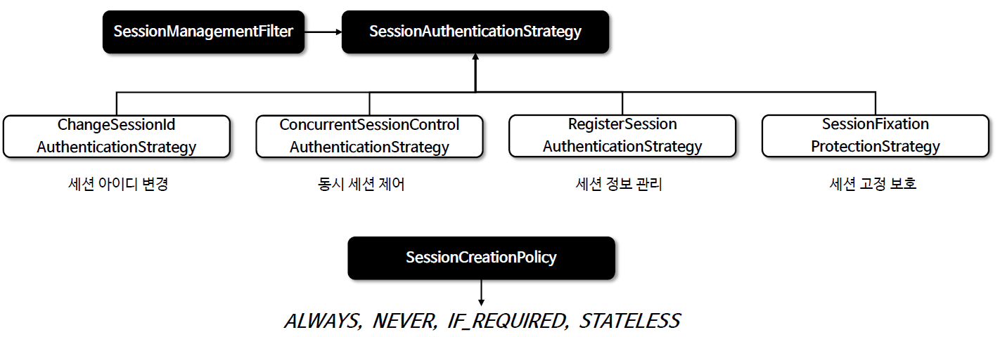
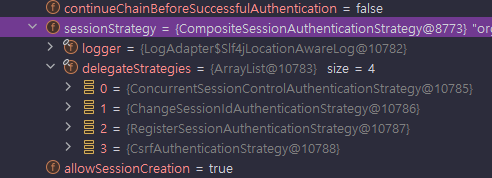
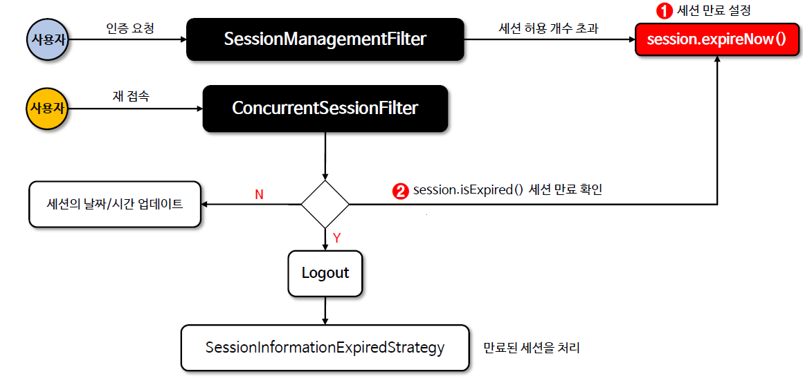
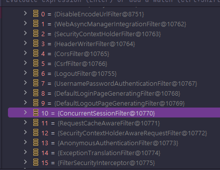

<nav>
    <a href="/#session-management" target="_blank">[Spring Security Core]</a>
</nav>

# 세션인증 전략(SessionAuthenticationStrategy) 및 세션관련 필터

---

## 1. 세션인증 전략 : SessionAuthenticationStrategy
```java
public interface SessionAuthenticationStrategy {

	void onAuthentication(Authentication authentication, HttpServletRequest request, HttpServletResponse response)
			throws SessionAuthenticationException;

}
```
- 인증이 발생할 때 HttpSession 관련 동작을 수행
- 최초 로그인하였을 때, 또는 로그인한 사용자가 특정 엔드포인트에 요청할 때 세션 제어 필터(SessionManagementFilter)에서 실행시킴
  - AbstractAuthenticationProcessingFilter
  - SessionManagementFilter
  - ...

---

## 2. 세션제어 필터(SessionManagementFilter)
이전 장에서 `http.sessionManagement()`를 이용해서 Spring에서 사용하는 여러 세션에 대한 정책을 설정했었다.
이 API를 이용해서 처리한 것들을 정리해보면 다음과 같다.

- 세션 관리 : 인증 시, 사용자의 세션 정보를 등록, 조회, 삭제(만료시) 등 세션 이력 관리
- 동시세션 제어 : 동일 계정으로 접속이 허용되는 최대 세션수를 제한
- 세션고정 보호 : 로그인 인증할 때마다 세션 쿠키를 새로 발급하여, 세션 고정 공격으로부터 보호
- 세션생성 정책 설정 : 세션 생성 정책을 조작. (Always, If_Required, Never, Stateless)

```java
private void doFilter(HttpServletRequest request, HttpServletResponse response, FilterChain chain)
			throws IOException, ServletException {

		// 이미 필터 적용됐다면 다음 필터로 통과
		if (request.getAttribute(FILTER_APPLIED) != null) {
			chain.doFilter(request, response);
			return;
		}
		request.setAttribute(FILTER_APPLIED, Boolean.TRUE);

		// SecurityContextRepository에 해당 요청의 컨텍스트가 없는 경우[저장된 인증 상태가 없는 사용자] 요청을 가로챔
		if (!this.securityContextRepository.containsContext(request)) {

			// SecurityContextHolder에서 인증을 꺼내온다.
			Authentication authentication = this.securityContextHolderStrategy.getContext().getAuthentication();
			
			// 인증이 null 이 아니고, 익명사용자가 아니면
			if (authentication != null && !this.trustResolver.isAnonymous(authentication)) {
				try {

					// SessionAuthenticationStrategy에게 인증에 대한 처리를 해달라고 요청
					this.sessionAuthenticationStrategy.onAuthentication(authentication, request, response);
				}
				catch (SessionAuthenticationException ex) {

					// 세션 처리과정에서 예외가 발생하면 실패 처리
					this.securityContextHolderStrategy.clearContext();
					this.failureHandler.onAuthenticationFailure(request, response, ex);
					return;
				}
				// SecurityContextRepository에 컨텍스트 저장
				this.securityContextRepository.saveContext(this.securityContextHolderStrategy.getContext(), request,
						response);
			}
			else {
				// SecurityContextRepository에 해당 컨텍스트가 있을 경우

				// request 에 sessionId가 있고, 유효하지 않을 때
				if (request.getRequestedSessionId() != null && !request.isRequestedSessionIdValid()) {
					// InvalidSessionStrategy에게 후속처리 위임
					if (this.invalidSessionStrategy != null) {
						this.invalidSessionStrategy.onInvalidSessionDetected(request, response);
						return;
					}
				}
			}
		}
        
		// 통과
		chain.doFilter(request, response);
	}
```
- SecurityContextHolderStrategy 를 통해 인증 정보를 조회해오고 인증된 사용자에 대해서 `SessionAuthenticationStrategy.onAuthenticated(...)` 메서드를
  호출하여 세션 관련 전략을 실행한다.
- 그러나 현재 스프링 시큐리티 6 이상에서는 SessionManagementFilter 가 기본적으로 설정 되지 않는다.
    - 최초 인증 시의 세션 제어는 기본적으로 AbstractAuthenticationProcessingFilter 와 같은 인증매커니즘에서 SessionAuthenticationStrategy 를 호출해야한다.
    - 매 요청마다 세션 만료여부를 체크하는 것은 ConcurrerntSessionFilter에서 제어한다.
    - 굳이 SessionManagementFilter를 둘 필요가 없는 것도 이런 이유다.
    - 참고: https://docs.spring.io/spring-security/reference/servlet/authentication/session-management.html#moving-away-from-sessionmanagementfilter
        - 스프링 시큐리티6 공식문서에서는 더 이상 SessionAuthenticationManagerFilter 가 사용되지 않는다고 명시했다.

---

## 3. 여러가지 세션 인증 전략


- CompositeSessionAuthenticationStrategy : 아래에서 후술. 복수의 다른 strategy를 리스트로 가지고 있는데 이들을 하나씩 호출한다.
- RegisterSessionAuthenticationStrategy : 인증 세션을 등록
- ConcurrentSessionControlAuthenticationStrategy: 동시 세션을 실질적으로 제어
    - 동시 세션 갯수를 카운팅
    - 동시세션 제한을 초과하는 지 여부 등을 판단
    - 내부 상태값을 기반으로 신규 세션을 차단할 것인지 기존 세션을 오래된 것부터 만료시킬 지 결정
        - 현재 세션을 차단해야한다면 예외를 발생시킴
        - 오래된 세션을 만료시켜야한다면 오래된 세션부터 초과된 세션 수만큼 SessionInformation의 Expired 변수가 만료상태로 바뀜(물리적으로 만료 x)
- ChangeSessionIdAuthenticationStrategy/SessionFixationProtectionStrategy : 세션 고정 보호를 담당
    - 둘 중 하나가 주입됨
    - ChangeSessionId : 세션 id만 변경
    - SessionFixationProtectionStrategy
        - 세션 생성 및 세션 id 변경
        - 설정에 따라 기존 세션 데이터를 복사하지 않고 새로운 클린 세션을 생성할지 말지가 달라짐

### Composite 패턴과 CompositeSessionAuthenticationStrategy


```java
public class CompositeSessionAuthenticationStrategy implements SessionAuthenticationStrategy {

    private final List<SessionAuthenticationStrategy> delegateStrategies;

    // 생략

    @Override
    public void onAuthentication(Authentication authentication, HttpServletRequest request,
                                 HttpServletResponse response) throws SessionAuthenticationException {
        int currentPosition = 0;
        int size = this.delegateStrategies.size();
        for (SessionAuthenticationStrategy delegate : this.delegateStrategies) {
            delegate.onAuthentication(authentication, request, response);
        }
    }
}
```
- SessionAuthenticationStrategy 의 기본 구현체는 CompositeSessionAuthenticationStrategy 인데 이것은 내부적으로 복수의 SessionAuthenticationStrategy 들을 거느리고 있다.
- 다른 복수의 구현체들을 하나씩 호출해서 세션관련 처리를 위임한다.

---

## 4. 동시세션 제어: ConcurrentSession
- 동시 세션을 관리하는 필터
- 각 요청에 대해 SessionRegistry에서 SessionInformation 을 검색하고 세션이 만료로 표시되었는지 확인하고 만료로 표시된 경우 로그아웃 처리를 수행한다(세션 무효화)
  - `session.isExpired() == true` → 로그아웃 처리, 즉시 오류 페이지 응답
  - “This session has been expired”
  - 물리적으로 세션을 만료시키는 역할
- 각 요청에 대해 SessionRegistry.refreshLastRequest(String)를 호출하여 등록된 세션들이 항상 '마지막 업데이트' 날짜/시간을 가지도록 한다

---

## 5. 각 유즈케이스별 세션 관리 흐름

### 5.1 로그인 시


그림에서는 SessionManagemnetFilter 로 되어있는데 현재 환경에서 놓고보면 로그인을 담당하는 필터(예: AbstractAuthenticationProcessingFilter) 로 생각하면 된다.

- UsernamePasswordAuthenticationFilter에서 요청을 가로챔(기본 사양)
- UsernamePasswordAuthenticationFilter 에서 로그인 성공 후 SessionAuthenticationStrategy 호출
    - CompositeAuthenticationStrategy : 세션이 활성화되면 이것이 작동
        - RegisterSessionAuthenticationStrategy : 세션 등록 (세션이 활성화되면 이것이 작동해서, 세션이 등록됨)
        - ConcurrentSessionControlStrategy: 동시세션 제어
            - 이번 로그인 세션이 만료 금지라면 예외 발생
            - 오래된 세션을 만료시켜야한다면 해당 세션을 expired 상태로 변경(플래그만 바꿀 뿐 물리적으로 만료시키지 않는다)
        - ChangeSessionIdAuthenticationStrategy/SessionFixationProtectionStrategy : 세션 고정 보호
    - NullAuthenticationStrategy: 아무 것도 안함. (세션이 비활성화됐을 경우)

### 5.2 매 필터 체인 인증마다


- ConcurrentSessionFilter는 매번 세션만료를 검사하고, `ConcurrentSessionFilter`는 `SessionManagementFilter`에서 `expired.Now()`를 했는지 `isExpired()` 메서드를 이용해 확인한다.
  - 이 때, 만료됐다면 `SessionInformation` 을 확인하고, 물리적으로 Session을 만료처리한다.(Invalidate)
  - 만료 처리후 사용자에게 오류 응답을 내린다.

---
